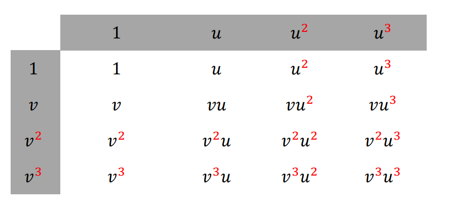
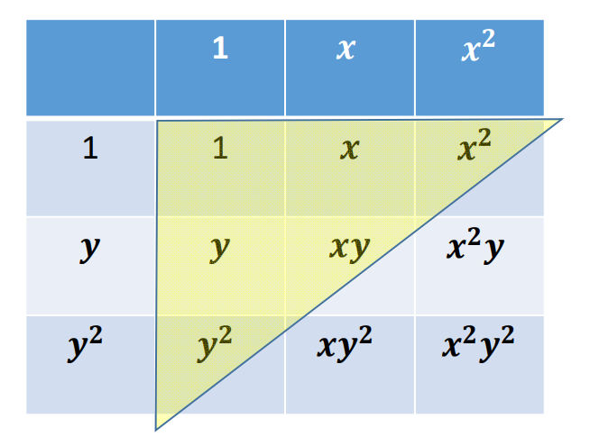

# 多元函数

# 多元函数（多变量）

• 多个变量的函数  

$$
f: R^n \rightarrow R^1
$$

$$
\begin{pmatrix}x_1
 \\\\\vdots 
 \\\\x_n
\end{pmatrix}
\rightarrow y
$$

$$
y = f(x_1,x_2, \cdots, x_n)
$$

• 例子：二元函数
$$
z=f(x,y),(x,y)\in[0,1]\times[0,1]
$$

  

# 二元函数的基函数构造   

• 方法：**张量积**形式，即用两个一元函数的基函数的相互乘积来定义   
• 比如：二次二元多项式函数的基函数\\(z=f(x,y)\\)的基函数{\\(1,x,y,x^2,xy,y^2\\)}   

  
> &#x1F446; [10:23] 例子：幂基

# 三次张量积多项式    

  

# 三次张量积函数

  
> &#x1F446; [13:00] 例子：高斯基

# 张量积基函数

  
> &#x1F446; [11:22] 例子：任意基。横轴和竖轴可以用不同的函数，但很少这样做

# 多元函数的张量积定义

* 优点：**定义简单，多个一元基函数的乘积形式**  
* 不足：  
• 随着维数增加，基函数个数急剧增加，导致**变量急据增加**（求解系统规模急剧增加，求解代价大）

   

# 多元函数的神经网络表达

$$
f:\begin{pmatrix}x_1
 \\\\\vdots 
 \\\\x_n
\end{pmatrix} →y
$$

• 用一个单变量函数\\(\sigma (x)\\)（称为激活函数）的不同仿射变换来构造 “基函数”：基函数数目可控    
$$
y=f(x_1,x_2,...,x_n)
$$
$$
=w_0+\sum_{j-1}^{m} w_j\sigma (a_j^1x_1+...a_j^ix_i+...+a_j^nx_n+b_j)
$$

  

> &#x1F50E; [16:12] 

