# 向量值函数

## 向量值函数（多个应变量）  

• 先看**单变量**的：  
$$
f:R^1 → R^m 
$$ 

$$
x →\begin{pmatrix}y_1
 \\\\\vdots 
 \\\\y_m
\end{pmatrix}
$$

• 看成多个单变量函数，各个函数独立无关   
• 一般会用同样的基函数（共享基函数）     

$$
\begin{cases}
 y_1=f_1(x)\\\\
\vdots  \\\\
y_m=f_m(x)
\end{cases}
$$

向量值函数（多个应变量）  
$$
f:R^1 → R^m 
$$   

$$
\left\{\begin{array}{c}
y_{1}=f_{1}(x) \\
\vdots \\
y_{m}=f_{m}(x)
\end{array}\right.
$$

• 几何解释：   
• 一个实数\\(𝑥∈𝑅_1\\)?映射到𝑚维空\\(𝑅^m\\)的一个点，轨迹构成\\(𝑅^m\\)的一条“曲线”      
• 本质维度为1   

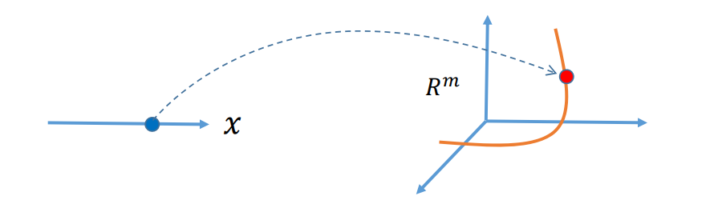   

## 特例：平面参数曲线

$$
f:R^1 → R^2 
$$ 

$$
\left\{\begin{array}{c}
x=x(t) \\
y=y(t) 
\end{array}\right.
$$

* 几何解释：    
• 一条曲线由一个变量参数𝑡决定，也称为单参数曲线   
• 参数𝑡可看成该曲线的“时间”变量      
• 可灵活表达非函数型的曲线（任意曲线）      

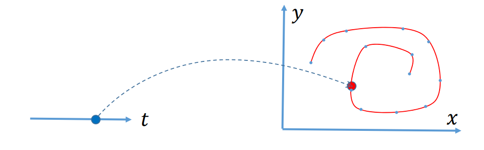 

## 特例：空间参数曲线

$$
f:R^1 → R^3 
$$ 

$$
\left\{\begin{array}{c}
x=x(t) \\
y=y(t)  \\
z=z(t) 
\end{array}\right.
$$

$$
t\in [0,1]
$$

* 几何解释:     
• 一条曲线由一个变量参数𝑡决定，也称为单参数曲线      
• 参数𝑡可看成该曲线的“时间”变量    
• 可灵活表达非函数型的曲线（任意曲线）   

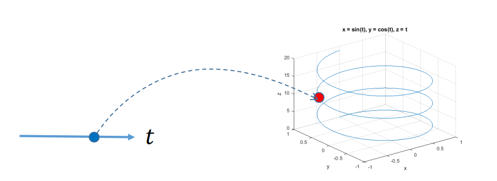   

## 特例：参数曲面

$$
f:R^2 → R^3 
$$ 

$$
\left\{\begin{array}{c}
x=x(u,v) \\
y=y(u,v)  \\
z=z(u,v) 
\end{array}\right.
$$

$$
(u,v)\in [0,1]\times [0,1]
$$

* 几何解释：    
• 一张曲面由两个参数\\((u,v)\\)决定，也称为双参数曲面       
• 可灵活表达非函数型的任意曲面     

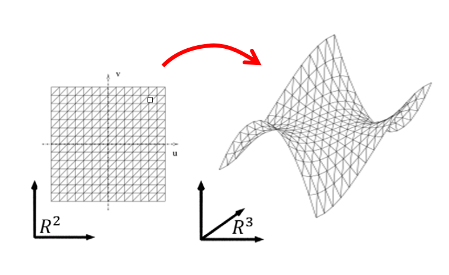   

## 特例：二维映射

$$
f:R^2 → R^3 
$$ 

$$
\left\{\begin{array}{c}
x=x(u,v) \\
y=y(u,v)
\end{array}\right.
$$

$$
(u,v)\in [0,1]\times [0,1]
$$

* 几何解释：    
• 二维区域之间的映射     
• 可看成特殊的曲面（第三个维度始终为\\(0\\)）      
• 应用：图像变形     

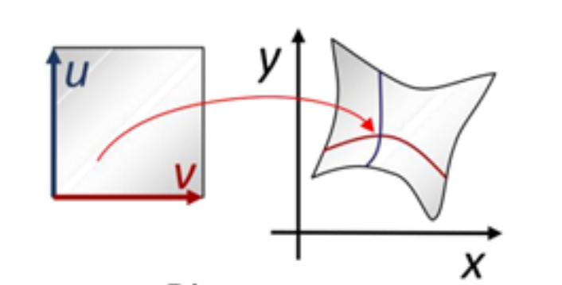  

## 特例：二维映射   

$$
f:R^3 → R^3 
$$ 

$$
\left\{\begin{array}{c}
x=x(u,v,w) \\
y=y(u,v,w)  \\
z=z(u,v,w) 
\end{array}\right.
$$

$$
(u,v,w)\in [0,1]^3
$$

* 几何解释：   
• 三维体区域之间的映射    
• 应用：体形变、体参数化    
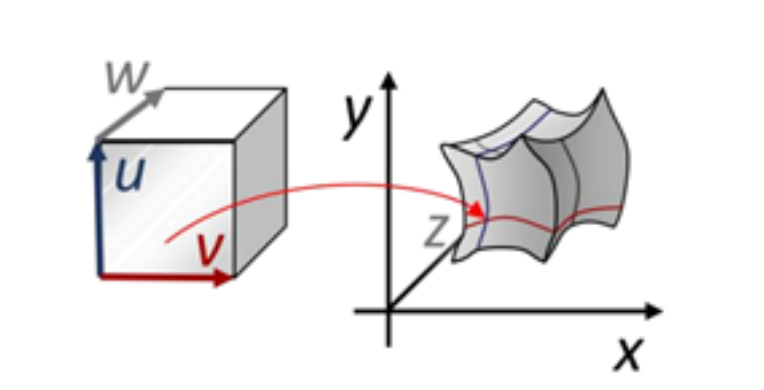   

## 特例：降维映射（低维投影）   

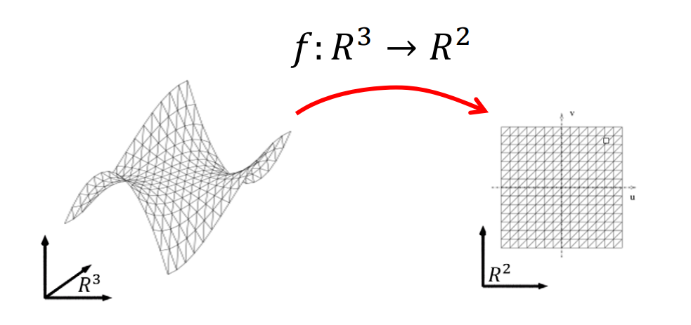   

* 降维映射一般有信息丢失    
• 丢失的信息大部分情况下不可逆，即无法恢复    

## 一般映射   

$$
f:R^n → R^m 
$$ 

* 如果\\(n<m\\)，为低维到高维的映射（高维的超曲面，\\(n\\)维流形曲面），**本征维度**为\\(n\\)   
* 如果\\(n>m\\)，为降维映射    
• 一般信息有损失   
• 如果𝑅^n中的点集刚好位于一个\\(𝑚\\)维（或小于\\(𝑚\\)）的流形上，则映射可能是无损的，即可以被恢复的    

## 低维空间之间的函数

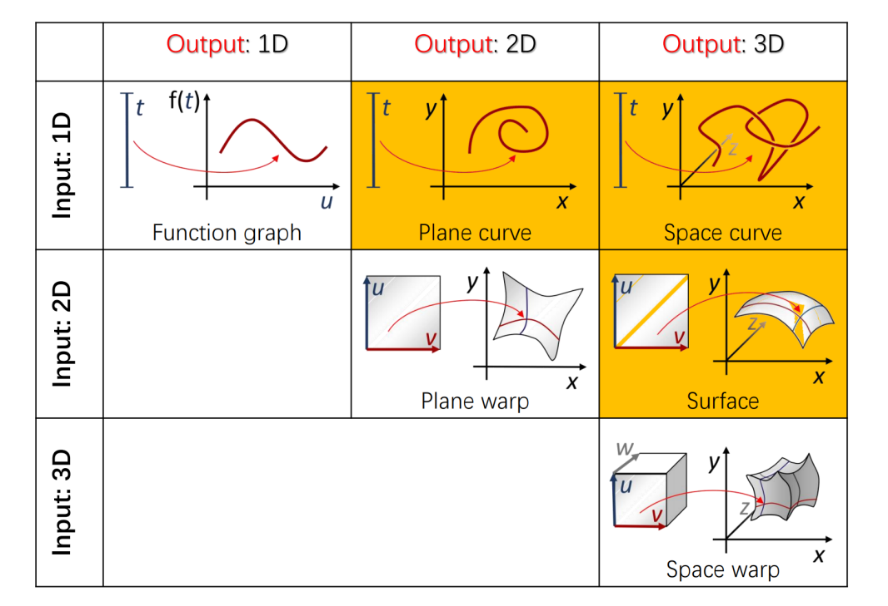   

# 曲线拟合

## 曲线拟合问题

• 输入：给定平面上系列点\\((x_i,y_i),1,2,...,n\\)     

• 输出：一条参数曲线，拟合这些点   

$$
f:R^1 → R^2 
$$ 

$$
\left\{\begin{array}{c}
x=x(t) \\
y=y(t) 
\end{array}\right.
$$

$$
t\in [0,1]
$$

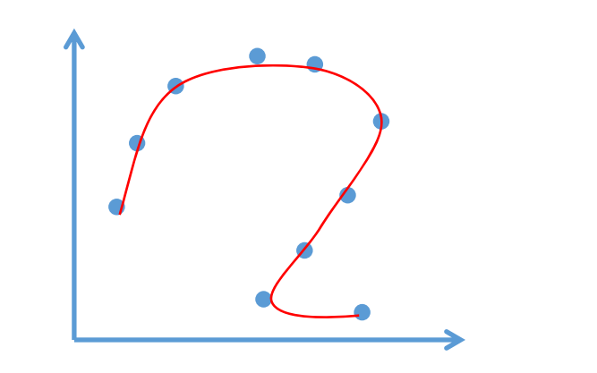  
**应该怎么做？**   

## 曲线拟合问题    

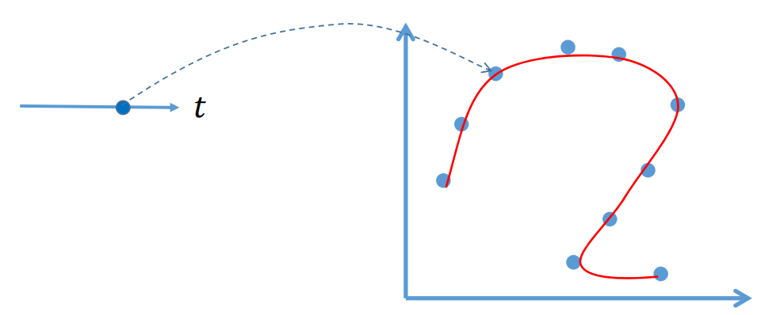   

$$
\left\{\begin{array}{c}
x=x(t) \\
y=y(t) 
\end{array}\right.
$$

$$
t\in [0,1]
$$

> 矢量符号化表达：
$$
p=p(t)=\binom{x(t)}{y(t)} 
$$

• 问题：对数据点\\((x_i,y_i)\\)，对应哪个参数\\(𝑡_i\\)？   
• 误差度量： 
$$
E= {\textstyle \sum_{i=1}^{n}} ||\binom{x(t_i)}{ y(t_i)}-\binom{x_i}{y_i} ||^2= {\textstyle \sum_{i=1}^{n}}||p(t_i)-p_i||^2
$$
 

## 参数化问题     

• 求数据点所对应的参数：一个降维的问题！   
     

$$
\left\{\begin{array}{c}
x=x(t) \\
y=y(t) 
\end{array}\right.
$$

$$
t\in [0,1]
$$

• 然后极小化误差度量：  
 
$$
E=  {\textstyle \sum_{i=1}^{n}}||p(t_i)-p_i||^2
$$

## 点列的参数化

* Equidistant (uniform) parameterization     
• \\(𝑡_{i+1}-𝑡_i=const\\)   
• \\(e.g.𝑡_i=i\\)   
• Geometry of the data points is not considered       
* Chordal parameterization      
• \\(𝑡_{i+1}-𝑡_i=||k_{i+1}-k_i||\\)    
• Parameter intervals proportional to the distances of
neighbored control points      

## 点列的参数化   

* Centripetal parameterization   
• \\(𝑡_{i+1}-𝑡_i=\sqrt{||k_{i+1}-k_i||} \\)  
* Foley parameterization     
• Involvement of angles in the control polygon      

$$
t_{i+1}-t_{i}=\left\|\boldsymbol{k}_{i+1}-\boldsymbol{k}_{i}\right\| \cdot\left(1+\frac{3}{2} \frac{\widehat{\alpha}_{i}\left\|\boldsymbol{k}_{i}-\boldsymbol{k}_{i-1}\right\|}{\left\|\boldsymbol{k}_{i}-\boldsymbol{k}_{i-1}\right\|+\left\|\boldsymbol{k}_{i+1}-\boldsymbol{k}_{i}\right\|}+\right.   \left.\frac{3}{2} \frac{\widehat{\alpha}_{i+1}\left\|\boldsymbol{k}_{i+1}-\boldsymbol{k}_{i}\right\|}{\left\|\boldsymbol{k}_{i+1}-\boldsymbol{k}_{i}\right\|+\left\|\boldsymbol{k}_{i+2}-\boldsymbol{k}_{i+1}\right\|}\right) 
$$

4 

\\[
with  \hat{\alpha}_{i}=\min \left(\pi-\alpha_{i}, \frac{\pi}{2}\right)  
\\]

$$
and  \alpha_{i}=\operatorname{angle}\left(\boldsymbol{k}_{i-1}, \boldsymbol{k}_{i}, \boldsymbol{k}_{i+1} \right) 
$$

## 一个例子  
• Examples: Uniform parameterization       

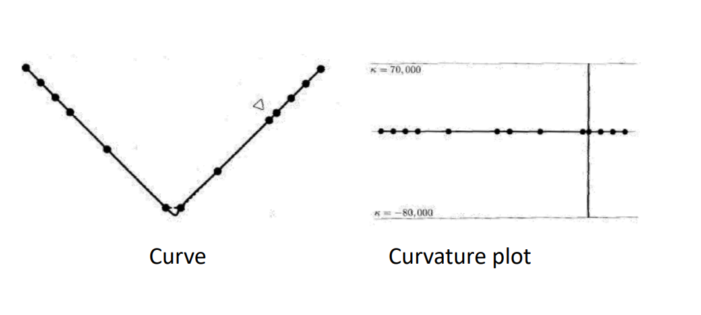 

## 一个例子   

• Examples: Chordal parameterization       

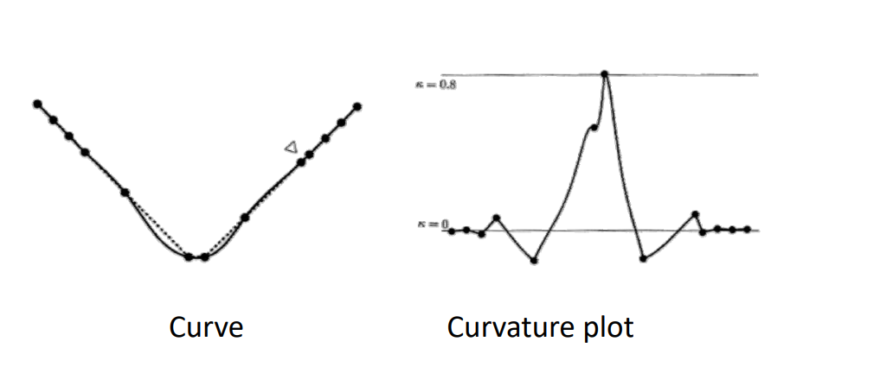   

## 一个例子  

• Examples: Centripetal parameterization    

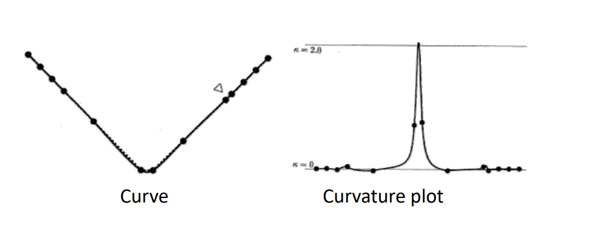   

## 一个例子  

• Examples: Foley parameterization   

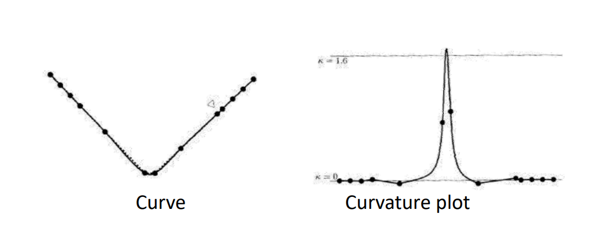  

## 另一个例子  

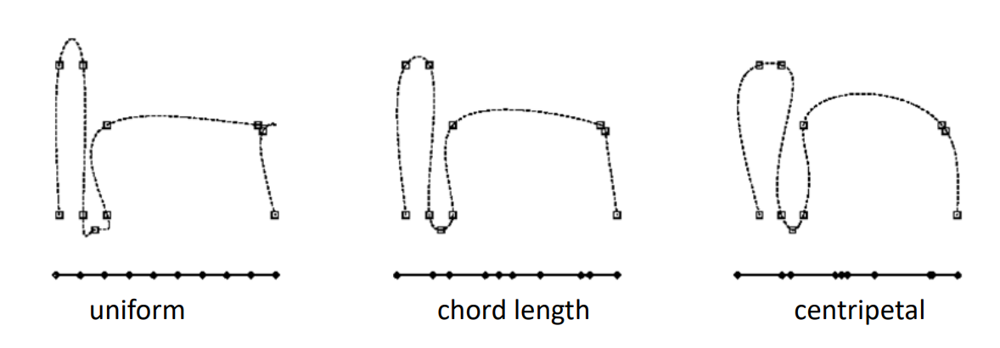   

点的参数化对曲线拟合的影响很大，需要**好的参数化**！  

## 曲面参数化  

• 三维的点找二维的参数：一个降维的问题！   

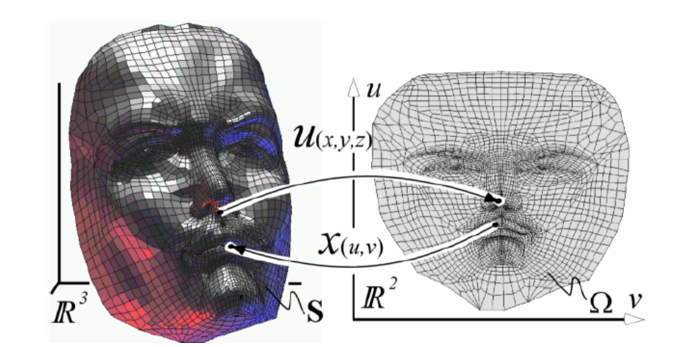   

## 曲面参数化的应用  

• 纹理映射  
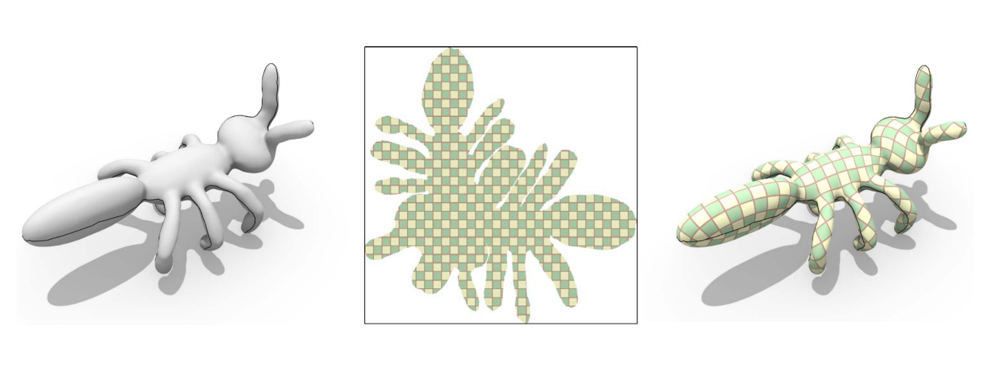   

$$ f(x)=\left\{
\begin{aligned}
x & = & \cos(t) \\
y & = & \sin(t) \\
z & = & \frac xy
\end{aligned}
\right.
$$

$$f(x)=
\begin{cases}
0& \text{x=0}\\
1& \text{x!=0}
\end{cases}
$$

$$ F^{HLLC}=\left\{
\begin{array}{rcl}
F_L       &      & {0      <      S_L}\\
F^*_L     &      & {S_L \leq 0 < S_M}\\
F^*_R     &      & {S_M \leq 0 < S_R}\\
F_R       &      & {S_R \leq 0}
\end{array} \right. 
$$
