# 1. Acquisition （数据采集）   

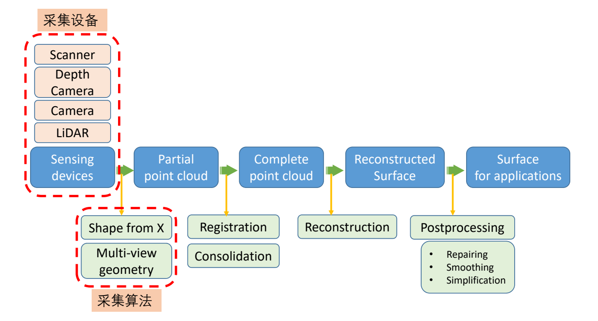

Structure of Data:  

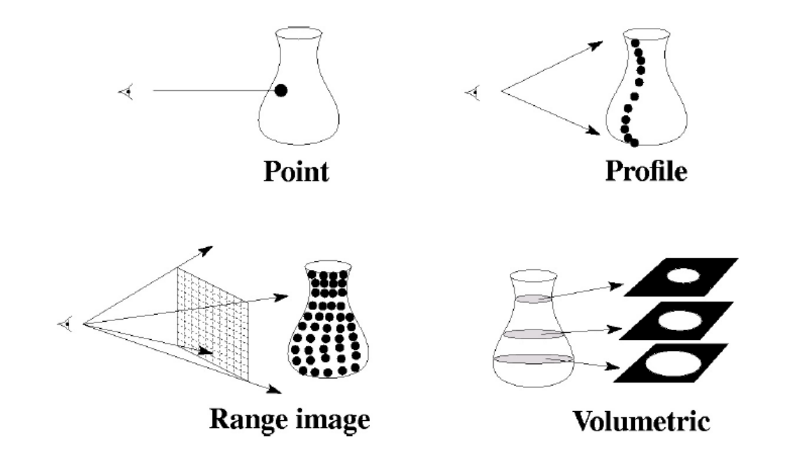

## 1.1 Volume Scanning     

- Input: a sequence of slice images     
- Output: 3D models of human organs     

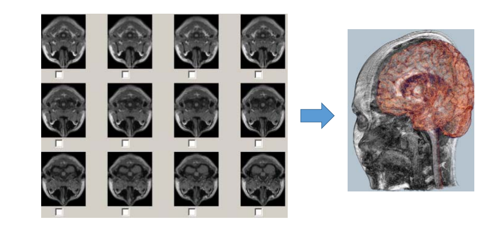

> 采集横截面序列，得到物体的空间信息对于医学图像、分割非常重要。    

- Reconstruction from 2D contours

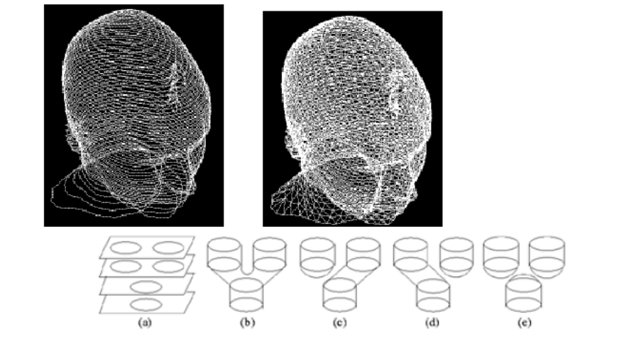      

> Note:contour topology can change   

## 1.2 Shape from shading (SFS)   

- Input: a single image     
- Output: a 3D model (with albedo, normal, etc.)    

### 基本方法

原理：根据 shading 估计出物体的信息相当于渲染的逆过程。[Horn 1980]     

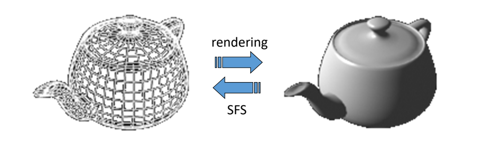      

> [16:40] 不考虑全局光照，只考虑局部光照，即Phong模型    

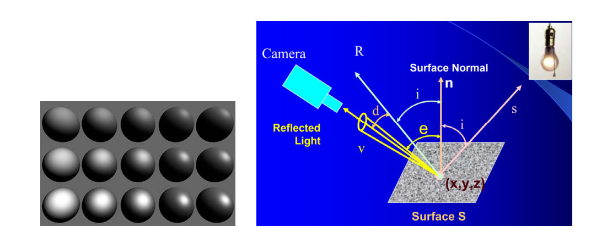      

### 进阶方法

> [17:46] 如果输入多照图片，信息量更大，不仅能重建几何，还能重建材质、Normal。  

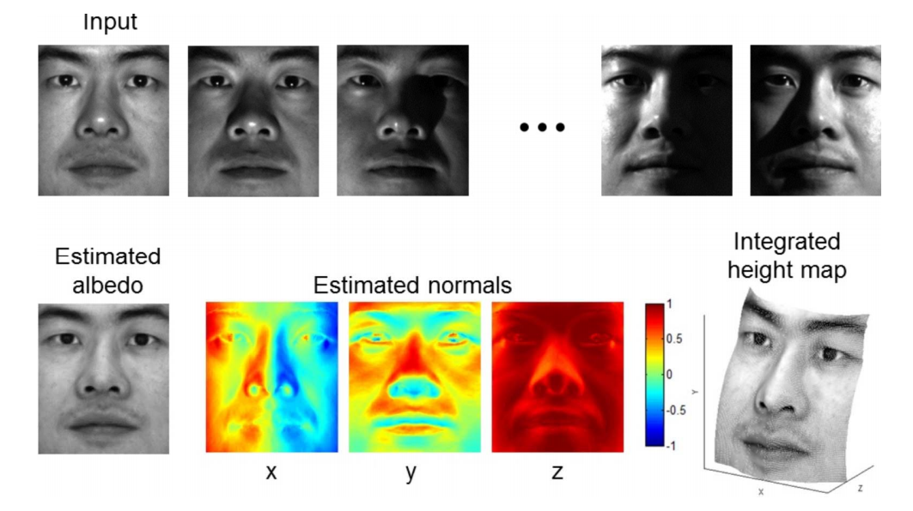      

Jiang et al. 3D Face Reconstruction with Geometry Details from a Single Image. IEEE Transactions on Image Processing, 2018.      
Xu et al. Shading-based Surface Detail Recovery under General Unknown Illumination. IEEE Transactions on Pattern Analysis and Machine Intelligence, 2018.      


Wu et al. Unsupervised learning of probably symmetric deformable 3D objects fro images in the wild. CVPR 2020. (Best paper award)    


## Shape from a single image – Learning based method

> 以图像中提取出置信度、深度、纹理，然后重建出原图、单张图像建3D模型，结果不唯一，需要先验知识，或者用多视角。   

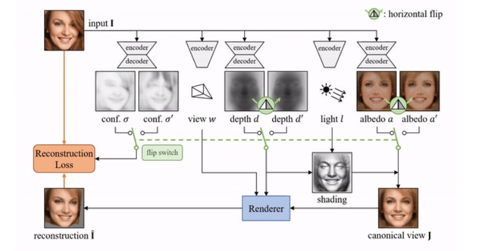      


Two confidence-adjusted reconstruction losses are minimized at the same time with asymmetric weights.     

Wu et al. Unsupervised learning of probably symmetric deformable 3D objects fro images in the wild. CVPR 2020. (Best paper award)      

## 1.3 Image based modeling (IBM)     

- Input: multiple photos from different views     
- Output: 3D models    

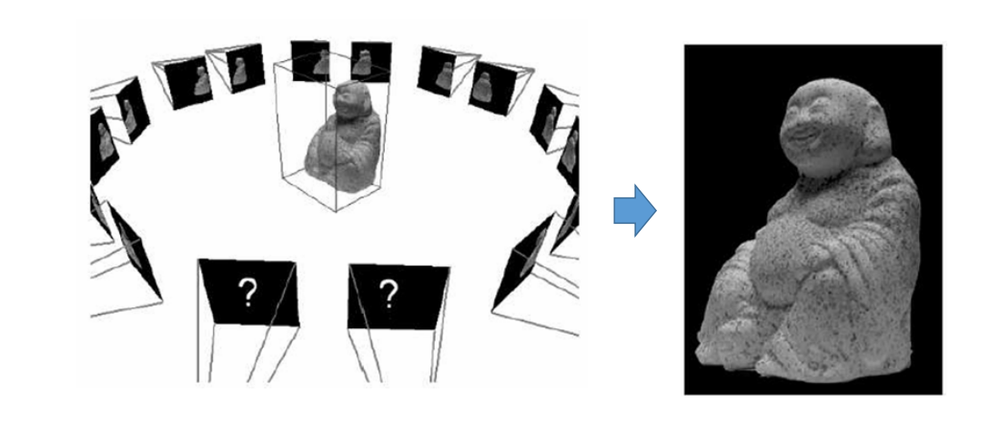    

**原理**：  

两个相机有视角差。模型同一个点在两个相机中出现在不同的位置。    
用(\\(R\\)旋转、\\( t \\)位置)来描述一个相机的状态   
找出两个相机的对应关系  

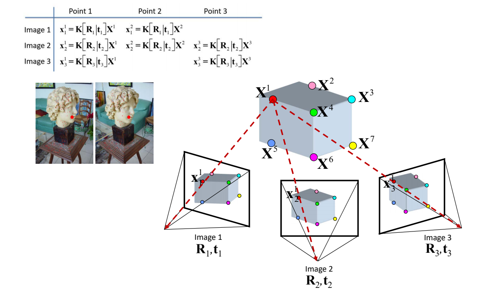    

> [23：43] 已知\\(x\\)点在三个相机呈像中的坐标     
\\((R、t)是相机外参， K\\)(焦距)是相机内参     
[25:02表] 公式中\\(K和R\\)是未知的，所有\\(x\\)已知的，根据关系列出等式，得到过约束系统，通过LS，求出内参和外参。     
> 问题：怎么找到对应点？ SIFT    
> [27:46] 多视角动捕存在同步问题   

##  1.4 Structured light （结构光/白光）

> 学术界上称为结构光，工业界称为白光。   

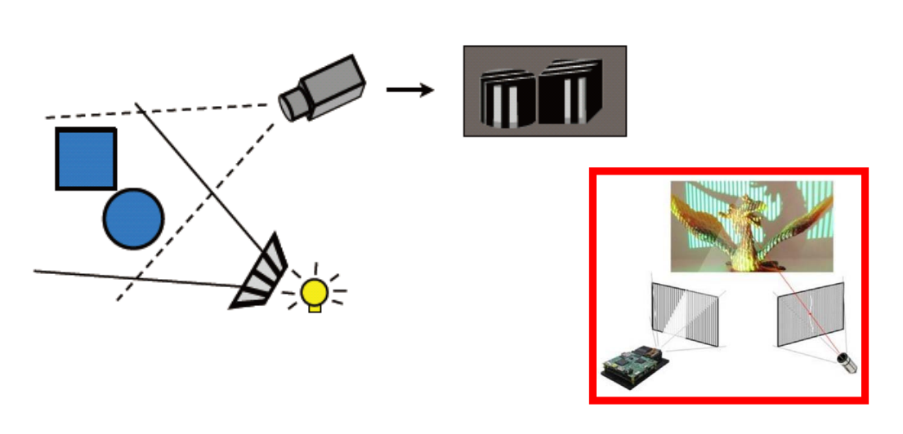    

> [30:05] 只有一个相机，光源向对象打条纹光，找对应关系。     

## 1.5 SfM & SLAM    

### SfM (Structure from Motion，运动恢复结构)

#### 基本概念
SfM是一种从一系列二维图像中自动恢复三维场景结构和相机运动参数的计算机视觉技术。它通过分析多视角图像之间的几何关系，同时求解相机的位姿和三维点云坐标。

#### 核心原理

**数学模型**：
给定多个视角的图像，每个3D点 $\mathbf{X}$ 在不同相机图像平面上的投影关系为：

$$
\mathbf{x}_{ij} = \mathbf{K}_i [\mathbf{R}_i | \mathbf{t}_i] \mathbf{X}_j
$$

其中：
- $\mathbf{x}_{ij}$：第 $i$ 个相机观测到第 $j$ 个3D点的图像坐标
- $\mathbf{K}_i$：第 $i$ 个相机的内参矩阵（焦距、主点、畸变系数）
- $\mathbf{R}_i, \mathbf{t}_i$：第 $i$ 个相机的旋转矩阵和平移向量（外参）
- $\mathbf{X}_j$：第 $j$ 个3D点的世界坐标

**求解过程**：
1. 通过特征匹配建立2D-2D对应关系
2. 使用对极几何（Epipolar Geometry）估计基础矩阵 $\mathbf{F}$ 或本质矩阵 $\mathbf{E}$
3. 从 $\mathbf{E}$ 中分解出相机运动 $\mathbf{R}, \mathbf{t}$
4. 通过三角测量（Triangulation）恢复3D点坐标
5. 使用Bundle Adjustment（光束法平差）优化所有参数

#### SfM的主要流程

```
输入：多视角图像序列
  ↓
1. 特征检测与匹配
  ↓
2. 初始相机姿态估计
  ↓
3. 增量式/全局式重建
  ↓
4. Bundle Adjustment优化
  ↓
输出：稀疏点云 + 相机位姿
```

**详细步骤**：

1. **特征提取与匹配**
   - 使用SIFT、SURF、ORB等算法检测图像中的关键点和描述子
   - 通过描述子匹配建立图像间的对应关系
   - 使用RANSAC算法去除错误匹配（外点）

2. **相机姿态估计**
   - **两视图几何**：通过基础矩阵 $\mathbf{F}$ 或本质矩阵 $\mathbf{E}$ 估计相对相机运动
   - **PnP问题**：已知3D-2D对应关系，求解相机位姿
   - **三角测量**：从两个视角的投影恢复3D点坐标

3. **增量式重建（Incremental SfM）**
   - 选择初始图像对，进行初始化
   - 逐步添加新的图像和3D点
   - 每次添加后进行局部Bundle Adjustment
   - 优点：精度高；缺点：累积误差、效率较低

4. **全局式重建（Global SfM）**
   - 同时估计所有相机的位姿
   - 使用旋转平均（Rotation Averaging）和平移平均（Translation Averaging）
   - 优点：效率髙、无累积误差；缺点：对噪声敏感

5. **Bundle Adjustment（光束法平差）**
   - 非线性优化方法，最小化重投影误差
   - 目标函数：
   $$
   \min_{\mathbf{R}_i, \mathbf{t}_i, \mathbf{X}_j} \sum_{i,j} \| \mathbf{x}_{ij} - \hat{\mathbf{x}}_{ij}(\mathbf{R}_i, \mathbf{t}_i, \mathbf{X}_j, \mathbf{K}_i) \|^2
   $$
   - 使用Levenberg-Marquardt等优化算法求解

#### SfM的关键技术

**1. 特征匹配**
- **SIFT**（Scale-Invariant Feature Transform）：尺度不变特征变换，对旋转、尺度、亮度变化具有鲁棒性
- **SURF**（Speeded Up Robust Features）：SIFT的加速版本
- **ORB**（Oriented FAST and Rotated BRIEF）：基于二进制描述子，计算效率高
- **SuperPoint**：基于深度学习的特征点检测和描述子生成方法

**2. 鲁棒估计**
- **RANSAC**（Random Sample Consensus）：随机采样一致性算法，用于去除错误匹配
- **MLESAC**：最大似然估计采样一致性
- **PROSAC**：渐进采样一致性，提高采样效率

**3. 相机模型**
- **针孔相机模型**：基本投影模型
- **鱼眼相机模型**：大视场角相机
- **全景相机模型**：360度相机

**4. 稠密重建**
- 从稀疏点云生成稠密点云
- 使用PMVS（Patch-based Multi-View Stereo）等算法
- 通过深度图融合生成完整表面

#### SfM的类型

| 类型 | 特点 | 优点 | 缺点 |
|------|------|------|------|
| **增量式SfM** | 逐步添加图像 | 精度高、鲁棒性强 | 累积误差、效率较低 |
| **全局式SfM** | 同时求解所有相机 | 无累积误差、效率高 | 对噪声敏感 |
| **混合式SfM** | 全局初始化+局部优化 | 兼顾精度和效率 | 实现复杂 |

#### SfM的挑战

1. **特征匹配困难**
   - 弱纹理区域（天空、白墙）难以提取特征
   - 重复纹理区域（草地、树叶）容易产生错误匹配
   - **解决方案**：使用深度学习特征、结合语义信息

2. **相机姿态估计误差**
   - 纯旋转运动导致尺度不确定性
   - 相机内参未知或不准确
   - **解决方案**：使用已知尺度的相机、结合IMU数据

3. **动态物体干扰**
   - 场景中的运动物体（行人、车辆）会影响重建
   - **解决方案**：动态物体检测与剔除、使用RANSAC鲁棒估计

4. **大规模场景重建**
   - 图像数量巨大，计算复杂度高
   - 内存消耗大
   - **解决方案**：分布式计算、增量式处理、场景分块

5. **光照变化**
   - 不同时间拍摄的图像存在光照差异
   - **解决方案**：使用光照不变特征、GAN数据增强

#### 开源SfM系统

- **COLMAP**：流行的SfM和MVS系统，提供完整的重建流程
- **OpenMVG**：开源多视角几何库，模块化设计
- **Theia**：高效SfM库，支持大规模重建
- **Bundler**：早期的SfM系统，奠定了基本流程
- **VisualSFM**：图形界面SfM工具，易于使用

#### SfM与SLAM的对比

| 维度 | SfM | SLAM |
|------|------|------|
| **应用领域** | 计算机视觉、摄影测量 | 机器人学、增强现实 |
| **核心目标** | 离线三维重建 | 实时定位与建图 |
| **处理方式** | 批量离线处理 | 在线增量处理 |
| **精度要求** | 高精度（厘米级甚至毫米级） | 实时性优先，精度适中 |
| **计算资源** | 可使用高性能计算 | 受限于嵌入式平台 |
| **输出结果** | 稠密点云、三维模型 | 稀疏地图、相机轨迹 |
| **特征跟踪** | 特征匹配（Frame-to-Frame） | 特征跟踪（Feature Tracking） |
| **优化方法** | 全局Bundle Adjustment | 滑动窗口优化、位姿图优化 |

### SLAM (Simultaneous Localization and Mapping，同步定位与建图)

- SfM: Structure from Motion     
- SLAM: Simultaneous Localization and Mapping     

|  SfM   |  SLAM  |
|  ----  | ----  |
| Vision  | Robotics |
| Structure  | Mapping |
| Camera poses  | Location |
| 3D reconstruction  |   Localization   |
| Feature tracking  | Prediction |   

> 输入RGB图像、内置IMU记录位置，得到点的对应关系。     
被动式：被动获得3D坐标   
常用于机器人领域。    
 
**SLAM的主要流程**    

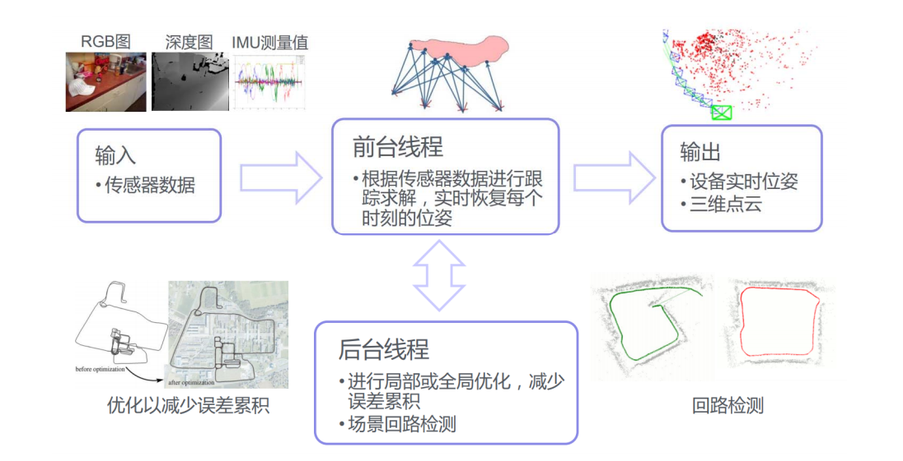    

**SLAM的关键模块**：
1. **前端（视觉里程计）**：估计相邻帧间的相机运动
2. **后端**：优化相机轨迹和地图点的非线性优化
3. **闭环检测**：检测相机是否回到之前的位置，消除累积误差
4. **建图**：构建环境的三维地图

**SLAM的主要方法**：
- **特征点法**：提取特征点，建立数据关联（如ORB-SLAM）
- **直接法**：使用像素亮度信息，不需要特征提取（如LSD-SLAM、DSO）
- **半直接法**：结合特征点和直接法（如SVO）

**SLAM的挑战**：
- 尺度不确定性（单目SLAM）
- 动态环境
- 计算资源受限
- 长期运行的鲁棒性

## 1.6 Laser Radar （激光雷达测距）    

LiDAR = Light Detection And Ranging,     

原理：**主动**向目标发射探测信号（激光束）,然 后将接收到的从目标反射回来的信号（目标回波）与发射信号进行比较（三角测距）

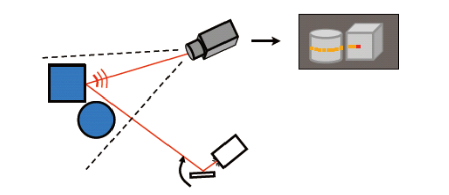    

## 1.7 Depth Images    

- Microsoft Kinect     
- Apple Primesense     
- Intel RealSense     
- Google Project Tango     
- Asus Xtion     
- iPhone XI/XII    


### Depth Data: Grid Points   

2.5D image：     

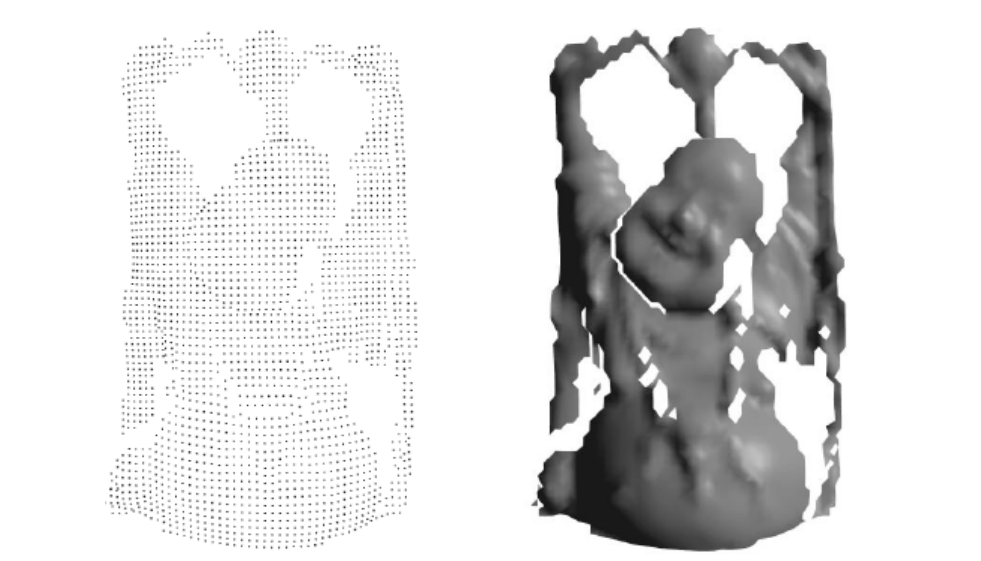    

### 深度相机原理 

**TOF** = Time of flight     

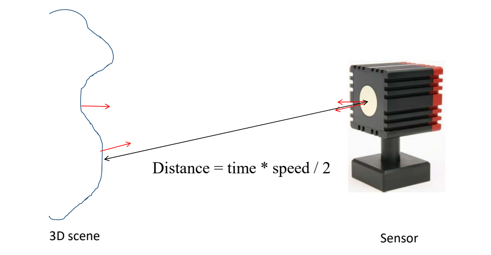    

> 通过发射一个点计算回来的时间估计深度。  
只能采集小的对象    

**Kinect**    

当激光穿透毛玻璃后形成随机衍射斑点，这些散斑（laser speckle）具有高度的随机性，而且会随着距离的不同变换图案（pattern）。空间中任意两处散斑图案都不同     
Light coding打出了一个具有三维纵深的“体编码”，只要看物体表面的散斑图案，就可以知道这个物体在什么位置      

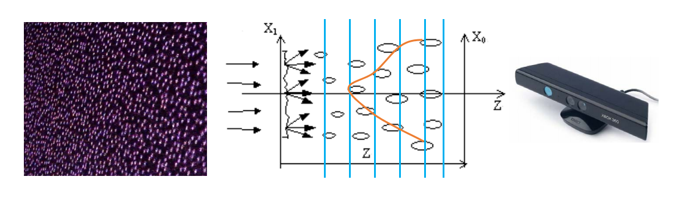    

> Kinect Fusion [40:00]：使用CPU:通过隐函数来做实时重建

## 1.8 Shape from Silhouette/Contours     

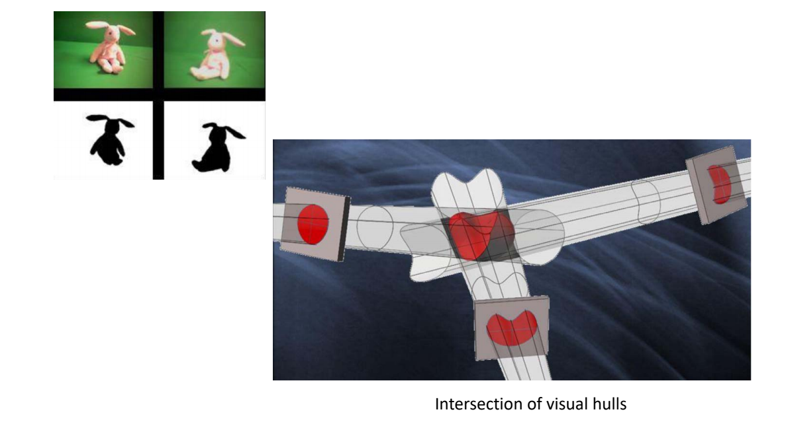    

> [41:00] 扫略体形成的交集就是物体本身       
适用于轮廓清晰的物体    


> 后面的机械方法都跳过

---  

> 本文出自CaterpillarStudyGroup，转载请注明出处。
https://caterpillarstudygroup.github.io/GAMES102_mdbook/
 
