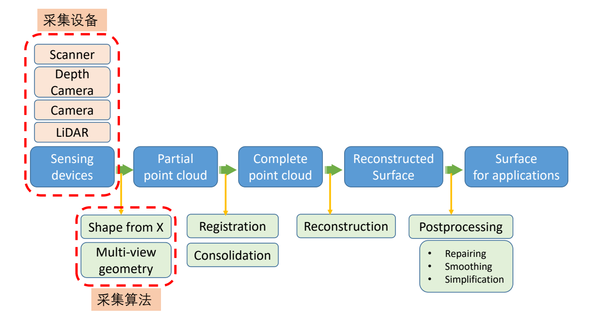
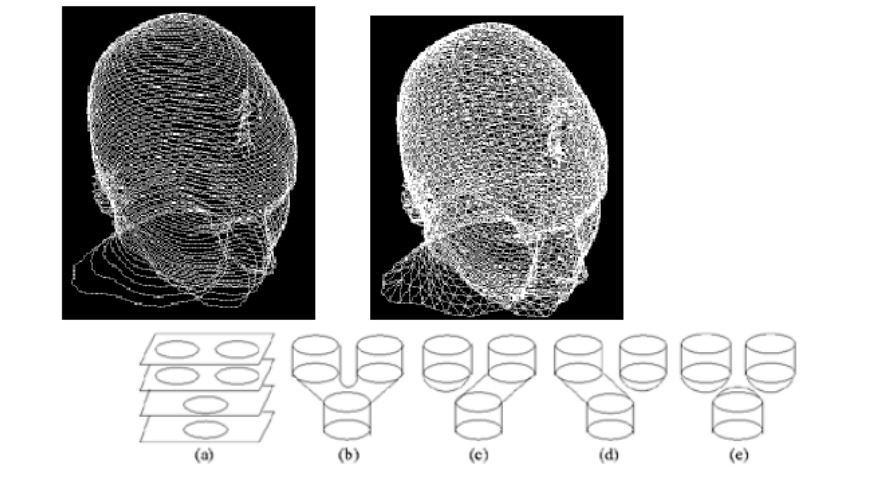
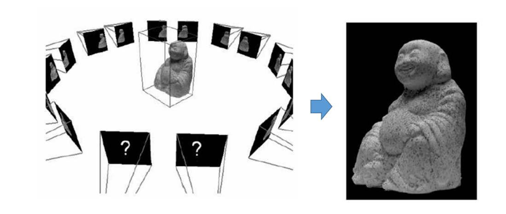
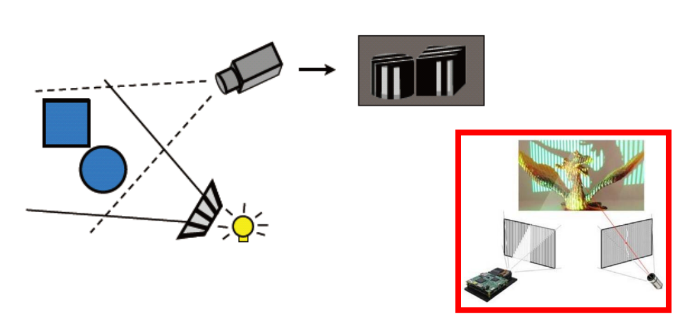
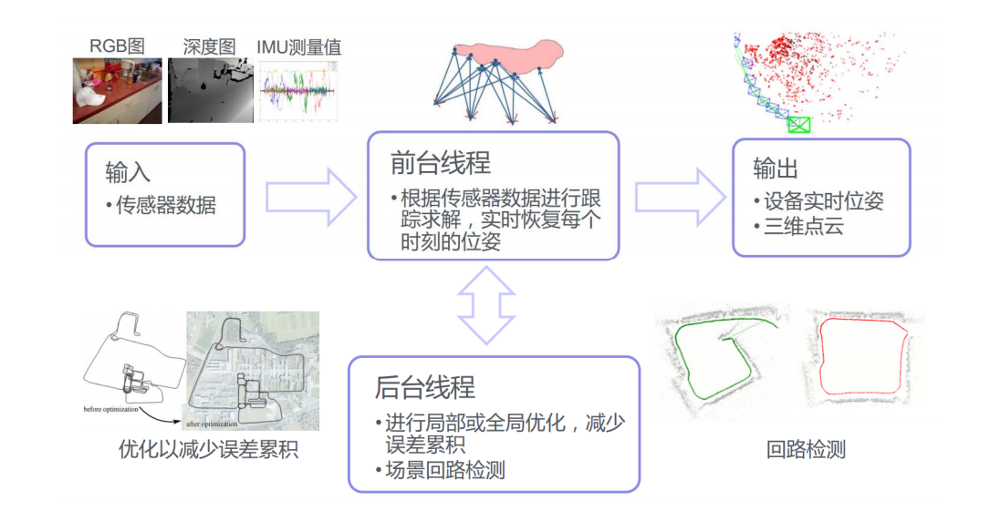
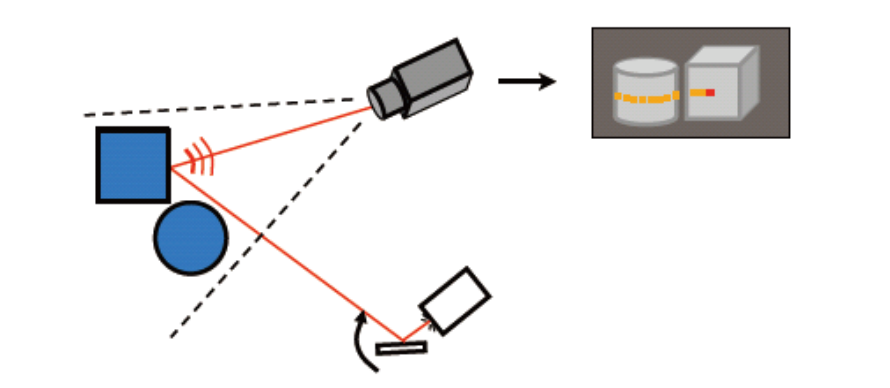
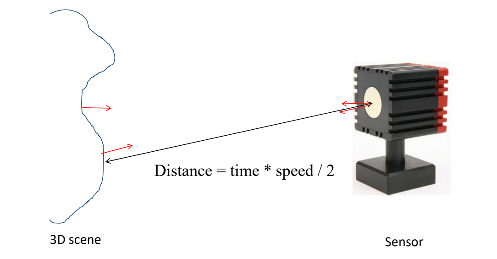
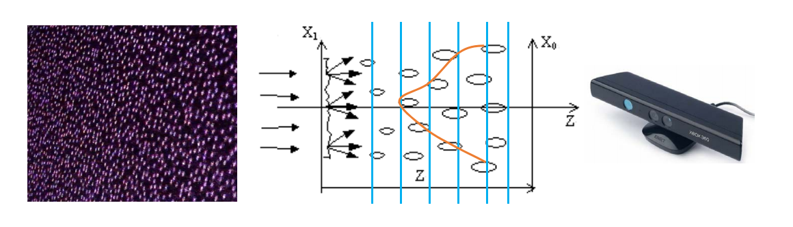

# 1. Acquisition （数据采集）   

Structure of Data:  

## 1.1 Volume Scanning     

- Input: a sequence of slice images     
- Output: 3D models of human organs     

> 采集横截面序列，得到物体的空间信息对于医学图像、分割非常重要。    

- Reconstruction from 2D contours

      

> Note:contour topology can change   

## 1.2 Shape from shading (SFS)   

- Input: a single image     
- Output: a 3D model (with albedo, normal, etc.)    

### 基本方法

原理：根据 shading 估计出物体的信息相当于渲染的逆过程。[Horn 1980]     

      

> [16:40] 不考虑全局光照，只考虑局部光照，即Phong模型    

      

### 进阶方法

> [17:46] 如果输入多照图片，信息量更大，不仅能重建几何，还能重建材质、Normal。  

      

Jiang et al. 3D Face Reconstruction with Geometry Details from a Single Image. IEEE Transactions on Image Processing, 2018.      
Xu et al. Shading-based Surface Detail Recovery under General Unknown Illumination. IEEE Transactions on Pattern Analysis and Machine Intelligence, 2018.      

Wu et al. Unsupervised learning of probably symmetric deformable 3D objects fro images in the wild. CVPR 2020. (Best paper award)    

## Shape from a single image – Learning based method

> 以图像中提取出置信度、深度、纹理，然后重建出原图、单张图像建3D模型，结果不唯一，需要先验知识，或者用多视角。   

      

Two confidence-adjusted reconstruction losses are minimized at the same time with asymmetric weights.     

Wu et al. Unsupervised learning of probably symmetric deformable 3D objects fro images in the wild. CVPR 2020. (Best paper award)      

## 1.3 Image based modeling (IBM)     

- Input: multiple photos from different views     
- Output: 3D models    

    

**原理**：  

两个相机有视角差。模型同一个点在两个相机中出现在不同的位置。    
用(\\(R\\)旋转、\\( t \\)位置)来描述一个相机的状态   
找出两个相机的对应关系  

    

> [23：43] 已知\\(x\\)点在三个相机呈像中的坐标     
\\((R、t)是相机外参， K\\)(焦距)是相机内参     
[25:02表] 公式中\\(K和R\\)是未知的，所有\\(x\\)已知的，根据关系列出等式，得到过约束系统，通过LS，求出内参和外参。     
> 问题：怎么找到对应点？ SIFT    
> [27:46] 多视角动捕存在同步问题   

##  1.4 Structured light （结构光/白光）

> 学术界上称为结构光，工业界称为白光。   

    

> [30:05] 只有一个相机，光源向对象打条纹光，找对应关系。     

## 1.5 SfM & SLAM    

- SfM: Structure from Motion     
- SLAM: Simultaneous Localization and Mapping     

|  SfM   |  SLAM  |
|  ----  | ----  |
| Vision  | Robotics |
| Structure  | Mapping |
| Camera poses  | Location |
| 3D reconstruction  |   Localization   |
| Feature tracking  | Prediction |   

> 输入RGB图像、内置IMU计录位置，得到点的对应关系。     
被动式：被动获得3D坐标   
常用于机器人领域。    
 
**SLAM的主要流程**    

    

## 1.6 Laser Radar （激光雷达测距）    

LiDAR = Light Detection And Ranging,     

原理：**主动**向目标发射探测信号（激光束）,然 后将接收到的从目标反射回来的信号（目标回波）与发射信号进行比较（三角测距）

    

## 1.7 Depth Images    

- Microsoft Kinect     
- Apple Primesense     
- Intel RealSense     
- Google Project Tango     
- Asus Xtion     
- iPhone XI/XII    

### Depth Data: Grid Points   

2.5D image：     

    

### 深度相机原理 

**TOF** = Time of flight     

    

> 通过发射一个点计算回来的时间估计深度。  
只能采集小的对象    

**Kinect**    

当激光穿透毛玻璃后形成随机衍射斑点，这些散斑（laser speckle）具有高度的随机性，而且会随着距离的不同变换图案（pattern）。空间中任意两处散斑图案都不同     
Light coding打出了一个具有三维纵深的“体编码”，只要看物体表面的散斑图案，就可以知道这个物体在什么位置      

    

> Kinect Fusion [40:00]：使用CPU:通过隐函数来做实时重建

## 1.8 Shape from Silhouette/Contours     

    

> [41:00] 扫略体形成的交集就是物体本身       
适用于轮廓清晰的物体    

> 后面的机械方法都跳过

本文出自CaterpillarStudyGroup，转载请注明出处。
https://caterpillarstudygroup.github.io/GAMES102_mdbook/  
