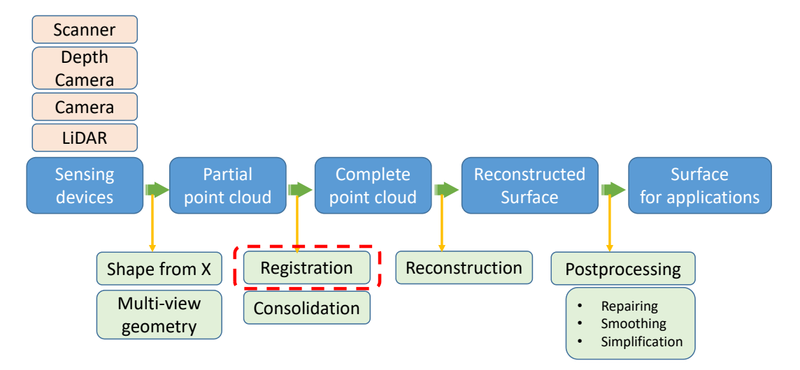
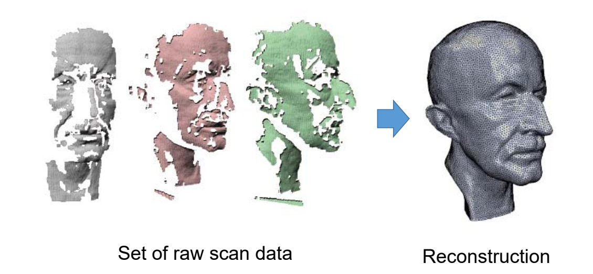
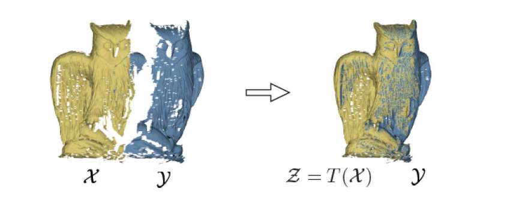
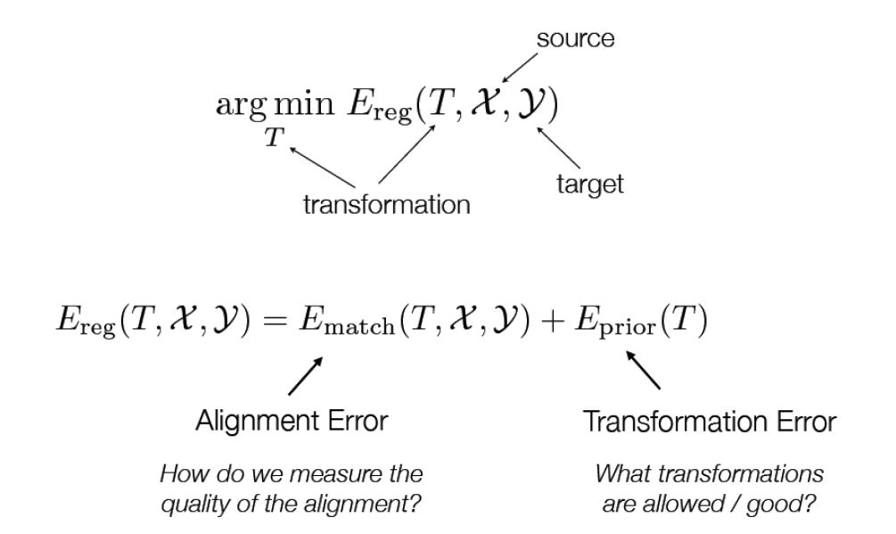
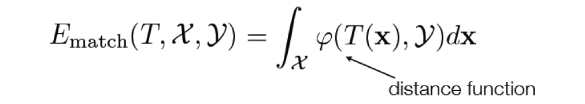
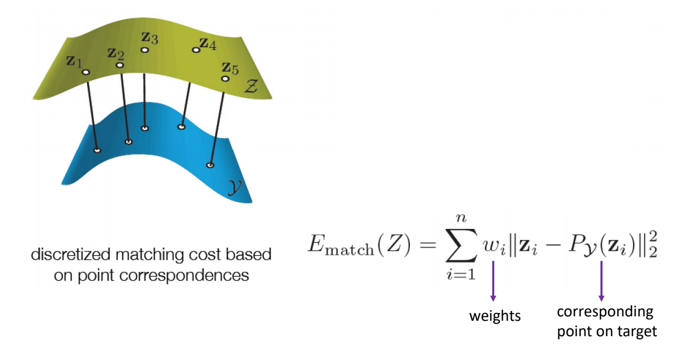
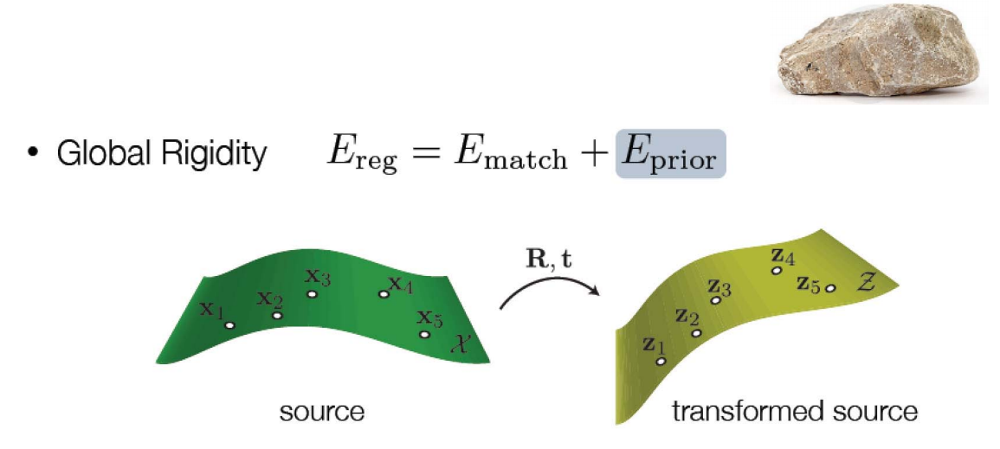
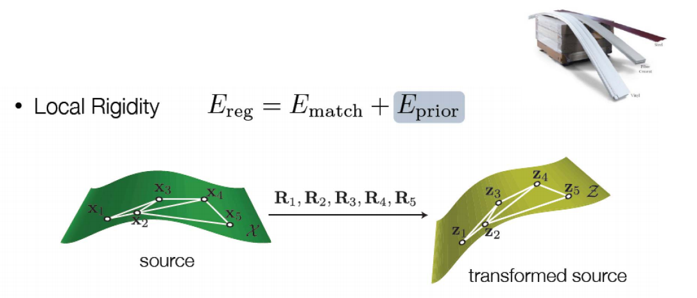
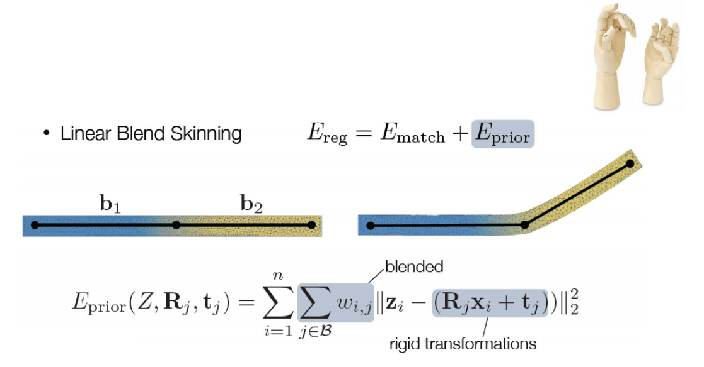
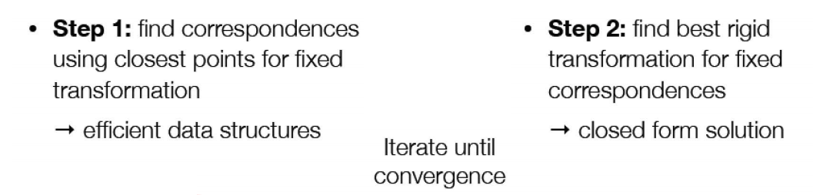

# 2. Registration    

    

要解决的问题：Reconstruction from scans

    

多个视点的扫描，每个视点得到分片3D数据，**如何将这些分片数据合并成一个整体数据**？       

> 各个角度采集到的特体是碎片的，怎么拼起来？    
Planing 怎么扫不同角度得到完整数据    

## Pairwise Registration    

目标：  
Align a source model \\(\chi\\) onto　a target model \\(y\\)，find a transformation  T \\(\chi\\) that brings \\(\chi\\) into alignment with \\(y\\)      
挑战：  
- How do we measure the quality of the alignment?     
- What transformations are acceptable?    

    

**基本方法**：Registration as energy minimization-    

    

> energy包含两部分：Alignment Error和Transformation Error，分别对应解决上面的两个挑战。  
[46:21] Ematchi ：匹配误差， Eprior:先验知识     

### Alignment Error   

    

    

### Prior Error – 1 (Rigid objects)   

    

$$
E_{prior}(\mathbf{Z,R,t})=\sum_{i=1}^{n} ||\mathbf{Z}_i-(\mathbf{RX}_i+\mathbf{t})||^2_2
$$

### Prior Error – 2 (Elastic objects)

> 弹性物体，存在少量变形   

    

$$
E_{prior}(\mathbf{Z},(R_i))=\sum_{i=1}^{n} \sum_{j\in \mathcal{N}_{i}}||(\mathbf{Z}_j-\mathbf{Z}_i)-R_i(\mathbf{X}_j-\mathbf{X}_i)||^2_2
$$

### Prior Error – 3 (Articulated objects)    

> 分段刚性

    

## Iterative Closest Point (ICP) Algorithm
[Besl+92]

    

> 根据对应点求变换关系(R.t)      
根据变换关系就对应点    

---  

> 本文出自CaterpillarStudyGroup，转载请注明出处。
https://caterpillarstudygroup.github.io/GAMES102_mdbook/

