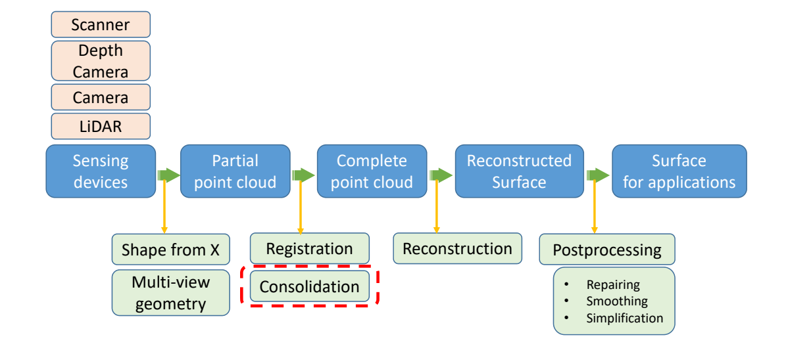
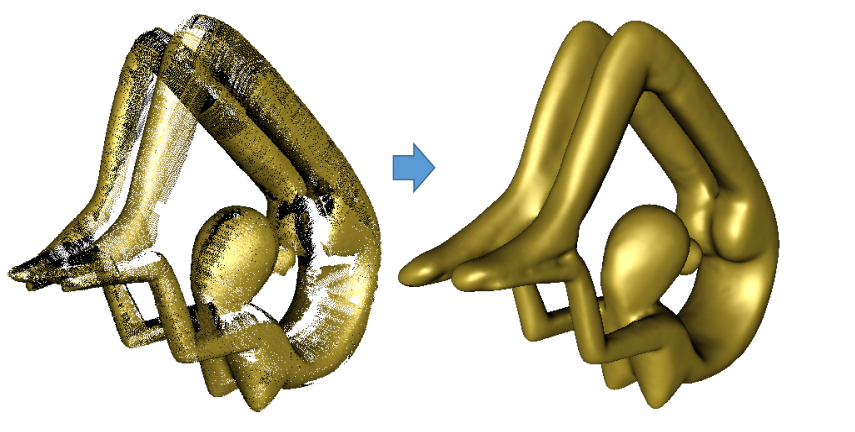
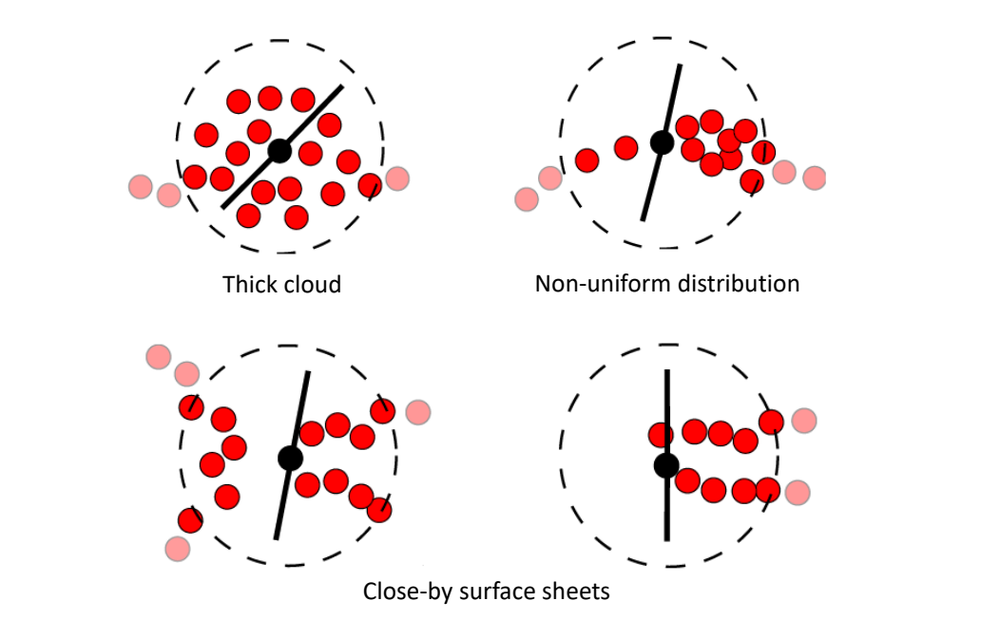
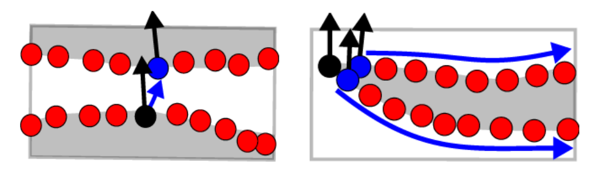
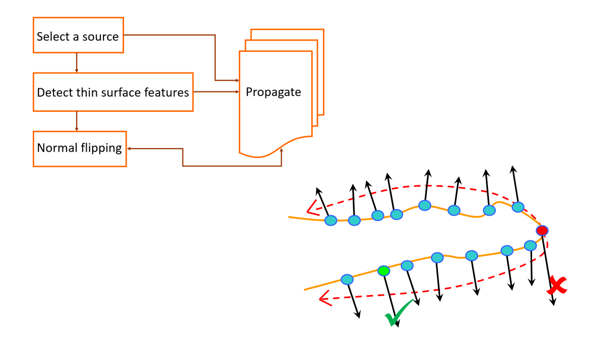
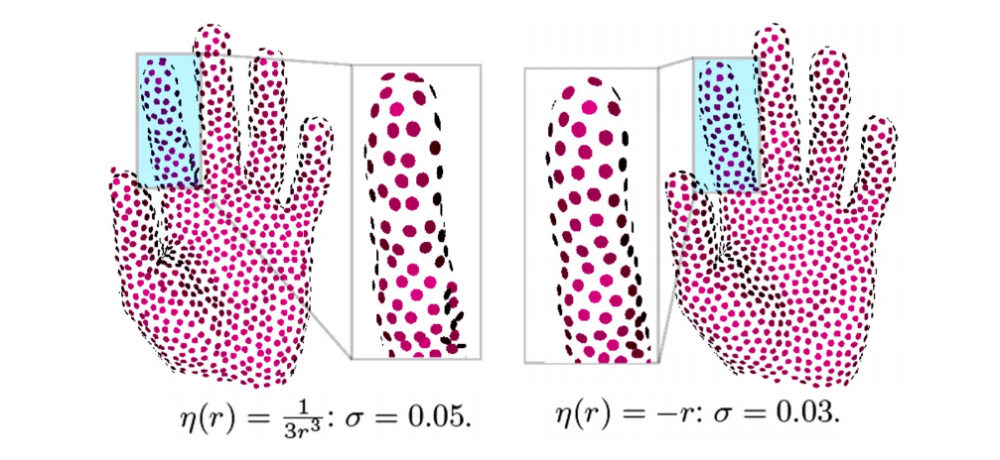
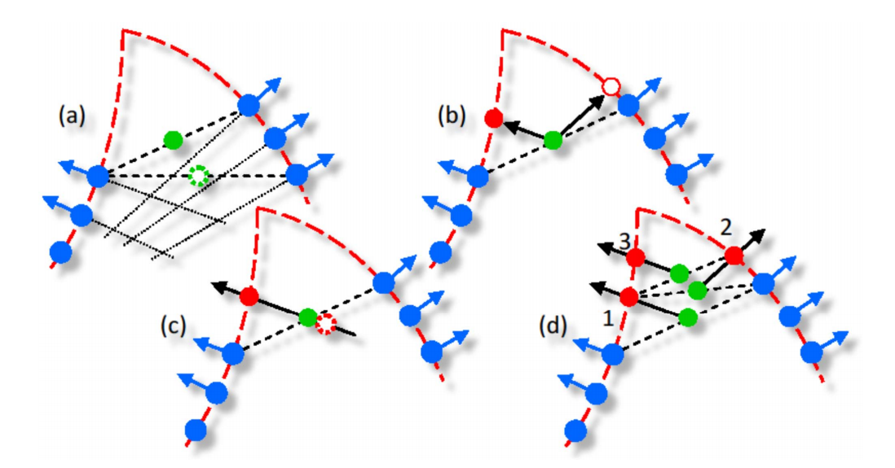
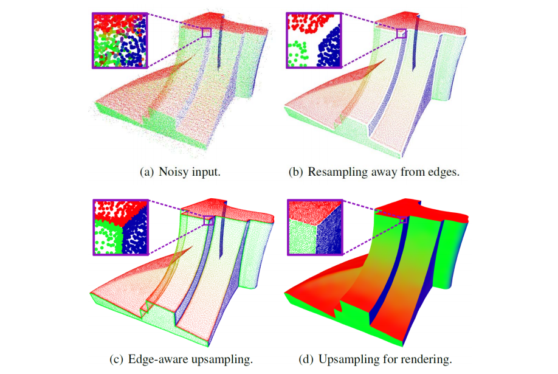

# 3. Consolidation     

    

> 校准之后的结果还有些问题。在配准之前对物体做前处理

  

**Imperfect Acquisition**:    

- Outliers --> Outlier‐free    
- Noisy data --> Clean   
- Orientation --> Oriented   
- Large missing parts    
- Non‐uniform sampling --> Uniform    
- Blurred features --> Thin   
- …       

  

> [52:03图] Thick cloud.不是流形，怎么去掉多余点    
左下图，点为靠近，拓扑关系会出错。   

## Orientation --> Oriented

  

> 从某个非常置信的 normal 开始传播，夹角<90，   
> [37:24图] 难以处理尖锐特征 

Zhang et al. Multi‐Normal Estimation via Pair Consistency Voting. IEEE TVCG, 2019.     
Liu et al. Quality Point Cloud Normal Estimation by Guided Least Squares Representation. SMI 2015.    
Huang et al. Consolidation of Unorganized Point Clouds for Surface Reconstruction. Siggraph Asia 2009.    

  

> [55:30]为了保证特征点，在非特征处，法线正常传播。在特征处，特殊处理    

Huang et al. Consolidation of Unorganized Point Clouds- for Surface Reconstruction. Siggraph Asia 2009.    

## Non‐uniform sampling --> Uniform

> Sample 不均匀会导致很多重建算失效      

### 方法一

  

Huang et al. Consolidation of- Unorganized Point Clouds for Surface Reconstruction. Siggraph Asia 2009.      

### 方法二： Edge‐Aware Resampling (2D) 

  

Huang et al. Edge‐Aware Point Set Resampling. ACM TOG 2013.      

### Edge‐Aware Resampling (3D)    

  

Huang et al. Edge‐Aware Point Set Resampling. ACM TOG 2013.     

---  

> 本文出自CaterpillarStudyGroup，转载请注明出处。
https://caterpillarstudygroup.github.io/GAMES102_mdbook/
 

