# 4. Reconstruction   

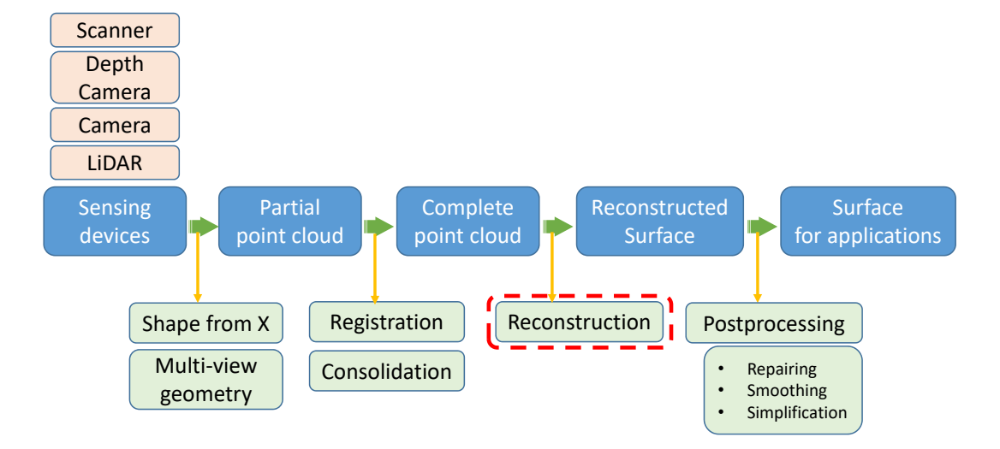  

## Surface Reconstruction    

> 把3D点重建成连续的或非连续的曲面    

- Input: A set of points in 3D that sampled from a model surface     
- Output: A 2D manifold mesh surface that closely approximates the surface of the original model    
    
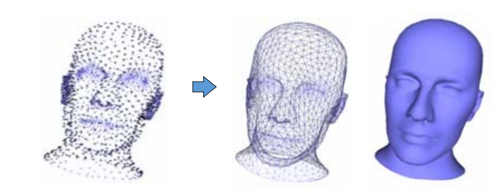      

### 难点：Desirable Properties    

- No restriction on topological type     

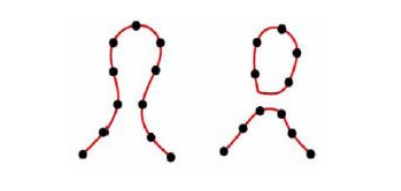  

- Representation of range uncertainty     
- Utilization of all range data     
- Incremental and order independent updating    
- Time and space efficiency    
- Robustness    
- Ability to fill holes in the reconstruction     

### Solutions    

- Approximation methods: Constructing continuous functions (Scattered data interpolation schemes)     
    - NURBS surfaces    
    - Signed distances [Hoppe et al. 1992]    
    - Radial basis function reconstruction [Carr et al. 2001]     
    - Poisson reconstruction [Kazhdan et al. 2006]     
 - Discrete methods: Constructing triangle meshes directly    
    - [Amenta & Bern 1998]    
    - Power‐crust [Amenda et al. 2001]    
    - Cocone [Dey & Giesen 2001]    
    - [Cazals & Giesen 2006]    
    - …

# Approximation methods
## NURBS surfaces

[59:30] NURBS 逼近法:用一个函数逼近点云

## Implicit Approximation Methods (similar to GAMES 102‐9)     

### 第一步： Convert point cloud into a signed distance field   

For every point, add two *off‐surface* points, one inside and one outside the surface in the direction of the normal     
Add a point only if it is closest to its source     
N≈3n points    
> [1:01:26] \\(n\\)个点产生了\\(3n\\)个点，分别是(-1,0，1)     

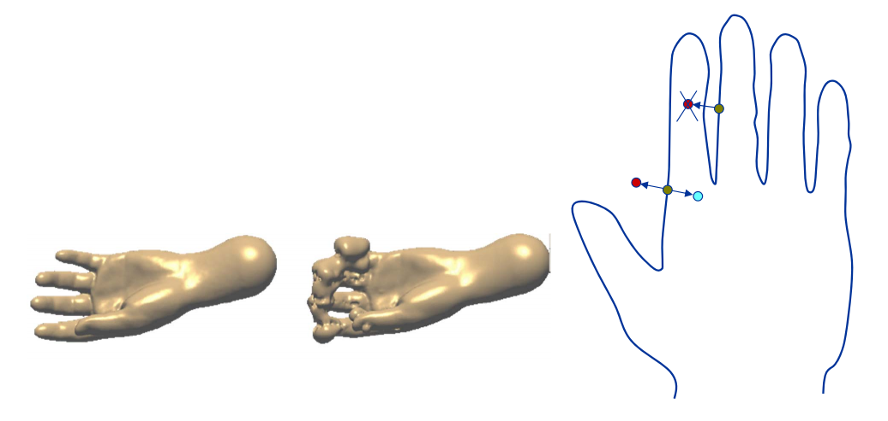     

### 第二步：Construct an implicit function whose iso‐surface with iso‐value 0 to approximate the field     
构造高维（4D）曲面，使得函数的0整面经过这些点   

### 第三步： Extract the mesh surfaces from the implicit function     

Marching cube methods

### Complexity     

- Storage O(\\(N^2\\))      
- Solving the \\(W_i O(N^3)\\)          
- Evaluating f(x) O(N)       

Carr et al. Reconstruction and representation of 3D objects with Radial Basis Functions, SIGGRAPH 2001.    

## (2) MPU Implicits    

> 根据距离场自适应地剖分，一种自适应版本的Marching Cube    

MPU = Multi‐level partition of unity implicits:    
- Given: data points with normal    
- Computes: hierarchical approximation of the signed distance function    

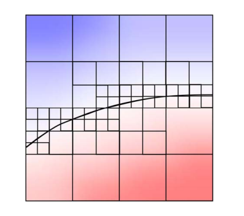  

Ohtake et al. Multi‐level Partition of Unity Implicits, SIGGRAPH 2003    

## (3) Possion reconstruction    

Idea: fitting an indicator function     

$$
\chi M(x)=\begin{cases}
1 & \text{  } x\in M \\\\
0 & \text{ } x\notin M
\end{cases}
$$

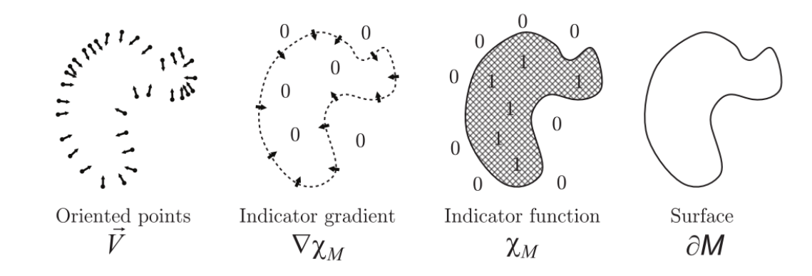  

Kazhdan et al. Poisson surface reconstruction. SGP 2006.

> 隐函数方法对法向非常敏感     
不仅逼近函数，还逼近梯度本身    
把重建问题变成方程求解隐函数的问题    
[1:08:39]隐函数求解后要找到上面的点，用 Marching Cube   

## (4) Marching Cube   

method for approximating surface defined by isovalue  \\(\alpha\\), given by grid data      
- Input:    
  - Grid data (set of 2D images)    
  - Threshold value (isovalue)  \\(\alpha\\)     
- Output:    
  - Triangulated surface that matches isovalue surface of  \\(\alpha\\)      

具体步骤：  
- First pass    
  - Identify voxels which intersect isovalue    
- Second pass    
  - Examine those voxels，For each voxel produce set of triangles，approximate surface inside voxel    

  

# Discrete methods
    
## Curve from Points

### 第一步：Connect the Dots    

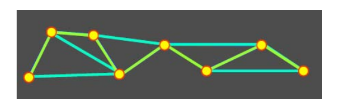  

Can be ambiguous     
 - Use Voronoi Diagram    
 - Construct Delaunay triangulation    
 
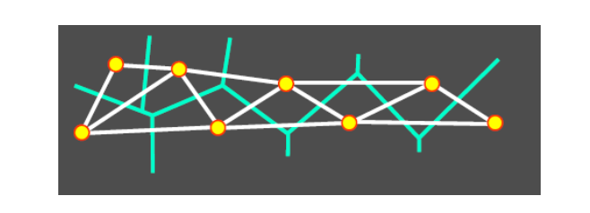  

### 第二步：基于字典学习的曲面重建    

Xiong et al. Robust Surface Reconstruction via Dictionary Learning. Siggraph Asia 2014.    

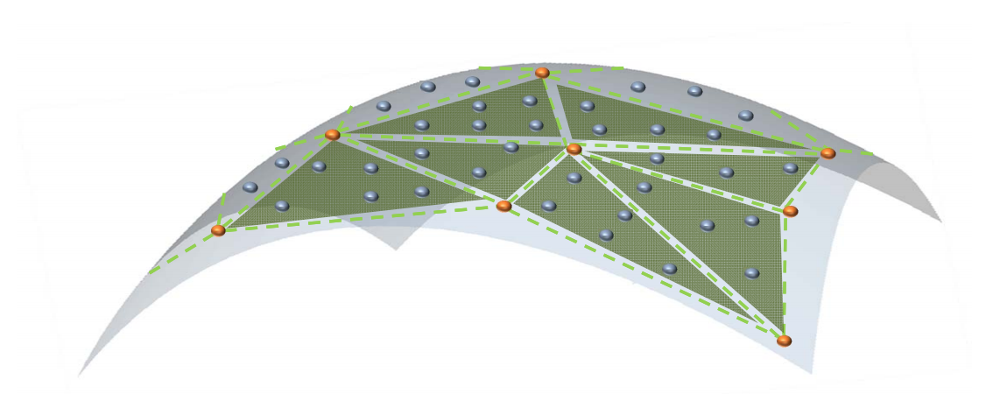     

 - 输入：三维点集（蓝色点）P    
 - 输出    
    - 采样点集（红色点）V    
    - V构成的三角网格M，使得M逼近P   

**问题**   
- **误差度量**：如何度量点集P与网格M之间的误差？    
答：**某个点到三角形的距离**

> 难点:红点的位置和连接关系未知     
度量:蓝点到三角形面片的距离最小     
用交替法求解V和B,稀疏优化中的字典学习问题    

$$
d(\mathbf{p}_i,f) =|| \mathbf{p}_i-\mathbf{p}_i^{\prime} || 
$$

$$
\begin{aligned}
=\min _{\substack{\alpha+\beta+\gamma=1 \\\\
\alpha, \beta, \gamma \geq 0}}||\mathbf{p}_i-(\alpha \mathbf{v}_r+\beta \mathbf{v}_s+\gamma \mathbf{v}_t)||
\end{aligned}
$$

> 
\\({P}' _i=\alpha ^{\ast}V_r+\beta ^{\ast}V_s+\gamma ^{\ast}V_t\\)

\\((\alpha ^{\ast},\beta ^{\ast},\gamma ^{\ast})\\):\\({P}' _i\\)相对与\\(f\\)的重心坐标     

> 

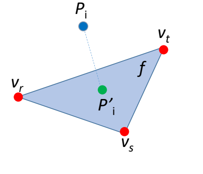  

**某个点到三角形的距离**    

$$
d(\mathbf{p}_i,f) =|| \mathbf{p}_i-\mathbf{p}_i^{\prime} || 
$$

$$
\begin{aligned}
=\min _{\substack{\alpha+\beta+\gamma=1 \\\\
\alpha, \beta, \gamma \geq 0}}||\mathbf{p}_i-(\alpha \mathbf{v}_r+\beta \mathbf{v}_s+\gamma \mathbf{v}_t)||
\end{aligned}
$$

> 

\\(\mathbf{Ｖ}=[\mathbf{Ｖ}_1,\mathbf{Ｖ}_2,\cdots ,\mathbf{Ｖ}_m] \in  \mathbb{R }^{3\times m}\\)

Vertex matrix of **M**  
> 

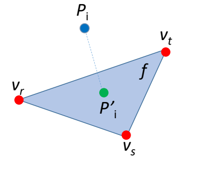  

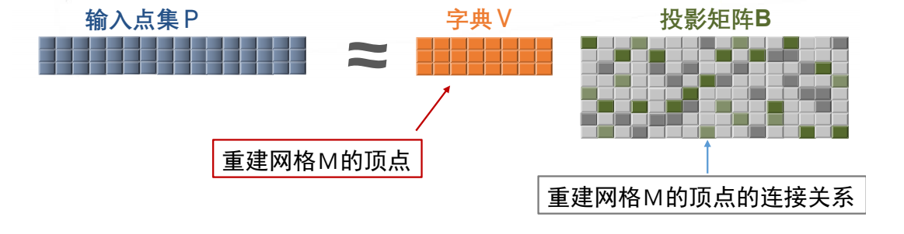

### 特点

- Iterative Refinement   

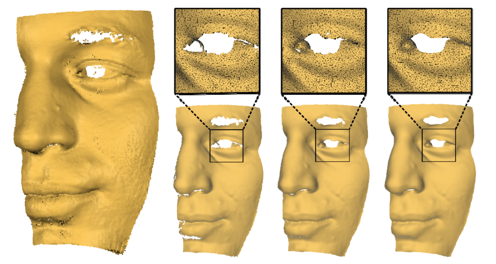

- Resistant to Noise   

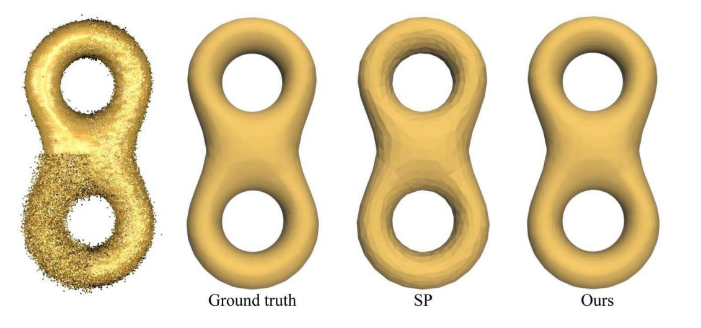

- Feature Preserving

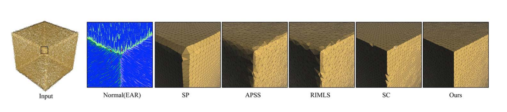

Implicit methods need normal information, while normal estimation is another challenging problem.     

### Conclusion   

Model the surface reconstruction problem via **dictionary learning**     
 - VS Implicit method    
    - Straightforward    
    - Approximation error is considered    
 - VS Existing Explicit method     
    - Denoising the input point cloud    
    - Global approximation error    

> dictionary learning是一种半显式的方法。

## Hybrid Methods

### (1) Competing Fronts     

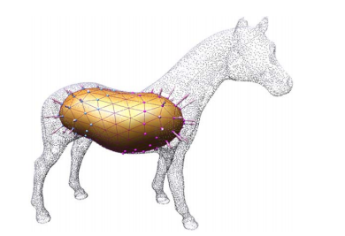   

> [1:21:10] 假设物体是封闭曲面。   
物体内的距离场不断膨胀，形成 mesh    

Sharf et al. Competing Fronts for Coarse–to–Fine Surface Reconstruction. Eurographics 2006.

## (2) Cooperative Evolutions  

 - Two deformable models     
    - One from interior     
    - The other from exterior    
 - Alternative evolutions     

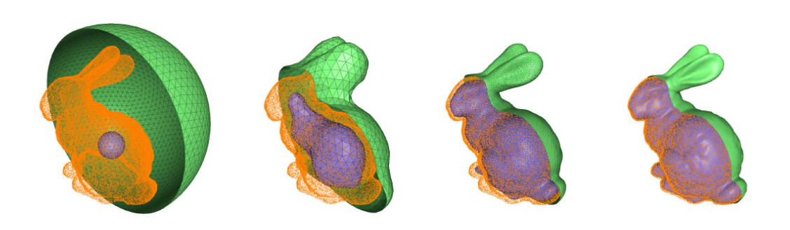

> [1:23:02] 改进版:里面的球不断膨胀。外面的球不断收缩，直到两个曲面靠近,适用于有大的空洞的物体。

Lu and Liu. Surface Reconstruction via Cooperative Evolutions. CAGD 2020.    

本文出自CaterpillarStudyGroup，转载请注明出处。
https://caterpillarstudygroup.github.io/GAMES102_mdbook/  
