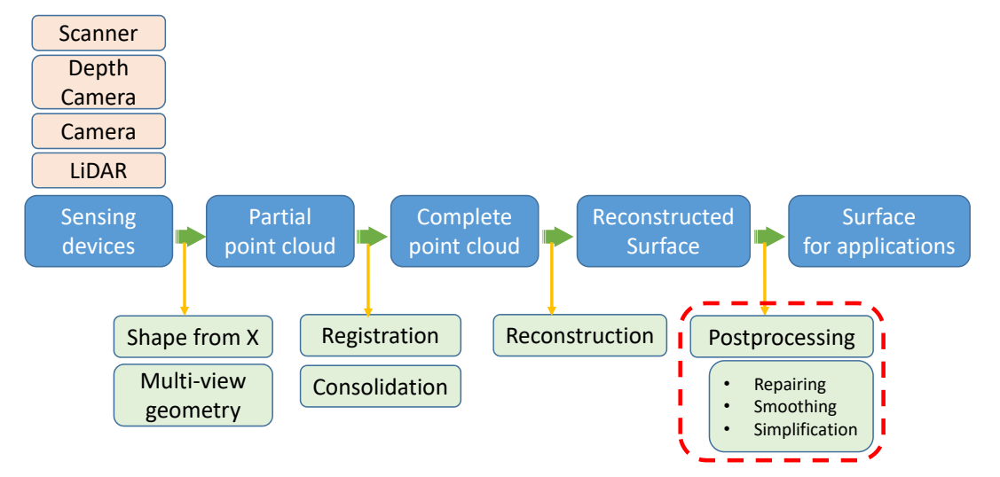
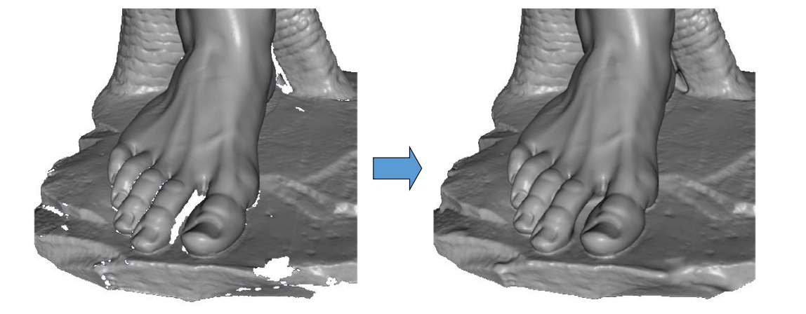
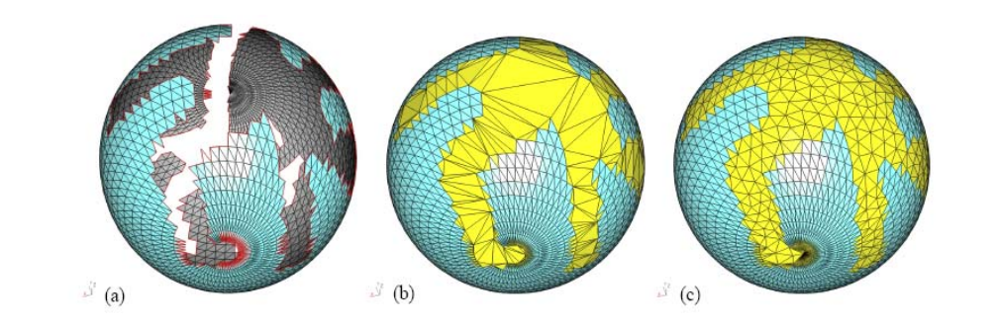
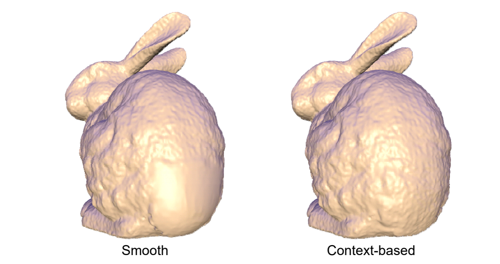
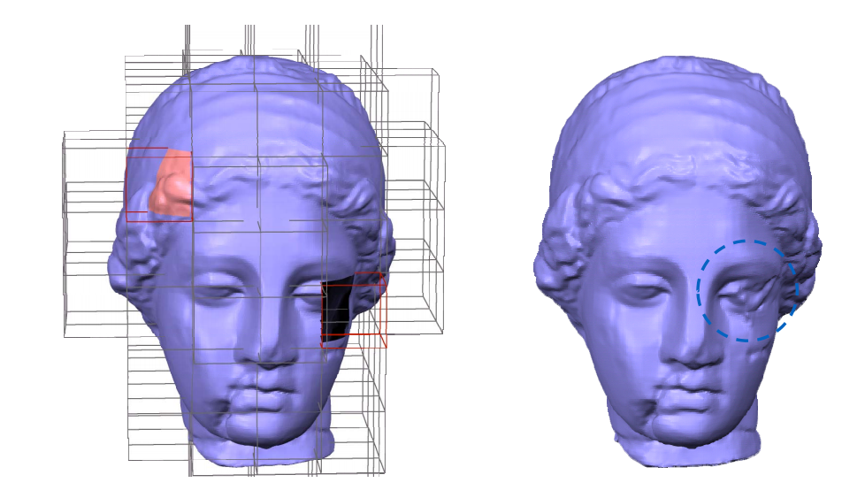
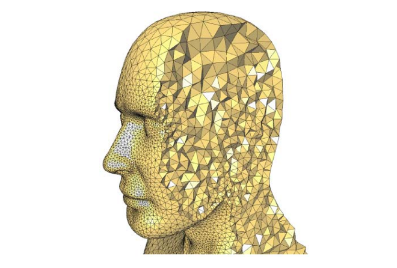

# 5. Post‐processing    

Repairing, denoising, smoothing, simplification…    

Repairing (completion, hole‐filling, restoration)   

## (1) Filling Holes in Meshes      

[Liepa, SGP 2003]    

### Pipeline   

1. Hole identification     
2. Hole triangulation    
3. Mesh refinement     
4. Mesh fairing    

> 对空洞部分三角化 ⇒ 三角形加密    

### Summary    

 - Easy to implement     
 - Focus algorithm on holes     
 - **Triangulation may self‐intersect**    
 - **Can’t fill holes with islands**     
 - **Fairing weaken original surface feature**    

## (2) Robust Repair of Polygonal Models [Ju, Siggraph 2004]

> 没讲，能保证拓扑关系    

 - Employ a space‐efficient octree grid     
 - Produce closed, manifold surface for any input 
model     

## (3) Context‐based Surface Completion    
[Sharf et al., Siggraph 2004]

### Motivation     

Complete the missing region with patches that conform with its context     

> 学习周边的几何细节，再插值    

### Method    

Import patches with matching context from the surface itself:     
 - Analyze surface characteristics.    
 - Find best matching patch.    
 - Fit imported patch to boundary.    

### Limitations: Semantics

   

## (4) Example‐based Surface Completion     
[Pauly et al., SGP 2005]

 - Use **3D model database** to provide geometric priors for shape completion      
 - Apply **non‐rigid transforms** on the models     
    - More deformation \\(\Rightarrow \\) less likely completion    
 - **Consistently** combine geometric information from multiple context models    
 - Final result comes with **confidence values**    
 
> 从数据库里相似的数据来修复缺失的数据    
 
 
## (5) Atomic Volumes for Mesh Completion     
[ Podolak and Rusinkiewicz, SGP 2005]

### Atomic Volumes    

A volume is **atomic** if it doesn’t intersect
the polygons of the mesh.    

  

> 利用内部信息    

## Summary　　　

 - Avoid changing, approximating or re‐sampling the original mesh data     
 - Incorporate user constraints     
 - **Can’t process holes with islands**    

## (6) Geometry Completion by Texture Synthesis    
[Nguyen et al., PG 2005]

> 在图像空间做纹理合成，再恢复到3D空间中    

## (7) Others  

- Marco Attene, Marcel Campen, Leif Kobbelt. Polygon Mesh Repairing: An Application Perspective. ACM Computing Surveys, 2012.     

 - Learning based 3D data completion in recent years    
    - Han et al. High Resolution Shape Completion Using Deep Neural Networks for Global Structure and Local Geometry Inference. ICCV 2017.    
    - Han et al. Deep Reinforcement Learning of Volume‐guided Progressive View Inpainting for 3D Point Scene Completion from a Single Depth Image. CVPR 2019.   
    - Nie et al. Skeleton‐bridged Point Completion: From Global Inference to Local Adjustment. NeuIPS 2020.    

本文出自CaterpillarStudyGroup，转载请注明出处。
https://caterpillarstudygroup.github.io/GAMES102_mdbook/  
