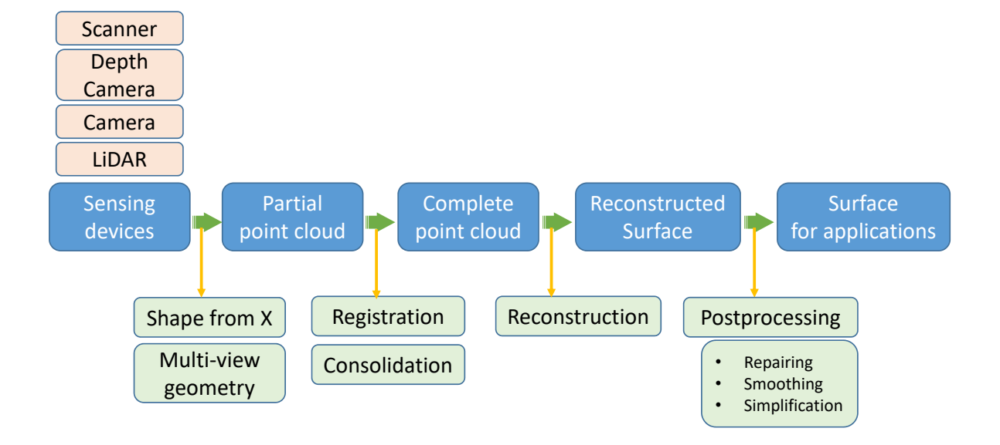

# 曲面重建 (Reconstruction)
   
存在的物体：对其采集并进行数字化构建  
也称为：逆向工程、扫描重、Reverse engineering, scanning    
     
Outline：   

本文出自CaterpillarStudyGroup，转载请注明出处。
https://caterpillarstudygroup.github.io/GAMES102_mdbook/  

