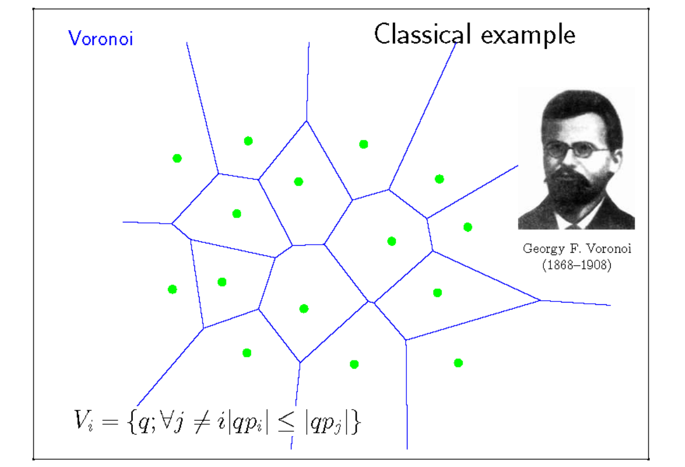
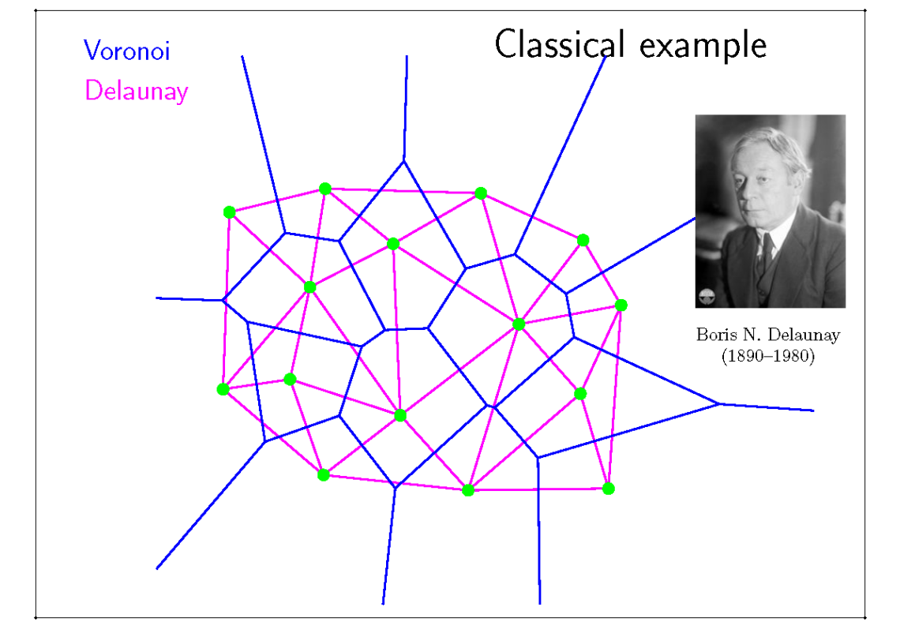
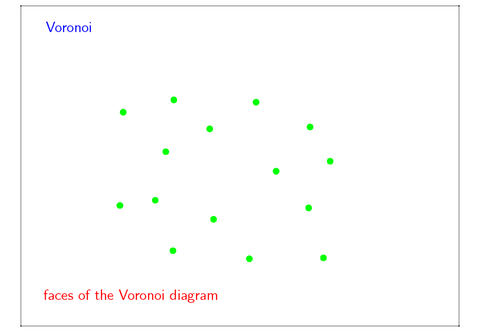
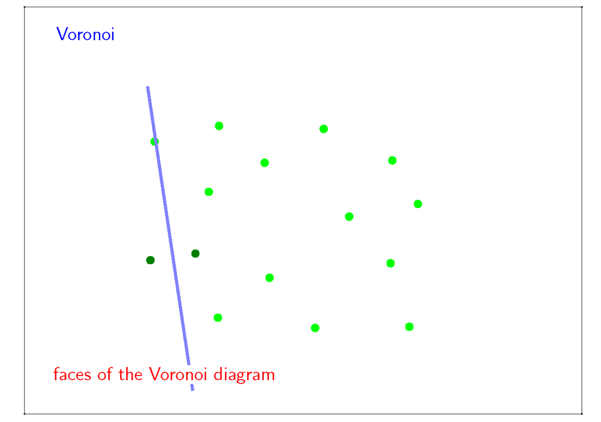
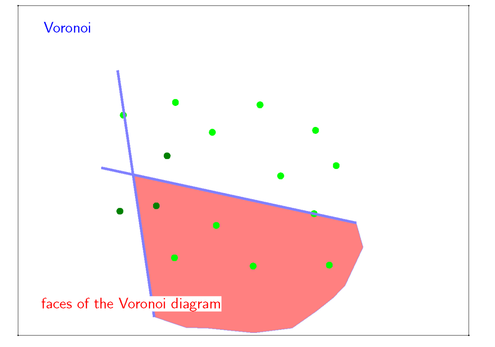
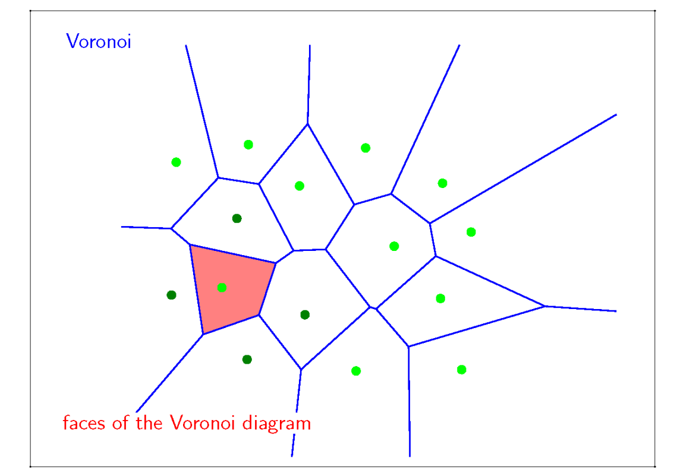
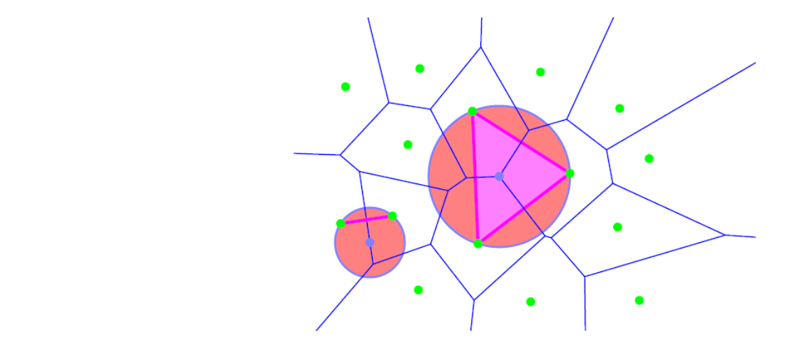
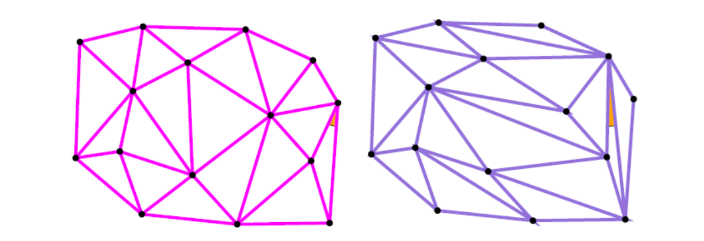
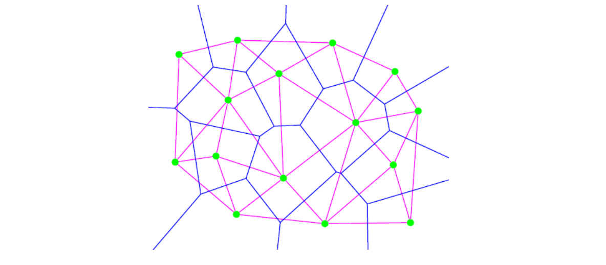

# Delaunay三角化   

> [1:06:28] 一种点云剖分算法    

## 剖分结果

    

> 绿点：点云、平面上的点    

    

> (1) 给每个点一个区域，区域的边界由两个绿点的中垂线构成。（蓝线图）    
(2) 红线图为蓝线图的对偶图    
[?] 什么是对偶图？边对边、面对点是什么意思？     
以图上观察是，点所属区域有几个边，点就会发出多少连线，连线的另一端是区域边界对应的点。    

## 具体过程

    

    

    

    

(1)图称为 Voronoi 图    
(2)图称为 Trangulation 图 

# Properties of DT

> DT: Delaunay Triangulation     

## 空圆性质

Empty sphere property: no points inside the circum‐sphere of any simplex     

空圆性质：三角形外接圆一定不含其它绿点（四点共圆除外）    

    

## 最小角最大    

最小角是指：所有三角形中最小的角      
最大是指：所有可能的三角化方法中，此方法的最小角最大。    

*[Lawson 1977] and [Sibson 1978]*    

    

## 凸包    

三角形最外层边是点集的凸包

    

## 其它

- DT maximizes the arithmetic mean of the radius of inscribed circles of the triangles.    
   - [Lambert 1994]   
- DT minimizes roughness (the Dirichlet energy of any piecewise‐linear scalar function)   
   - [Rippa 1990]   
- DT minimizes the maximum containing radius (the radius of the smallest sphere containing the simplex)    
   - [Azevedo and Simpson 1989], [Rajan 1991]   

# Edge Swapping/Flipping [Sibson 1978]    

> 这是一个求Delaunay的方法

1. Start with any triangulation     
2. find any two adjacent triangles that form a onvex uadrilateral that does not satisfy empty sphere condition    
3. swap the diagonal of the quadrilateral to be a Deluany triangulation of that four points    
4. repeat step 1,2 until stuck.    

    

> 优点：简单、直观、必定收敛。    
缺点：慢、不可并行。

# Algorithms for Voronoi Diagrams    

> 这是一个求Voronoi的方法

- Compute the intersection of n‐1 half‐planes for each site, and “merge” the cells into the diagram    
- Divide‐and‐conquer (1975, Shamos & Hoey)    
- Plane sweep (1987, Fortune)    
- Randomized incremental construction (1992, Guibas, Knuth& Sharir)   
 
---  

> 本文出自CaterpillarStudyGroup，转载请注明出处。
https://caterpillarstudygroup.github.io/GAMES102_mdbook/

