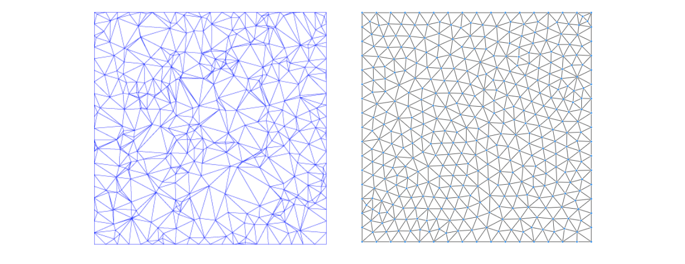
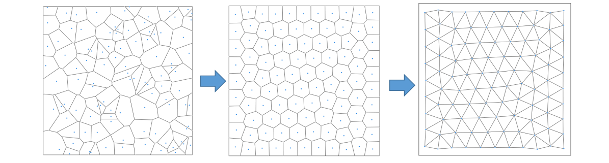
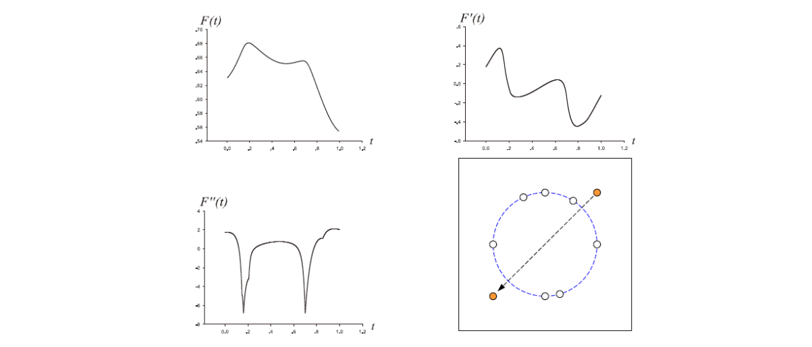

# Mesh Generation    

Given a **fixed point set**, Delaunay triangulation will try to make the triangulation more shape regular and thus is considered as a “good” structured mesh.    

    

**如果点集的位置本身就不好？**

    

> &#x1F446; The **distribution of points** is more important for a good mesh.    

How to sample points to generate high‐quality meshes?    

    

# Centroidal Voronoi Tessellation     

## 定义

**定义**: The VT is a centroidal Voronoi tessellation (CVT) , if each seed coincides with the **centroid** of its Voronoi cell     

    

> &#x1F446; CVT:满是“点与所在区域的重心重合”的 Voronoi 图。    

## 方法

• Construct the  VT associated with the points    
• Compute the centroids of the Voronoi regions    
• Move the points to the centroids    
• Iterate until convergent    

## 效果

    

## CVT理论    

CVT energy function:    

$$
F(X)=\sum_{i=1}^{N} \int _{V_i}\rho (X)||X-X_i||^2dX
$$

CVT is a critical point of \\(F(X)\\), an optimal CVT is a global minimizer of \\(F(X)\\)    

### Geometric interpretation     

The CVT energy with \\(\rho (X)\\) identical to 1, is the volume difference between the circumscribed polytope and the araboloid.    

> \\(\rho (x)\\)是种加权，用于内容相关。    
当 \\(\rho =I 时， X为 V_i \\)的重心时能量最小。    

    

The gradient of \\(F(X)\\) is [Iri et al. 1984; Asami 1991; 
Du et al. 1999]:    

$$
\frac{\partial F}{\partial \chi _i} =2m_i(\chi _i-C_i),
$$
where 
$$
m_i=\int _{\chi\in \Omega _i }\rho (\chi )d\sigma
$$

Lloyd’s method is a gradient descent method, thus has linear convergence    
 
 

### Smoothness of F(X)    

Can BFGS method be applied to computing CVT? Or does CVT energy F(X) have required \\(C^2\\) smoothness?    

Results:   
- It has been noted that F(X) is non‐smooth [Iri et al. 
1984], but without proof    
- It has been proved that F(X) is \\(C^1\\) [Cortes et al. 2005]    
- F(X) is \\(C^2\\) in a convex domain in 2D and 3D [Liu et al. 2009]     

### C2 Continuity of F(X)    

    

**Figure**: Illustration of \\(C^2\\) smoothness of CVT energy in 2D     

## CVT的应用

- CVT on Surface    
- CVT for Remeshing    

> [1:20:59]    
把 CVT 算法推广到曲面，可以把距离改为测地线度量     
连续曲面测地距离：表面上的孤长    
离散网格的测地距离：可参数化到平面再计算 

# Optimal Delaunay Triangulation    

ODT energy function:    

$$
E(X)=||f-f_{I,T }||L^1(\Omega)
$$

$$
=\sum _{\tau \in T}\int _\tau f_I(X)dX-\int _\Omega f(X)dX
$$

    

# CVT VS ODT Energy    

• CVT energy    

$$
F(X)=\sum _{i=1}^N\int _{V_i}||X-X_i||^2dX
$$

• ODT energy    

$$
E(X)=\sum _{\tau \in T}\int _\tau f_I(X)dX-\int _\Omega f(X)dX
$$

    

**比较：**
    

本文出自CaterpillarStudyGroup，转载请注明出处。
https://caterpillarstudygroup.github.io/GAMES102_mdbook/  
