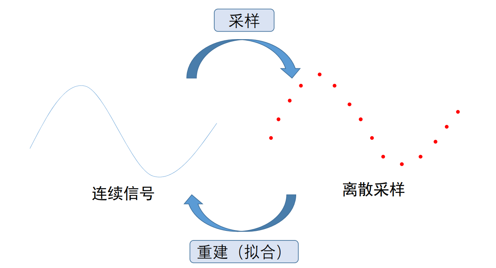
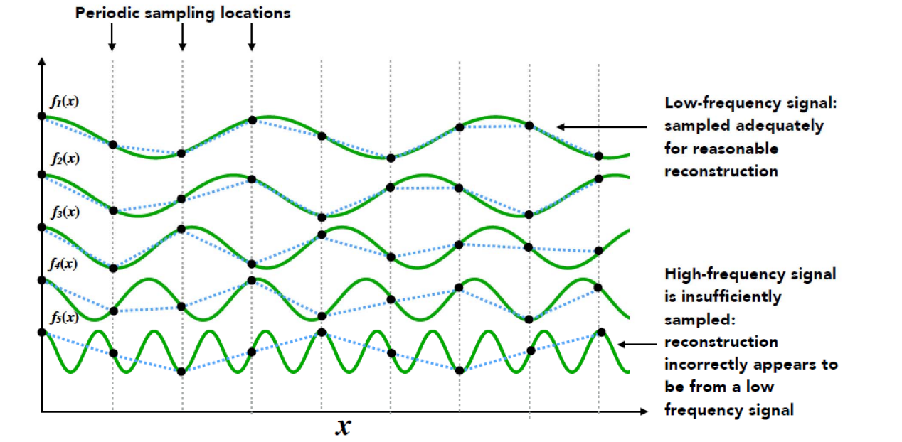
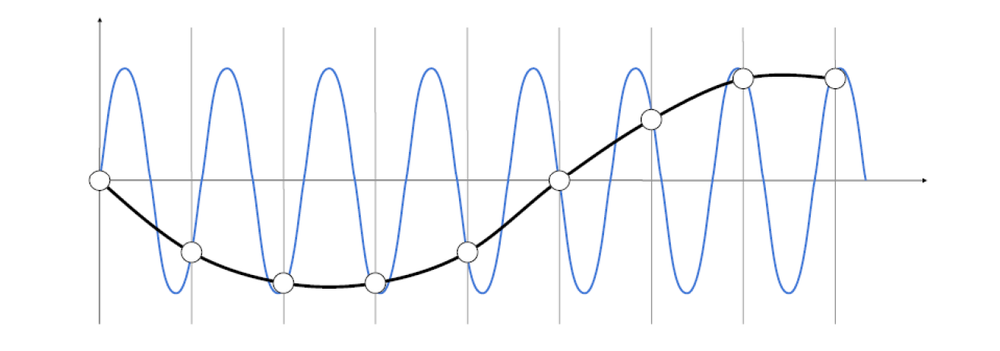
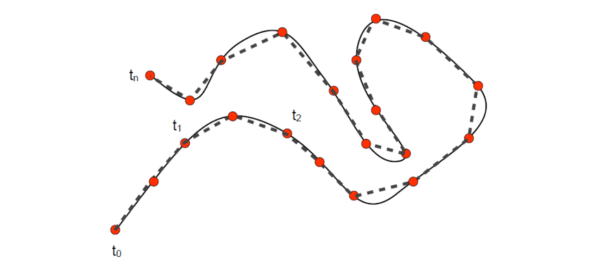
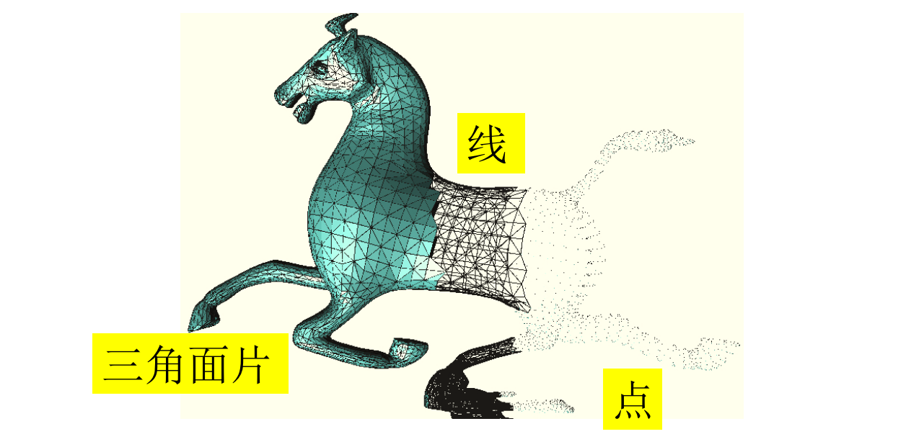
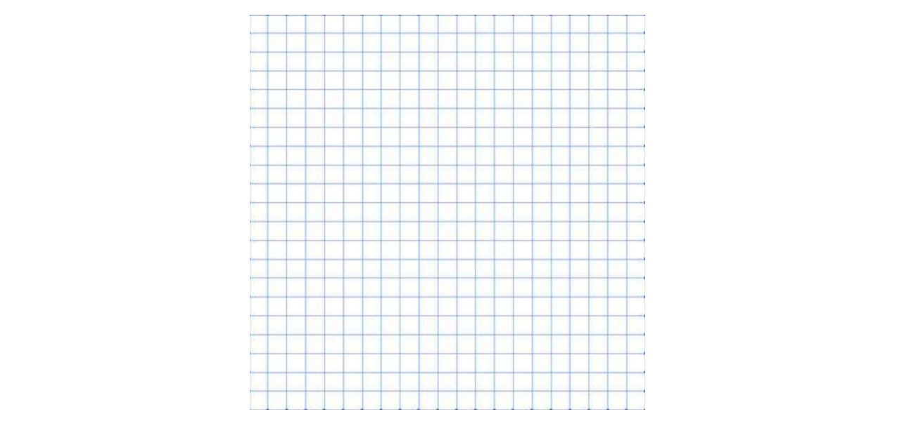
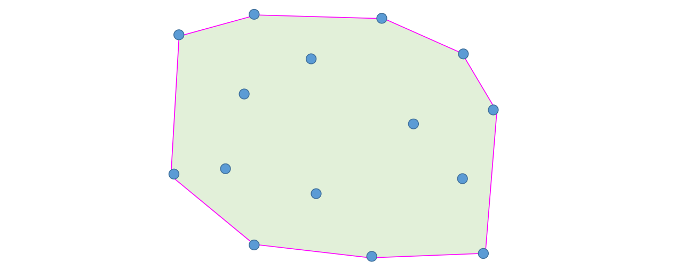
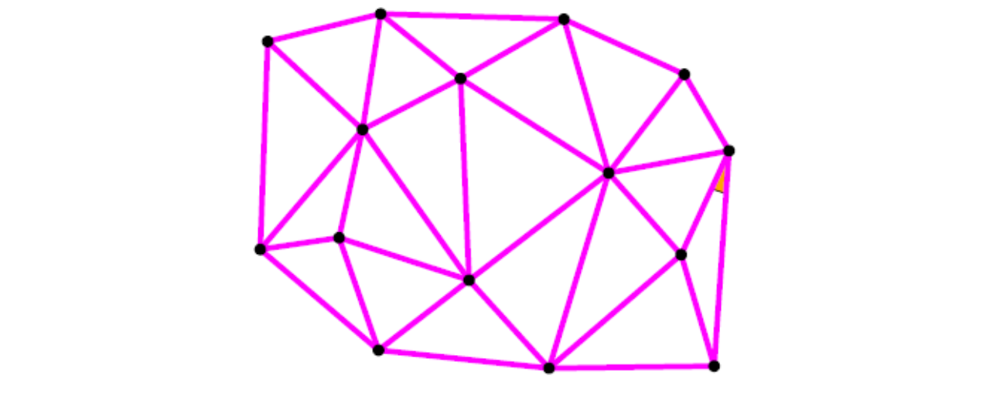
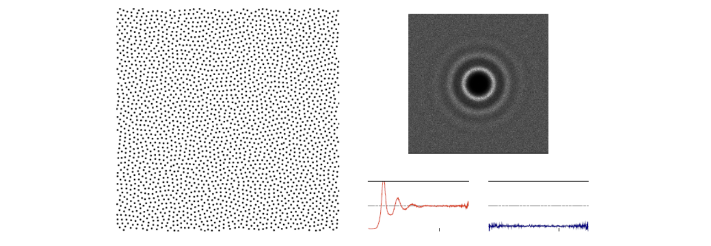
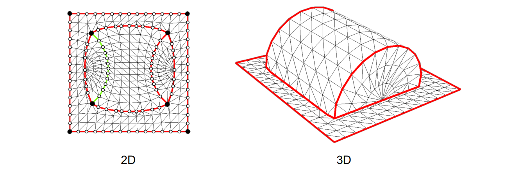

# 采样 (Sampling)   

从连续到离散：[link](../DiscreteCurves/Discretization.md)    
曲线曲面的离散表达：[link](../DiscreteCurves/Discretization.md)        

图像是对区域的采样，视频是对时间的采样    

## 采样与重建    

    

## 采样与信号频率    

**Nyquist–Shannon sampling theorem**   

    

Slide courtesy of Prof. Ren Ng, UC Berkeley   

## 欠采样产生频率的走样    

• 高频函数拟合低频信号：过拟合    
• 低频函数拟合高频信号：欠拟合    

    

# 采样举例

## 1D曲线的采样：分段线性逼近表达    

   

## 2D曲面的采样：分片线性逼近表达     

    

> 三角形面片拟合曲面：分片线性逼近面      
课程以2D为例。    

# 平面区域的采样

## 规则采样     

将一个区域分解为若干个小区域    

    

## 不规则采样    

    

> 如何根据不规则的采样点，把平面**剖分**成子区域（三角形）     

    

## Blue Noise Sampling    

Blue Noise：不均匀且没有规整的 pattern 可通过频谱图来分析。

    
> &#x1F446; 左： A uniformly distributed yet randomly located point set   
> 右：The typical power spectrum, radially averaged ower spectrum and anisotropy of blue noise distributions.         

# 三角化 Triangulation   

复杂函数的分片线性逼近 (piece‐wise linear approximation)   

    

