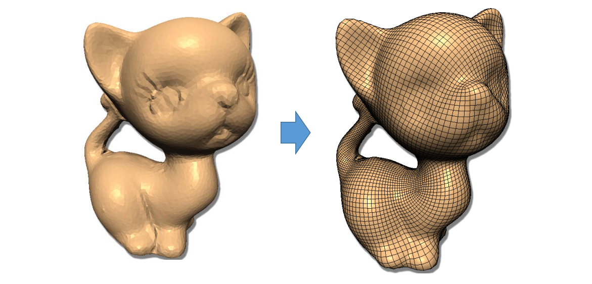
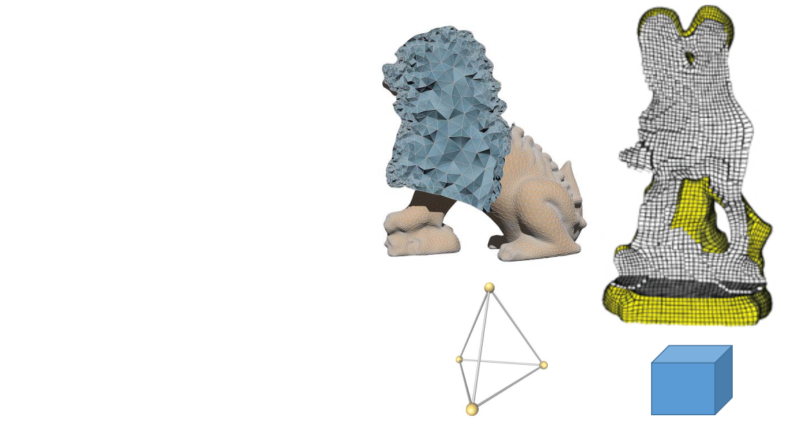
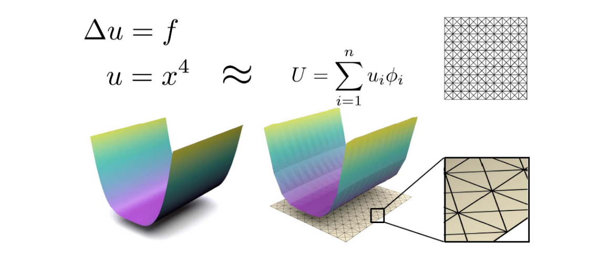
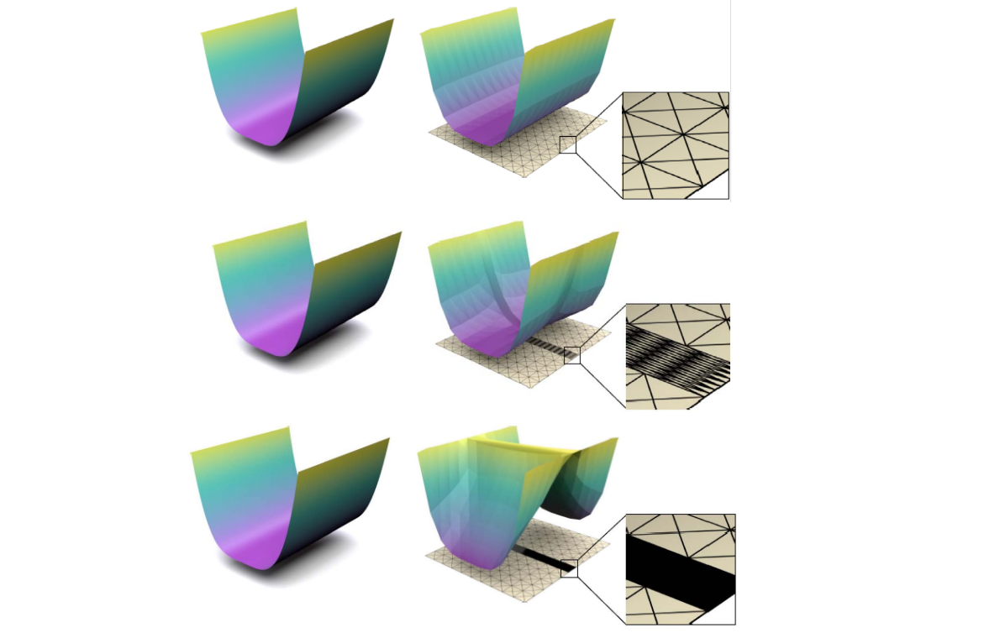

# 高维几何对象的采样与剖分    

    

- 二维流形曲面的采样与网格化   

    

- 二维流形曲面的四边形网格化   

    

# 空间体的采样与剖分    

* Interior of 3D shapes    
• FEM   
• Simulation    
• …    
* Two typical types   
• Tetrahedral meshes    
• Hexahedral meshes   

    

> 表面三角形，内部四面体。    
表面四边形，内部六面体。  

# Solving PDE (FEM)
• Resolution, basis order, element quality…     

    

    

