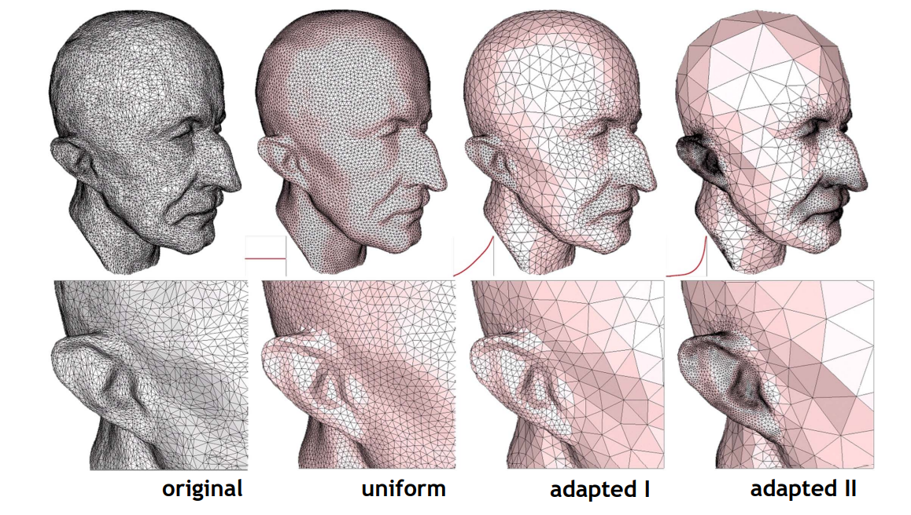

# Mesh Generation    

# Mesh Generation    

 - Given a fixed point set, Delaunay triangulation will try to make the triangulation more shape regular and thus is considered as a “good” nstructured mesh.    

    

# DT is not necessary a good mesh   

    

DT only optimize the **connectivity** when points are fixed. The **distribution of points** is more important for a good mesh.    

# Mesh Generation    

• How to sample points to generate high‐quality meshes?    

    

# Centroidal Voronoi Tessellation     

 - Definition: The VT is a centroidal Voronoi tessellation (CVT) , if each seed coincides with the **centroid** of its Voronoi cell     

    

> CVT:满是“点与所在区域的重心重合”的 Voronoi 图。    

# Centroidal Voronoi Tessellation    

    

> \\(\rho (x)\\)是种加权，用于内容相关。    
当 \\(\rho =I 时， X为 V_i \\)的重心时能量最小。    

# Lloyd Algorithm    

• Construct the  VT associated with the points    
• Compute the centroids of the Voronoi regions    
• Move the points to the centroids    
• Iterate until convergent    

    

# Centroidal Voronoi Tessellation    

* Definition (Variational point of view)    
• CVT energy function:    

$$
F(X)=\sum_{i=1}^{N} \int _{V_i}\rho (X)||X-X_i||^2dX
$$

• CVT is a critical point of \\(F(X)\\), an optimal CVT is a global minimizer of \\(F(X)\\)    

# CVT Energy Function    

 - Geometric interpretation     
    - The CVT energy with \\(\rho (X)\\) identical to 1, is the volume difference between the circumscribed polytope and the araboloid.    

    

# The Gradient of CVT Energy    

 - The gradient of \\(F(X)\\) is [Iri et al. 1984; Asami 1991; 
Du et al. 1999]:    

$$
\frac{\partial F}{\partial \chi _i} =2m_i(\chi _i-C_i),
$$
where 
$$
m_i=\int _{\chi\in \Omega _i }\rho (\chi )d\sigma
$$
 - Lloyd’s method is a gradient descent method, thus has linear convergence    
 
 
> [1:20:59] # CVT on Surface    
把 CVT 算法推广到曲面，可以把距离改为测地线度量     
连续曲面测地距离：表面上的孤长    
离散网格的测地距离：可参数化到平面再计算 

# Smoothness of F(X)    

 - Can BFGS method be applied to computing CVT? Or does CVT energy F(X) have required \\(C^2\\) smoothness?    
 - Results:   
    - It has been noted that F(X) is non‐smooth [Iri et al. 
1984], but without proof    
    - It has been proved that F(X) is \\(C^1\\) [Cortes et al. 2005]    
    - F(X) is \\(C^2\\) in a convex domain in 2D and 3D [Liu et al. 2009]     

# C2 Continuity of F(X) – Illustration    

    

**Figure**: Illustration of \\(C^2\\) smoothness of CVT energy in 2D     

# CVT on Surface    

    

Left: initial Voronoi; Right: CVT    

# CVT for Remeshing    

    

Left: initial mesh; Right: dual mesh of CVT    

# Optimal Delaunay Triangulation    

• ODT energy function:    

$$
E(X)=||f-f_{I,T }||L^1(\Omega)
$$

$$
=\sum _{\tau \in T}\int _\tau f_I(X)dX-\int _\Omega f(X)dX
$$

    

# CVT & ODT Energy    

• CVT energy    

$$
F(X)=\sum _{i=1}^N\int _{V_i}||X-X_i||^2dX
$$

• ODT energy    

$$
E(X)=\sum _{\tau \in T}\int _\tau f_I(X)dX-\int _\Omega f(X)dX
$$

    

# Compare ODT and CVT    

    

# 高维几何对象的采样与剖分    

    

# 二维流形曲面的采样与网格化   

    

# 二维流形曲面的四边形网格化   

    

# 空间体的采样与剖分    

* Interior of 3D shapes    
• FEM   
• Simulation    
• …    
* Two typical types   
• Tetrahedral meshes    
• Hexahedral meshes   

    

> 表面三角形，内部四面体。    
表面四边形，内部六面体。  

# 空间体的四面体网格    

    

# Meshing is still hard…   

# Solving PDE (FEM)
• Resolution, basis order, element quality…     

    

    

