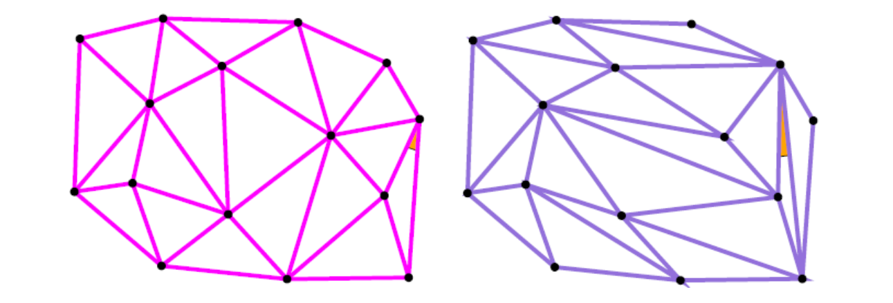

# 平面三角网格

给定平面上一些点，如何生成**比较好**的三角剖分？   
有无“最好”的三角剖分？    

    

# Mesh Quality    

* What do we mean a “good” mesh/simplex (triangle)?    
• Minimal angle   
• Mean ratio   
• Aspect/radius ratio   
• **Singular values**    
• …   

* It is not easy to define a universal mesh quality cceptable by everyone. But everyone agrees on the "best" simplex: equilateral triangle and tetrahedra.      

> Singular values：奇异值    
计算当前三角形到正三角形的变换矩阵。 A 对 A 做分解，得到2或3个奇异值。   
奇异值越接近，表明三角形越正。质量越好。     
