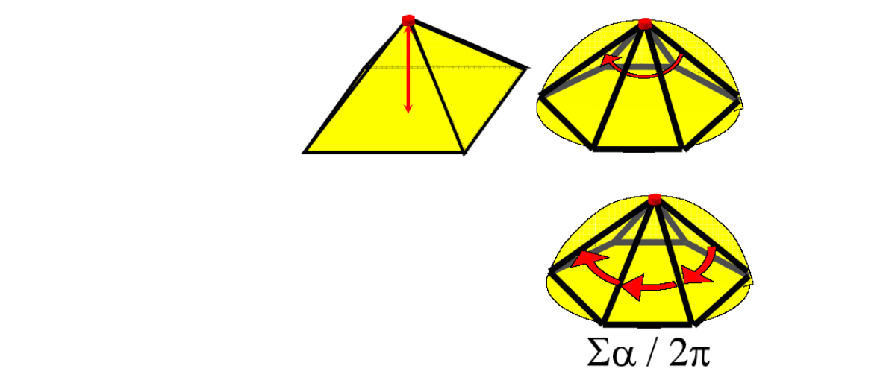
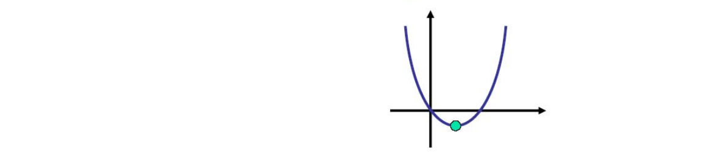
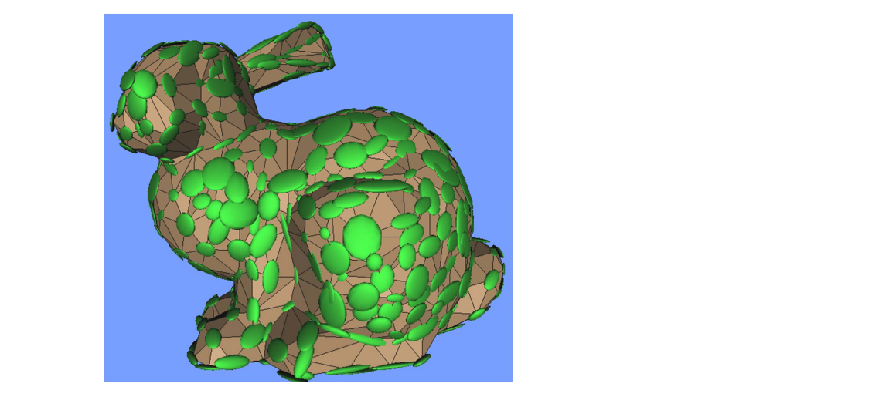
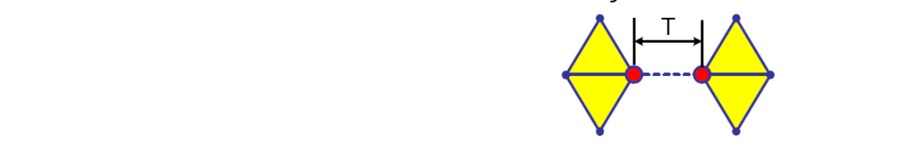
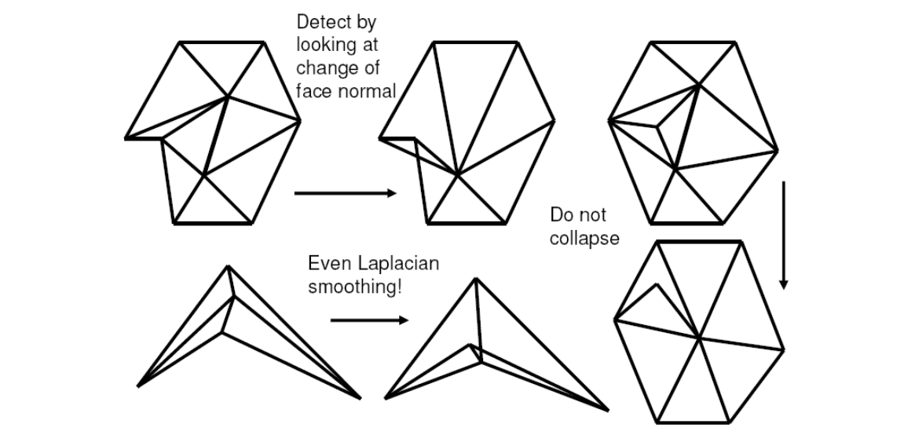

# 1. Local Simplification Strategies    

Local error: Compare new patch with previous iteration    

• Fast    
• Accumulates error    
• Memory‐less    

大部分情况下local就够用了。  

## The Basic Algorithm    

（1） Select the element with minimal error     
（2） Perform simplification operation (remove/contract)     
（3） Update error (local/global)    
重复（1）-（3）Until mesh size / quality is achieved     

## 顶点删除的误差度量

> 点越尖锐越重要。(Laplace,一圈夹角等)   

* Measures    
• Distance to plane    
• Curvature    
* Usually approximated    
• Average plane    
• Discrete curvature    

     

## 边收缩的误差度量 

### Quadris Error Matrics(QEM), 二次误差度量    

二次误差度量用于衡量“坍缩后的形状与坍缩前的接近程度”，使算法可以基于此标准选择要坍缩的边及确定坍缩点的位置。

用二次曲面拟合这条边。拟合得到系数矩阵，用矩阵性质度量扭曲。从直观上理解就是， 二次误差来度量[41：17]  = new point 到 old edge（或old face） 的距离平方和。    

（1） Choose point closest to set of planes (triangles)    

     

坍缩点的位置应该在使二次度量误差最小的地方。  
找到坍缩点转化为一个优化问题。

（2） Sum of squared distances to set of planes is quadratic  \\(\Rightarrow\\)  has a minimum     

把所有边都尝试坍缩，评估一下每条边如果要做坍缩并选择了最好的坍缩点位置，会得到多少误差。最后选择造成误差最少的边。

即：遍历-计算-排序-选择-坍缩

每次选择当前最优，这是贪心的思想。不一定最终是最优，但是至少效果可用。

     

> 用二次曲面来拟合，得到系数矩阵，用二次曲面性质来度量 [Garland & Heckbert 1997]    

Given a plane, we can define a **quadric** Q    

$$
Q=(A,b,c)=(nn^T,dn,d^2)
$$

measuring squared distance to the plane as    

$$
Q(V)=V^TAV+2b^TV+c
$$

$$
Q(V)=\begin{bmatrix}
x  &  y&z
\end{bmatrix}\begin{bmatrix}
 a^2 &ab  &ac \\\\
  ab&  b^2&bc \\\\
 ac & bc &c^2
\end{bmatrix}\begin{bmatrix}
 x\\\\
 y\\\\
 z
\end{bmatrix}+2\begin{bmatrix}
 ad & bd &cd
\end{bmatrix}\begin{bmatrix}
 x\\\\
 y\\\\
 z
\end{bmatrix}+d^2
$$

> Garland and Heckbert. Surface Simplification Using Quadric Error Metrics. Siggraph 1997.   

* Sum of quadrics represents set of planes   

$$
\sum _i(n_i^TV+d_i)^2=\sum _iQ_i(V)=\begin{pmatrix}\sum _iQ_i
\end{pmatrix}(V)
$$

* Each vertex has an associated quadric     
• Error\\((v_i) = Q_i (v_i)\\)    
• Sum quadrics when contracting \\((v_i,v_j) \to v’\\)   
• Cost of contraction is \\(Q(v’)\\)    

$$
Q=Q_i+Q_j=(A_i+A_j,b_i+b_j,c_i+c_j)
$$

* Sum of endpoint quadrics determines v’    
• Fixed placement: select \\(v_1\\) or \\(v_2\\)   
• Optimal placement: choose v’ minimizing \\(Q(v’)\\)   

$$
\nabla Q({V}' )=0\Rightarrow {V}' =-A^{-1}b
$$

• Fixed placement is faster but lower quality    
• But it also gives smaller progressive meshes    
• Fallback to fixed placement if A is non‐invertible    

### Contracting Two Vertices    

- **Goal**: Given edge e=(\\(v_1, v_2\\)), find contracted    

 \\(v=(x, y, z)\\) that minimizes  \\(\Delta(v)\\):    

$$
\partial \Delta / \partial x=\partial \Delta / \partial y=\partial \Delta / \partial z=0 
$$

- Solve system of linear normal equations.    

$$
\begin{bmatrix}
 q_{11} &q_{12}  &q_{13}  &q_{14} \\\\
q_{21}  & q_{22} &q_{23}  & q_{24}\\\\
q_{31}  & q_{32} &q_{33}  & q_{34}\\\\
  0& 0 & 0 &1
\end{bmatrix}V=\begin{bmatrix}
0 \\\\
 0\\\\
 0\\\\
1
\end{bmatrix}
$$

If no solution - select the edge midpoint    

### Visualizing Quadrics    

     

* Quadric isosurfaces    
• Are ellipsoids (maybe degenerate)    
• Centered around vertices     
• Characterize shape    
• Stretch in least‐curved directions    

> 简化后的折叠、翻转现象     

### Selecting Valid Pairs for Contraction    

- Edges:   

{\\((v_1, v_2):(v_1v_2)\\). is in the mesh }     

- Close vertices:   

{\\((v_1,v_2):||v_1-v_2||<T\\)}

- Threshold T is input parameter     

     
### 动态优先队列

计算一条边的坍缩点及坍缩误差是一个优化问题，用迭代法来解。因此“遍历-计算”是一个比较耗时的过程。  
尤其是使用“遍历-计算-排序-选择-坍缩”的过程坍缩了一条边之后，坍缩过程对被坍缩的边周围的边造成影响，上一轮的“遍历-计算”的结果已经不适用了，不能直接基于此结果做排序和选择。

- 解决方法：

优先队列。动态更新受影响的边。

预处理：遍历-计算-生成队列  
循环：取队列top - 坍缩 - 部分点重新计算 - 更新队列部分点

> &#x1F4A1; 计算出new point的位置后可以再调整一下old point的位置。  

### Algorithm    

- Compute \\(Q_v\\) for all the mesh vertices    
- Identify all valid pairs   
- Compute for each valid pair (\\(v_1, v_2\\)) the contracted vertex \\(v\\) and its error  \\(\Delta(v)\\)    
- Store all valid pairs in a priority queue (according to  \\(\Delta(v)\\))    
- While reduction goal not met    
• Contract edge (\\(v_1, v_2\\))  with the smallest error to \\(v\\)       
• Update the priority queue with new valid pairs     

### Artifacts by Edge Collapse    

     

收缩后会出现边的翻转

### Pros and Cons    

* Pros    
• Error is bounded    
• Allows topology simplification    
• High quality result    
• Quite efficient    
* Cons    
• Difficulties along boundaries    
• Difficulties with coplanar planes    
• Introduces new vertices not present in the original mesh    

## Appearance‐based metrics    

- Generalization required to handle appearance properties    
  - color    
  - texture    
  - normals    
  - etc.    
- Treat each vertex as a 6‐vector [x,y,z,r,g,b]    
  - Assume this 6D space is Euclidean    
    - Of course, color space is only roughly Euclidean    
  - Scale xyz space to unit cube for consistency     

### Generalized Quadric Metric    

|        |  Vertex  |  Dimension  |
|  ----  | ----  | ----  |
| Color  | [x y z r g b] | 6x6 quadrics |
| Texture  | [x y z s t] | 5x5 quadrics |
| Norma  | [x y z u v w] | 6x6 quadrics |
| Color+Normal  | [x y z r g b u v w] | 9x9 quadrics |   

$$
Q(V)=V^TAV+2b^TV+C
$$

---  

> 本文出自CaterpillarStudyGroup，转载请注明出处。
https://caterpillarstudygroup.github.io/GAMES102_mdbook/

