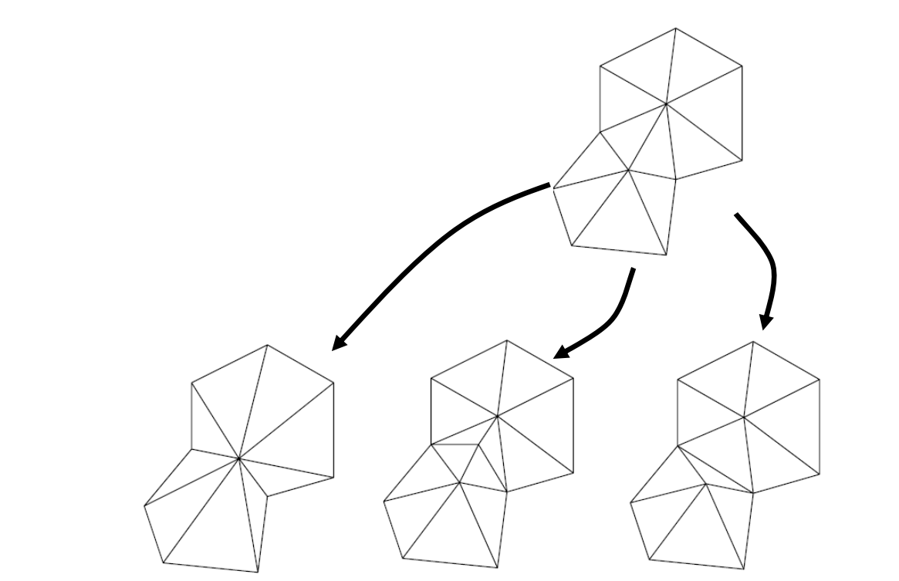

# 2. Global Simplification Strategies    
Resampling    

## 2.1 Mesh Re‐Tiling [Turk 92]    

Re‐tiling attempts to simplify as well as improve meshing by introducing new “uniformly spaced ” vertices   

    

> Re-Tilling：重采样

## 2.2 Mesh Optimization [Hoppe et al 93]    

* Frames simplification as an optimization problem    
• Minimizes some **energy function**    
• Make simple changes to the topology of the mesh    
• Evaluate the energy before and after the change    
• Accept any change that reduces the energy     

$$
\min\int d^2(U,V)
$$

    

> 全局简化策略
把顶点看作曲面上流动的粒子，模拟粒子之间的作用力不能保持 Appearance 特征     
光顺能量    
minimize Laplacian 能量 [1:06:02图]  

# Basic Topological Operations    

• Edge Collapse   
• Edge Split    
• Edge Swap   

    

