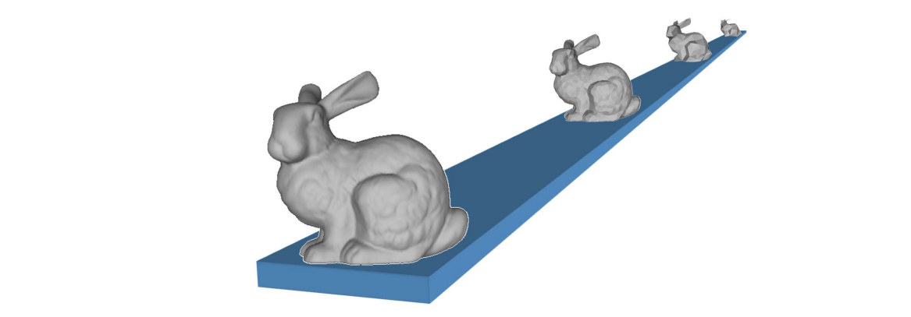
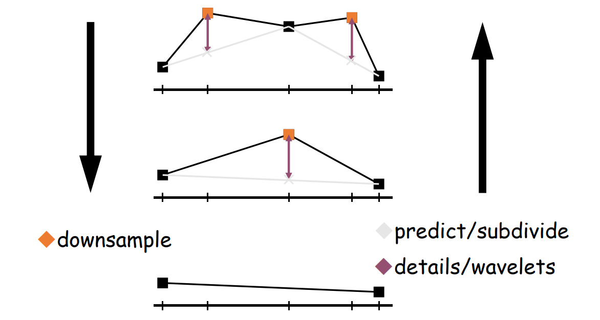
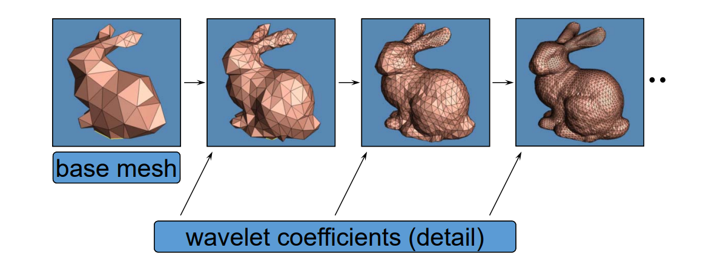
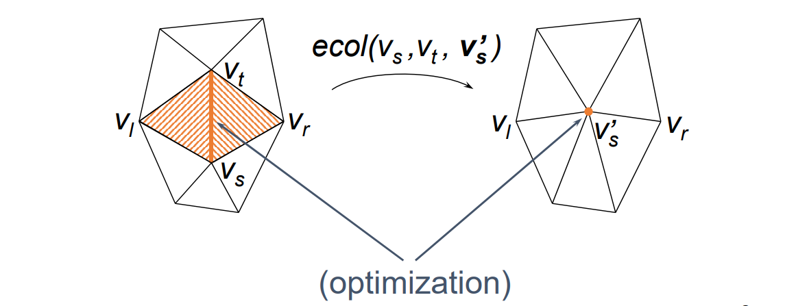
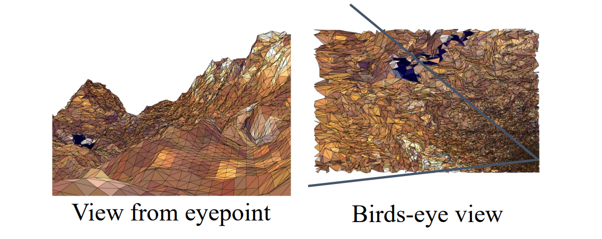

# Level of Detail (LOD)    

    

# 多分辨率的分析与表达

## 多分辨率表达 Multiresolution Representation    

Multiresolution Representation of \\(M\\) = Base mesh \\(M^0\\)  +  A sequence of refinements \\(M^i\\)    

> \\(M_i\\)： (中间的操作)，记录简化过程     

    

## 多分辨率分析 Multiresolution Analysis   

[Lounsbery-etal93] [Eck-etal95] [Certain-etal96]    

    

# 1. Discrete LOD   

提前生成好不同 level 的模型，根据实际情况决定用哪个可能存在跳变。    

# 2. Continuous LOD    

记录中间操作，可以只增加或减少一个边     
消耗计算资源，因此不常用      

    
> &#x1F446; recode sequence of edge collapses

# 3. View‐Dependent LOD    

Show nearby portions of object at higher resolution than distant portions    

    

# Challenges   

* 纹理的简化   
• 熵、保特征…   
* 数据组织与调度   
• 虚拟纹理   
• 虚拟几何   
* 计算模式   
• Client/Server (CS)   
• Browser/Server (BS)    
• Cloud‐Edge‐Client computing：云、边、端    
* …     

# Resources   

* Internet, Papers, Siggraph courses    
* VDSlib ‐<http://vdslib.virginia.edu>    
• A public‐domain view‐dependent simplification and rendering  package/library    
* Luebke's work on view‐dependent simplification:    
• <http://www.cs.virginia.edu/~luebke/simplification.html>    
* Hoppe's work on progressive meshes:    
• <http://www.research.microsoft.com/~hhoppe>    
* Garland's work on quadric error metrics:    
• <http://www.uiuc.edu/~garland>    
• <http://www.cs.cmu.edu/afs/cs/user/garland/www/multires/survey.html>    
* The Multi‐Tesselation (MT) homepage:   
• <http://www.disi.unige.it/person/MagilloP/MT>   

