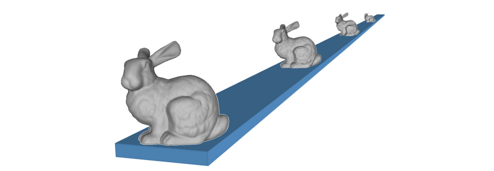
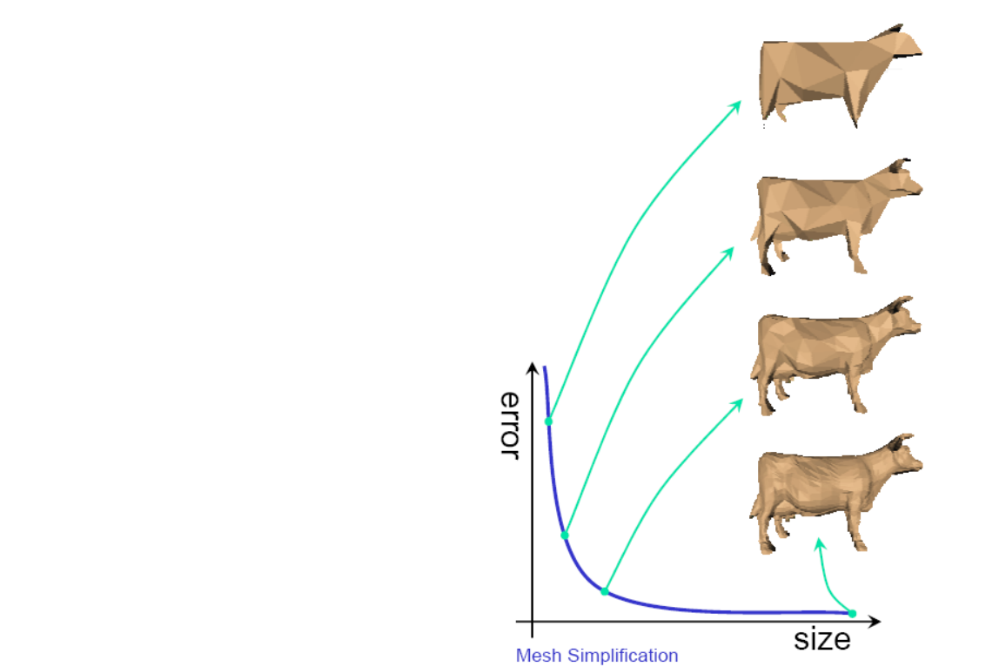
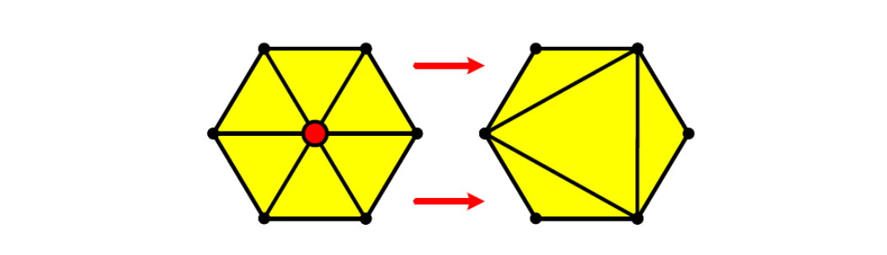
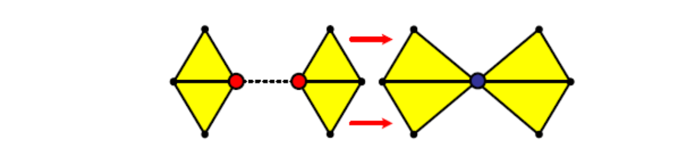
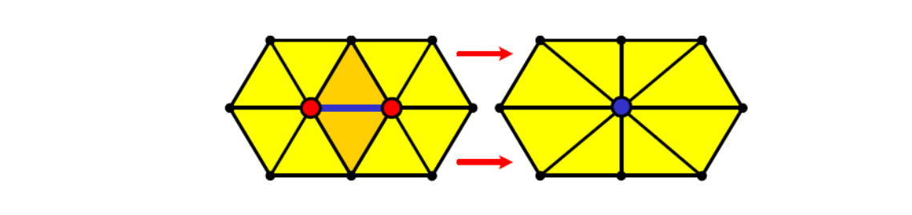
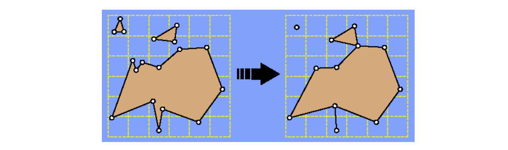

# 关于简化

## 简化原因

• 冗余数据：信息熵    
• 在不损失视觉效果的情况下减少数据量    
• Level of details (LOD)    

        

## Simplification Applications    

* Level‐of‐detail modeling     
• Generate a family of models for the same object with 
different polygon counts    
• Select the appropriate model based on estimates of the object's projected size    
* Simulation proxies     
• Run the simulation on a simplified model     
• Interpolate results across a more complicated model to be used for rendering       

## Tradeoff
• Size   
• Error
• Quality   

             

# 简化算法

## Performance Requirements    

* Offline   
• Generate model at given level(s) of detail   
• Focus on quality   
* Real‐time   
• Generate model at given level(s) of detail   
• Focus on speed   
• Requires preprocessing   
• Time/space/quality tradeoff    

## 简化目标   
   
### 顶点删除 [图54:51]   

#### 方法一
v ← v‐1，f ← f‐2      
Remaining vertices是subset of original vertex set     

        

#### 方法二

Pair contraction (cluster of two vertices)    
Vertices may move    

        

### 边收缩 [图56:46] Edge collapse   

#### 方法一

v ← v‐1，f ← f‐2    
Vertices may move   

        

#### 方法二

Cluster contraction (set of vertices)    
Vertices may move   

        

### 面 Triangle collapse    

#### 方法一

v ← v‐2，f ← f‐4    
Vertices may move     

        

#### 方法二

聚类法：[57:46]，画格子，格子内的三角形收缩、点合并会产生非流型和悬挂边     

Merge all vertices within the same cell    

     

## 简化度量     

• 几何   
• 视觉：纹理、材质、法向…    

### Local vs. Global Error    

全局优于局部，具体见下一页    

