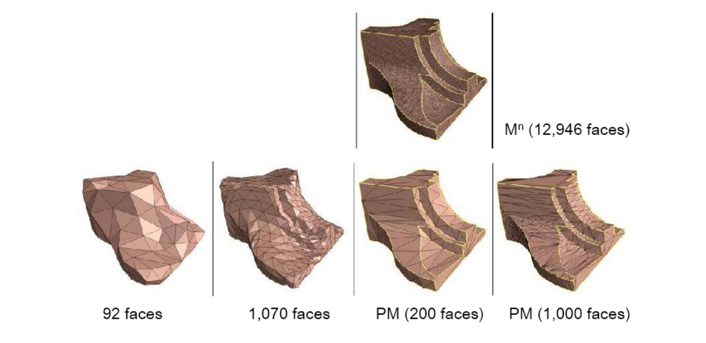

# 挑战：大规模网格数据   

数据：

• 存储    
• 传输     
• 处理    
• 渲染   

简化原因：

• 冗余数据：信息熵    
• 在不损失视觉效果的情况下减少数据量    
• Level of details (LOD)    

        

# Simplification Applications    

* Level‐of‐detail modeling     
• Generate a family of models for the same object with 
different polygon counts    
• Select the appropriate model based on estimates of the object's projected size    
* Simulation proxies     
• Run the simulation on a simplified model     
• Interpolate results across a more complicated model to be used for rendering       

# Tradeoff
• Size   
• Error   

        

# Quality    

        

# Performance Requirements    

* Offline   
• Generate model at given level(s) of detail   
• Focus on quality   
* Real‐time   
• Generate model at given level(s) of detail   
• Focus on speed   
• Requires preprocessing   
• Time/space/quality tradeoff    

# 简化方法   

* 几何对象   
• 顶点   
• 边    
• 面    
* 简化度量     
• 几何   
• 视觉：纹理、材质、法向…    

# Methodology    

* Sequence of local operations      
• Involve near neighbors ‐ only small patch affected in each operation    
• Each operation introduces error   
• Find and apply operation which introduces the least error    

> 面片简化：[51:47]     
1. 顶点删除 [图54:51]
2. 边收缩 [图56:46]
聚类法：[57:46]    
画格子，格子内的三角形收缩、点合并会产生非流型和悬挂边     

## simplification Operations (1)    

 - Decimation    
    - Vertex removal:   
      - v ← v‐1    
      - f ← f‐2    
 - Remaining vertices ‐ subset of original vertex set     

        

## Simplification Operations (2)    

 - Decimation     
    - Edge collapse     
      - v ← v‐1     
      - f ← f‐2    
 - Vertices may move   

        

## Simplification Operations (3)   

 - Decimation    
    - Triangle collapse    
      - v ← v‐2    
      - f ← f‐4    
 - Vertices may move     

        

## Simplification Operations (4)    

* Contraction    
• Pair contraction (cluster of two vertices)    
* Vertices may move    

        

## Simplification Operations (5)    

* Contraction    
• Cluster contraction (set of vertices)    
* Vertices may move   

        

## Simplification Operations: Vertex Clustering   

• Merge all vertices within the same cell    

     

# Error Control    

* Local error: Compare new patch with previous iteration    
• Fast    
• Accumulates error    
• Memory‐less    
* Global error: Compare new patch with original mesh    
• Slow    
• Better quality control    
• Can be used as termination condition    
• Must remember the original mesh throughout the algorithm   

## Local vs. Global Error    

> 误差度量[58:59]，全局优于局部    
局部度量方法：    
点越尖锐越重要。(Laplace,一圈夹角等）   

