# 挑战：大规模网格数据   

• 存储    
• 传输     
• 处理    
• 渲染   

# 挑战：大规模网格数据   

• 冗余数据：信息熵    
• 在不损失视觉效果的情况下减少数据量    
• Level of details (LOD)    

        

# Simplification Examples   

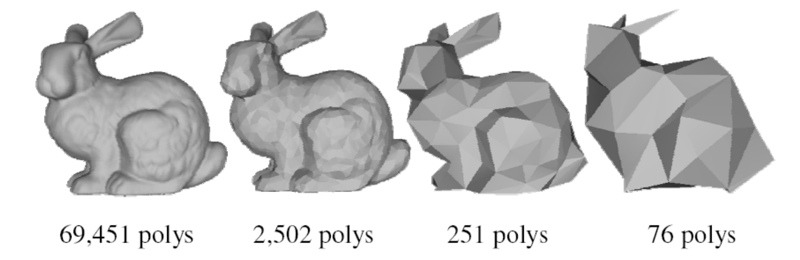        

# Simplification Applications    

* Level‐of‐detail modeling     
• Generate a family of models for the same object with 
different polygon counts    
• Select the appropriate model based on estimates of the object's projected size    
* Simulation proxies     
• Run the simulation on a simplified model     
• Interpolate results across a more complicated model to be used for rendering       

# Tradeoff
• Size   
• Error   

        

# Quality    

        

# Performance Requirements    

* Offline   
• Generate model at given level(s) of detail   
• Focus on quality   
* Real‐time   
• Generate model at given level(s) of detail   
• Focus on speed   
• Requires preprocessing   
• Time/space/quality tradeoff    

# 简化方法   

* 几何对象   
• 顶点   
• 边    
• 面    
* 简化度量     
• 几何   
• 视觉：纹理、材质、法向…    

# Methodology    

* Sequence of local operations      
• Involve near neighbors ‐ only small patch affected in each operation    
• Each operation introduces error   
• Find and apply operation which introduces the least error    

# simplification Operations (1)    

 - Decimation    
    - Vertex removal:   
      - v ← v‐1    
      - f ← f‐2    
 - Remaining vertices ‐ subset of original vertex set     

        

# Simplification Operations (2)    

 - Decimation     
    - Edge collapse     
      - v ← v‐1     
      - f ← f‐2    
 - Vertices may move   

        

# Simplification Operations (3)   

 - Decimation    
    - Triangle collapse    
      - v ← v‐2    
      - f ← f‐4    
 - Vertices may move     

        

# Simplification Operations (4)    

* Contraction    
• Pair contraction (cluster of two vertices)    
* Vertices may move    

        

# Simplification Operations (5)    

* Contraction    
• Cluster contraction (set of vertices)    
* Vertices may move   

        

# Simplification Operations: Vertex Clustering   

• Merge all vertices within the same cell    

     

# Error Control    

* Local error: Compare new patch with previous iteration    
• Fast    
• Accumulates error    
• Memory‐less    
* Global error: Compare new patch with original mesh    
• Slow    
• Better quality control    
• Can be used as termination condition    
• Must remember the original mesh throughout the algorithm   

# Local vs. Global Error    

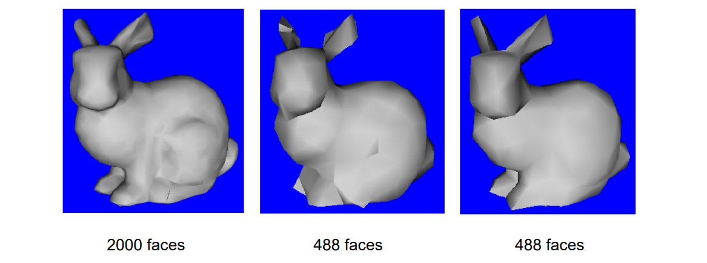     

# 1. Local Simplification Strategies    

# The Basic Algorithm    

* Repeat    
• Select the element with minimal error     
• Perform simplification operation (remove/contract)     
• Update error (local/global)    
* Until mesh size / quality is achieved     

# Simplification Error Metrics     

* Measures    
• Distance to plane    
• Curvature    
* Usually approximated    
• Average plane    
• Discrete curvature    

     

# Implementation Details    

* Vertices/Edges/Faces data structure     
• Easy access from each element to neighboring elements    
* Use priority queue (e.g. heap)    
• Fast access to element with minimal error    
• Fast update    

# 1.1 Vertex Removal [Schroeder et al 92]     

- Simplification operation: Vertex removal   
- Error metric: Distance to average plane    
- May preserve mesh features (creases)   

     
     

# 1.2 Edge Collapse [Hoppe el al 93]    

- Simplification operation: Pair contraction    
- Error metric: distance, pseudo-global    
- Simplifies also topology    

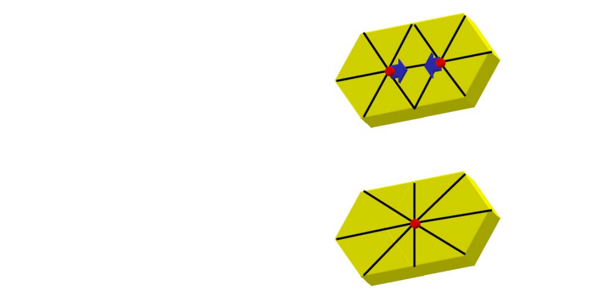     

# Distance Metric: Quadrics    

- Choose point closest to set of planes (triangles)    

     

- Sum of squared distances to set of planes is quadratic  \\(\Rightarrow\\)  has a minimum     

     

# The Quadric Error Metric (QEM)    
[Garland & Heckbert 1997]    

• Given a plane, we can define a **quadric** Q    

$$
Q=(A,b,c)=(nn^T,dn,d^2)
$$

measuring squared distance to the plane as    

$$
Q(V)=V^TAV+2b^TV+c
$$

$$
Q(V)=\begin{bmatrix}
x  &  y&z
\end{bmatrix}\begin{bmatrix}
 a^2 &ab  &ac \\\\
  ab&  b^2&bc \\\\
 ac & bc &c^2
\end{bmatrix}\begin{bmatrix}
 x\\\\
 y\\\\
 z
\end{bmatrix}+2\begin{bmatrix}
 ad & bd &cd
\end{bmatrix}\begin{bmatrix}
 x\\\\
 y\\\\
 z
\end{bmatrix}+d^2
$$

> Garland and Heckbert. Surface Simplification Using Quadric Error Metrics. Siggraph 1997.   

# The Quadric Error Metric    

* Sum of quadrics represents set of planes   

$$
\sum _i(n_i^TV+d_i)^2=\sum _iQ_i(V)=\begin{pmatrix}\sum _iQ_i
\end{pmatrix}(V)
$$

* Each vertex has an associated quadric     
• Error\\((v_i) = Q_i (v_i)\\)    
• Sum quadrics when contracting \\((v_i,v_j) \to v’\\)   
• Cost of contraction is \\(Q(v’)\\)    

$$
Q=Q_i+Q_j=(A_i+A_j,b_i+b_j,c_i+c_j)
$$

# The Quadric Error Metric     

* Sum of endpoint quadrics determines v’    
• Fixed placement: select \\(v_1\\) or \\(v_2\\)   
• Optimal placement: choose v’ minimizing \\(Q(v’)\\)   

$$
\nabla Q({V}' )=0\Rightarrow {V}' =-A^{-1}b
$$

• Fixed placement is faster but lower quality    
• But it also gives smaller progressive meshes    
• Fallback to fixed placement if A is non‐invertible    

# Contracting Two Vertices    

- **Goal**: Given edge e=(\\(v_1, v_2\\)), find contracted    

 \\(v=(x, y, z)\\) that minimizes  \\(\Delta(v)\\):    

$$
\partial \Delta / \partial x=\partial \Delta / \partial y=\partial \Delta / \partial z=0 
$$

- Solve system of linear normal equations.    

$$
\begin{bmatrix}
 q_{11} &q_{12}  &q_{13}  &q_{14} \\\\
q_{21}  & q_{22} &q_{23}  & q_{24}\\\\
q_{31}  & q_{32} &q_{33}  & q_{34}\\\\
  0& 0 & 0 &1
\end{bmatrix}V=\begin{bmatrix}
0 \\\\
 0\\\\
 0\\\\
1
\end{bmatrix}
$$

If no solution - select the edge midpoint    

# Visualizing Quadrics    

     

* Quadric isosurfaces    
• Are ellipsoids (maybe degenerate)    
• Centered around vertices     
• Characterize shape    
• Stretch in least‐curved directions    

# Selecting Valid Pairs for Contraction    

- Edges:   

{\\((v_1, v_2):(v_1v_2)\\). is in the mesh }     

- Close vertices:   

{\\((v_1,v_2):||v_1-v_2||<T\\)}

- Threshold T is input parameter     

     

# Algorithm    

- Compute \\(Q_v\\) for all the mesh vertices    
- Identify all valid pairs   
- Compute for each valid pair (\\(v_1, v_2\\)) the contracted vertex \\(v\\) and its error  \\(\Delta(v)\\)    
- Store all valid pairs in a priority queue (according to  \\(\Delta(v)\\))    
- While reduction goal not met    
• Contract edge (\\(v_1, v_2\\))  with the smallest error to \\(v\\)       
• Update the priority queue with new valid pairs     

# Artifacts by Edge Collapse    

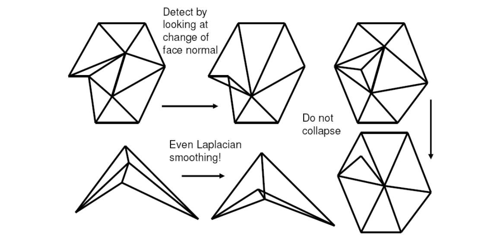     

# Examples    

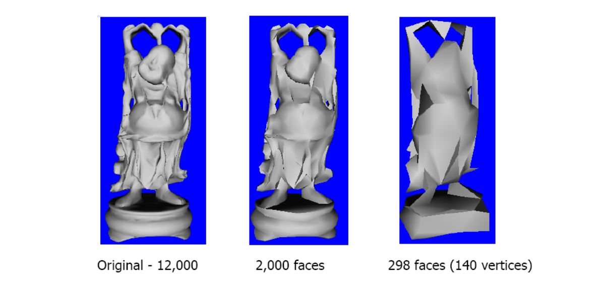     

# Pros and Cons    

* Pros    
• Error is bounded    
• Allows topology simplification    
• High quality result    
• Quite efficient    
* Cons    
• Difficulties along boundaries    
• Difficulties with coplanar planes    
• Introduces new vertices not present in the original mesh    

# 1.3 Appearance‐based metrics    

 - Generalization required to handle appearance properties    
    - color    
    - texture    
    - normals    
    - etc.    
 - Treat each vertex as a 6‐vector [x,y,z,r,g,b]    
    - Assume this 6D space is Euclidean    
      - Of course, color space is only roughly Euclidean    
    - Scale xyz space to unit cube for consistency     

# Generalized Quadric Metric    

|        |  Vertex  |  Dimension  |
|  ----  | ----  | ----  |
| Color  | [x y z r g b] | 6x6 quadrics |
| Texture  | [x y z s t] | 5x5 quadrics |
| Norma  | [x y z u v w] | 6x6 quadrics |
| Color+Normal  | [x y z r g b u v w] | 9x9 quadrics |   

$$
Q(V)=V^TAV+2b^TV+C
$$

# Example    

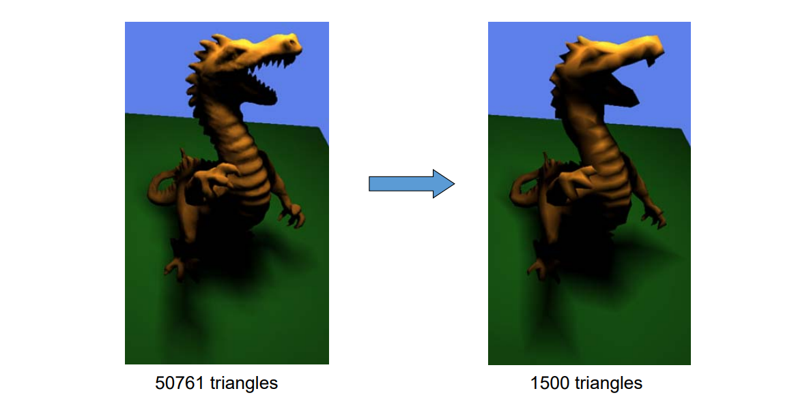    

# A Sample Textured Surface    

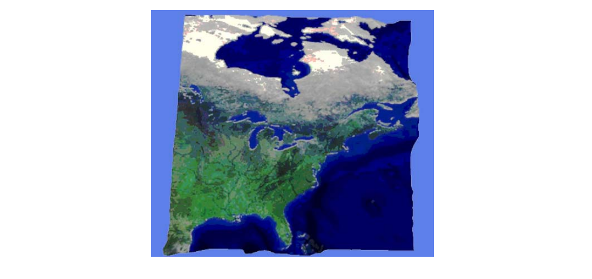    

# Comparison      

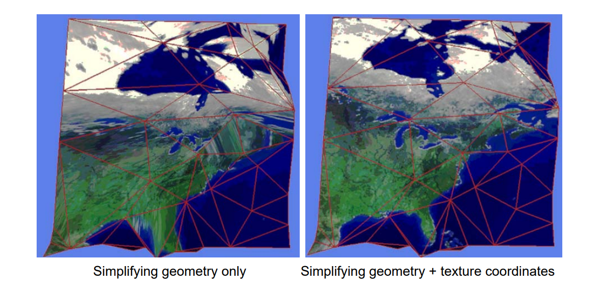    

# 2. Global Simplification Strategies    
Resampling    

# 2.1 Mesh Re‐Tiling [Turk 92]    

• Re‐tiling attempts to simplify as well as improve 
meshing by introducing new “uniformly spaced ” vertices   

    

# Re‐Tiling Example    

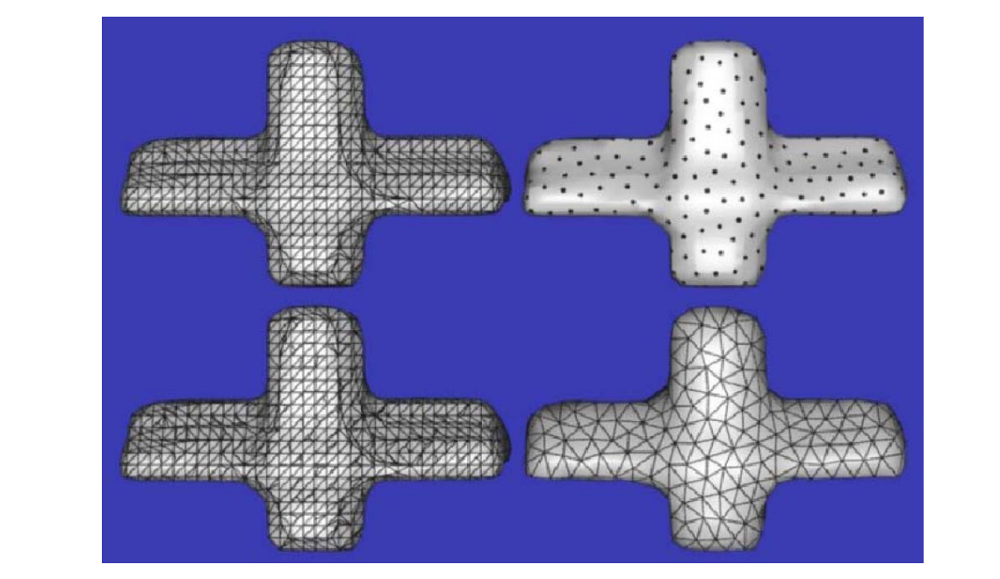    

# 2.2 Mesh Optimization [Hoppe et al 93]    

* Frames simplification as an optimization problem    
• Minimizes some **energy function**    
• Make simple changes to the topology of the mesh    
• Evaluate the energy before and after the change    
• Accept any change that reduces the energy     

$$
\min\int d^2(U,V)
$$

    

# Basic Topological Operations    

• Edge Collapse   
• Edge Split    
• Edge Swap   

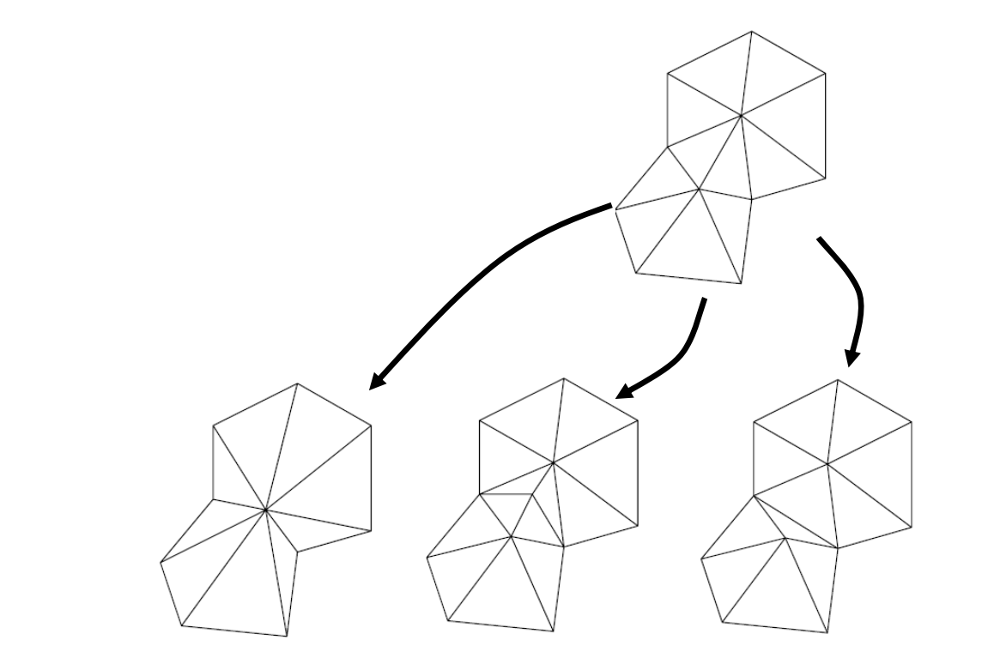    

# Level of Detail (LOD)    

    

# Multiresolution Representation    

Multiresolution Representation of \\(M\\) = Base mesh \\(M^0\\)  +  A sequence of refinements \\(M^i\\)    

# Multiresolution   

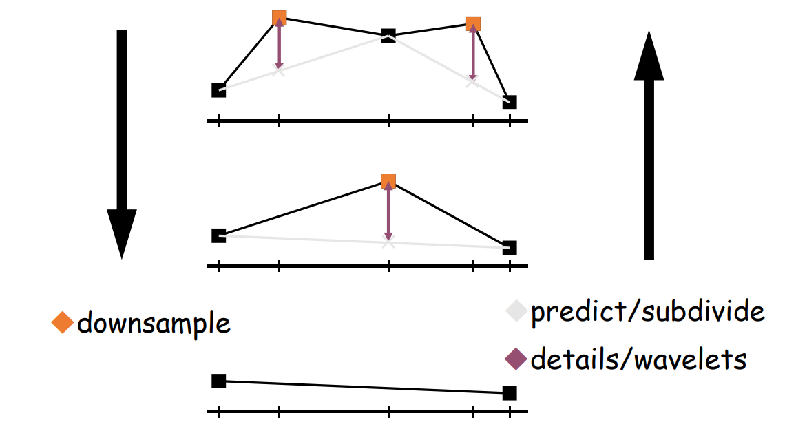    

# Multiresolution Analysis   

[Lounsbery-etal93] [Eck-etal95] [Certain-etal96]    

    

# 1. Discrete LOD   

\\(\Box \\) “Pop” discontinuity    

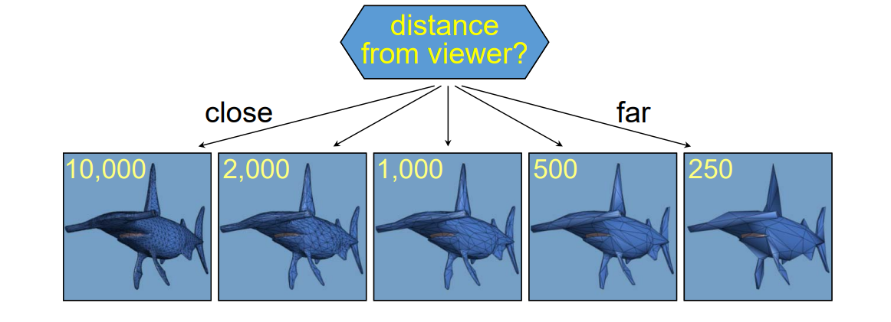    

**Concern**: **transitions may** “**pop**”       

# 2. Continuous LOD    

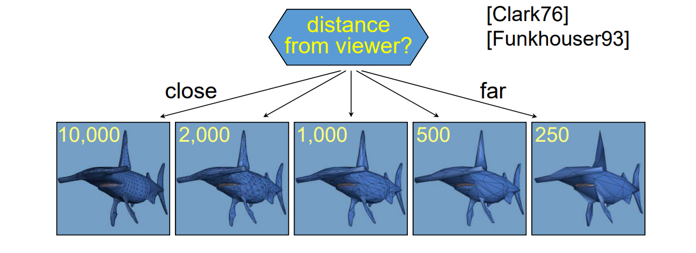    

Concern: transitions may “pop”   
\\(\to\\) would like smooth LOD   

# Mesh Simplification Procedure   

• Idea: recode sequence of edge collapses     

    

# Simplification Process    

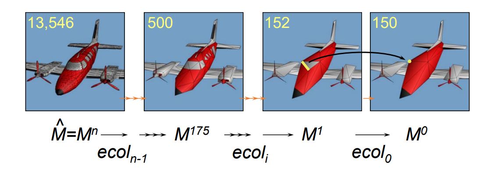    

# Invertible!    

Vertex split transformation:   

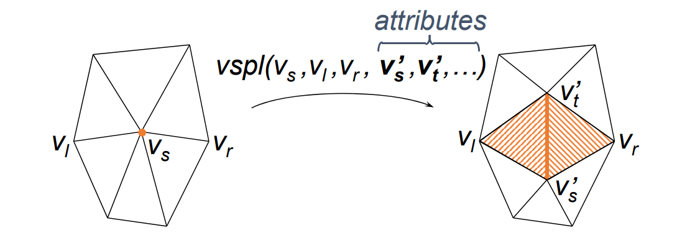    

# Reconstruction Process    

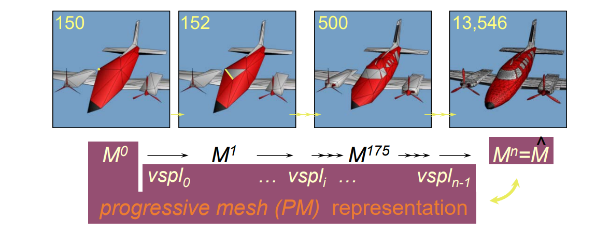    

# Continuous‐resolution LOD    

From PM, extract \\(M^i\\) of any desired complexity.   

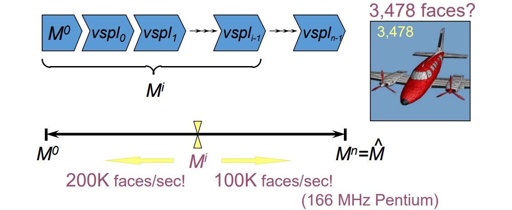    

# Progressive Transmission    

Transmit records progressively:   

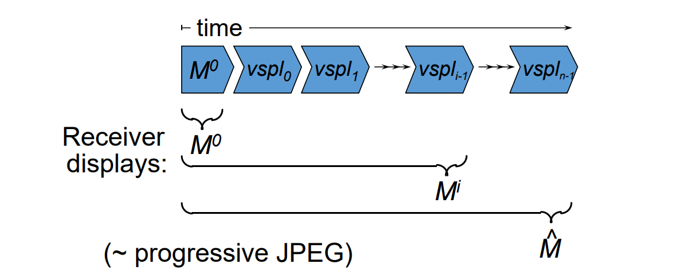    

# 3. View‐Dependent LOD    

• Show nearby portions of object at higher resolution than distant portions    

    

# Selective Refinement    

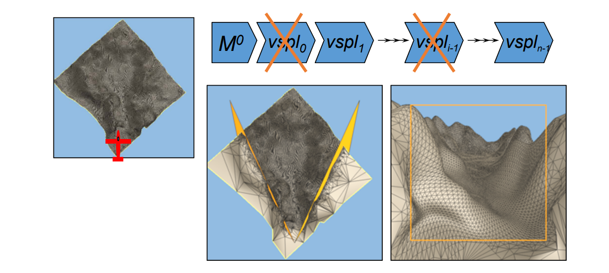    

[SIGGRAPH 96]: incremental update not possible   

# Challenges   

* 纹理的简化   
• 熵、保特征…   
* 数据组织与调度   
• 虚拟纹理   
• 虚拟几何   
* 计算模式   
• Client/Server (CS)   
• Browser/Server (BS)    
• Cloud‐Edge‐Client computing：云、边、端    
* …     

# Resources   

* Internet, Papers, Siggraph courses    
* VDSlib ‐<http://vdslib.virginia.edu>    
• A public‐domain view‐dependent simplification and rendering  package/library    
* Luebke's work on view‐dependent simplification:    
• <http://www.cs.virginia.edu/~luebke/simplification.html>    
* Hoppe's work on progressive meshes:    
• <http://www.research.microsoft.com/~hhoppe>    
* Garland's work on quadric error metrics:    
• <http://www.uiuc.edu/~garland>    
• <http://www.cs.cmu.edu/afs/cs/user/garland/www/multires/survey.html>    
* The Multi‐Tesselation (MT) homepage:   
• <http://www.disi.unige.it/person/MagilloP/MT>   

