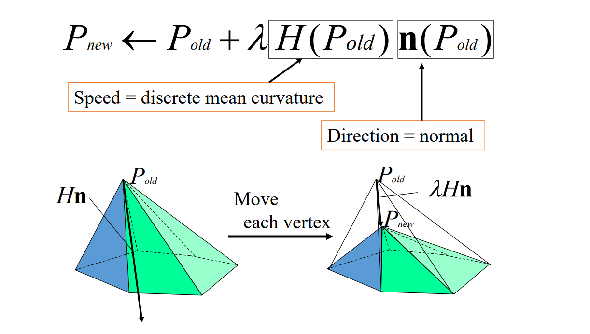
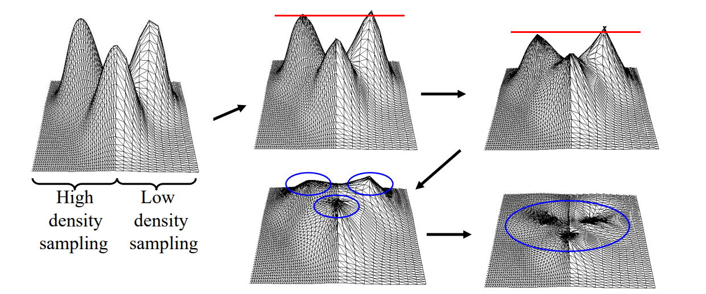
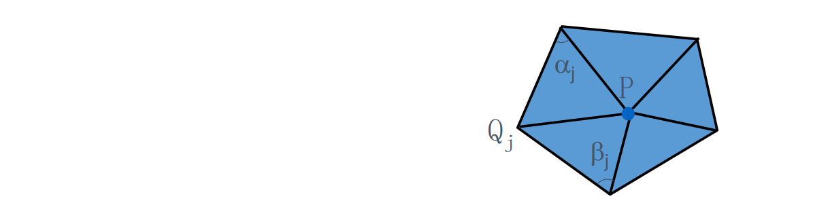
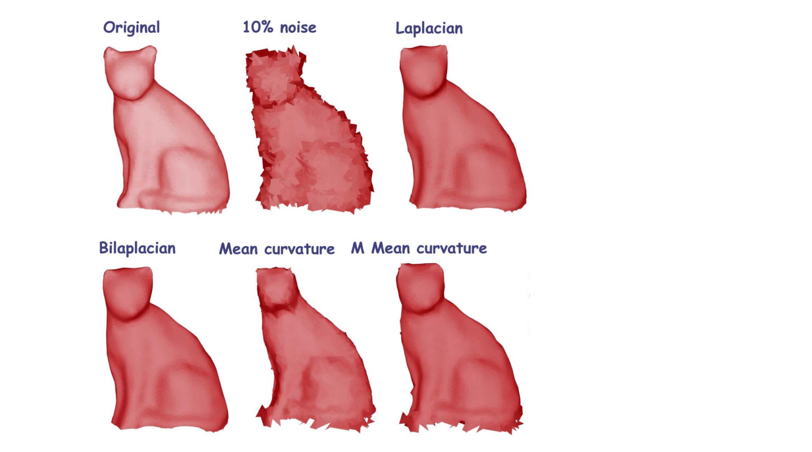
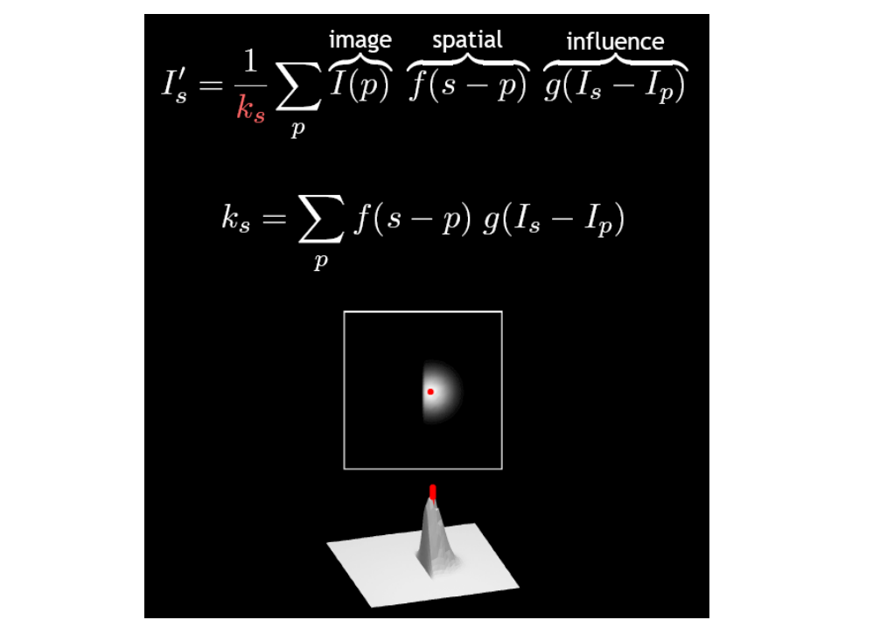
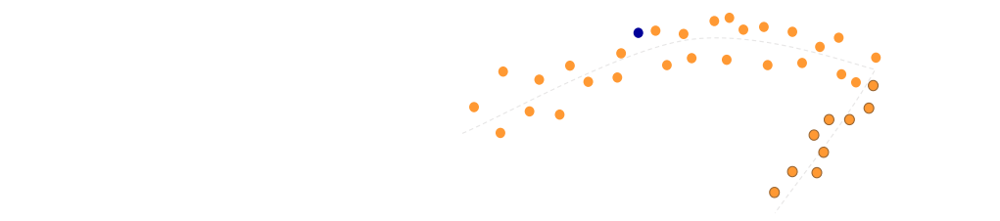
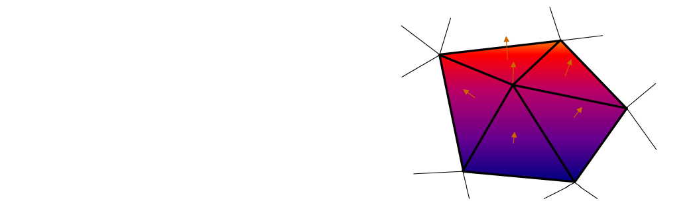
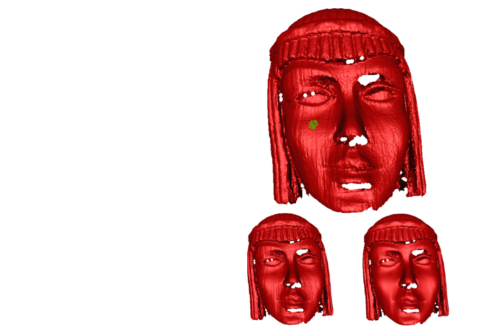

# 1. Vertex Filtering    

## 1.1 Laplacian Smoothing    

$$
P_{new}\gets P_{old}+\lambda L(P_{old})
$$

   

* Equivalent to box filter in signal processing     
* Apply to all vertices on mesh    
* Typically repeat several times     
* Can describe as energy minimization    
• Energy = sum of squared edge lengths in mesh     
• Parameter\\(\lambda >0\\)controls convergence "speed"     

### Problem of Over‐smoothing   

How to find appropriate and number of iterations?   

   

### Shrinkage Problem     

>&#x2705;Increases mesh regularity    
>&#x2705;Develops unnatural deformations    

   

> 存在的问题：    
① 过平滑   
② 不同密度收缩速度不同  

### Improved Laplacian   

* Laplacian   

$$
P^{new} = P^{old}+\lambda L(P^{old})
$$

* Taubin’95    
• Laplacian + Expansion     

$$
P^{new} = P^{old}-(\mu -\lambda )L(P^{old})-\mu \lambda L^2(P^{old}),\mu >\lambda >0
$$

* Bilaplacian    
• Special case of Taubin’s    

$$
P^{new} = P^{old}+\lambda L^2(P^{old})
$$

### Comparison    

   

 - Drawbacks   
    - Slow    
    - No stoping criteria    

> 图1：原图    
图2：普通 Laplace    
图3：Laplace + 扩张。    
图3去噪同时保留一些特征。 

## 1.2 Mean Curvature Flow    

   

> 引入平均曲率、考虑了几何特征。    

### Mean Curvature Filtering   

> &#x2705; Increases mesh irregularity.    
> &#x2705; Doesn’t develop unnatural deformations     

   

### Discrete Mean Curvature    

   

$$
Hn=\frac{\nabla _PA}{2A} 
$$

$$
Hn=\frac{1}{4A} \sum _j(\cot \alpha _j+\cot \beta _j)(P-Q_j)
$$

### Comparisons   

   

## 1.3 Bilateral filtering    

   

### Bilateral filtering    

   

   

> Bilateral:双边     
U 和 P 代表U点与P点的位置     
I(U) 和I(P)代表U和P点的值    
分子：U 点对 P 点的影响表现I(P)前面的系数上。     
系数考虑了两方面因素：     
(1) U 与 P 的距离，反映了U 对 P 的影响力。    
(2) I(U) 与I(P)的距离，反映了I(P)的特征性。    
二者都是距离越大权重越小。     
分母，归一化     
除了U和I(U)，还可以根据实际情况加入更多的特征考量。    

### Bilateral filtering of meshes   

 - Height above surface is equivalent to the gray level 
values in images    
 - Apply the bilateral filter to heights    
 - Move the vertex to its new height    

   
> 灰线：理想曲面，实际位置未知。    
黄点：曲面上的点，由于带噪声呈上下分布。     
蓝点：黄点中取的任意一点作为例子。

 - In practice:   
    - Sharp features    
    - The noise‐free surface is unknown    

   

### Solution    

 - A plane that passes through the point is the 
estimator to the smooth surface      
 - Plane \\(L=(p,n)\\)    

   

> 对蓝点做以下估计：    
取P点邻域内的点，做PCA，最大特征值对应的向量为 P点的法向。    
所有点向切平面上投影，得到距离1。    
所有点向法线上投影，得到距离2。     
由于同时考虑了距离1和距离2，因此称双边。   
[>] 前面提到的， feature 和 noise 很难区分。     
比如例子中的棱角和噪声一样，具有高频、曲率大的特点。    
但特征有连续性，在大的区间里表现出规律，而噪声不具备这个特点，可以据此区分。     

### Computing the plane    

* The approximating plane should be:     
• A good approximation to the surface    
• Preserve features   
* Average of the normal to faces in the 1‐ring neighborhood     

   

### Parameters   

* The two parameters to the weight function: \\(σ_c, 
σ_s\\)    
• Interactively select a  point p and the neighborhood radius ρ       
• \\(σ_c\\) = 1/2 ρ     
• \\(σ_s\\) = stdv ( Nbhd (p, ρ))    
* Number of Iterations     

   

### Results   

   

## 1.4 Implicit Mesh Evolutions   

Shape evolution  \\(\frac{\partial P}{\partial t} =F(P)\\)   

\\(M_{n+1}=M_n+\lambda L(M_n)\\) explicit scheme   

\\(M_{n+1}=M_n+\lambda L(M_{n+1})\\) implicit scheme   

$$
\Rightarrow (I-\lambda L)M_{n+1}=M_n
$$

> 认为噪声是沿着法向的偏移，本身就是一种猜测、为什么说用真实曲面的法向会更好呢？[?]     
隐通过求解线性稀疏方程组得到结果（类似全局法）    

