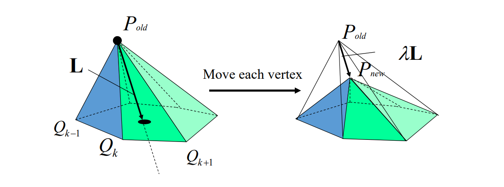
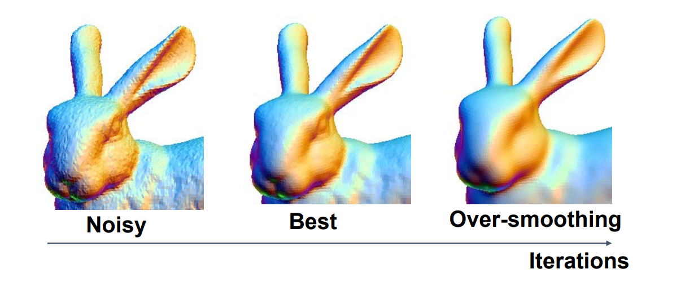
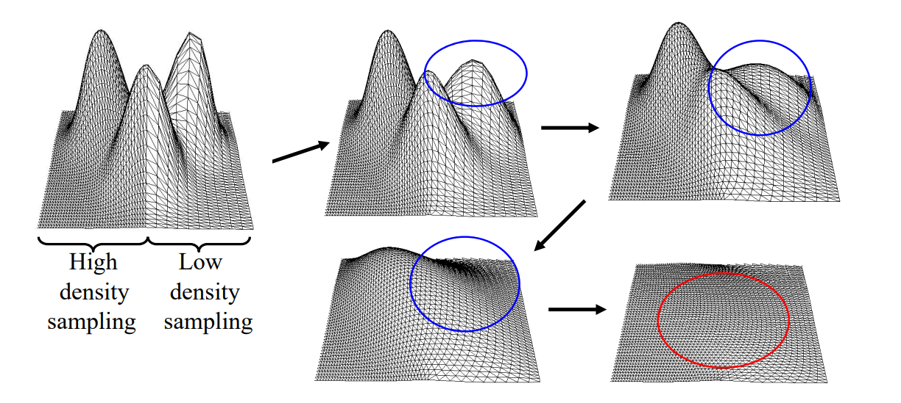
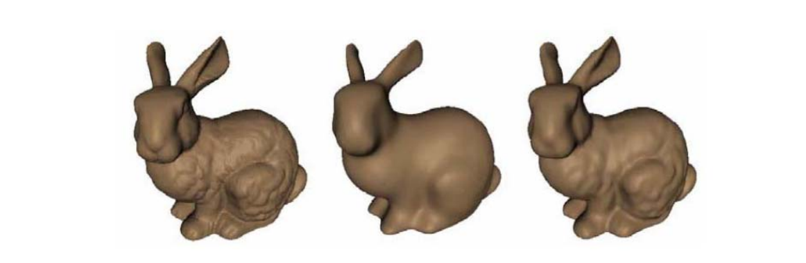
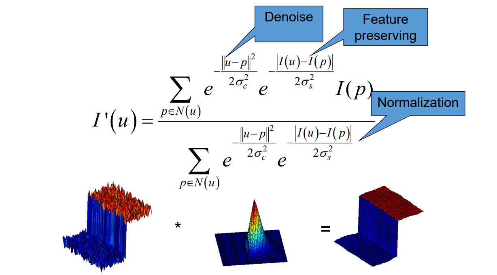
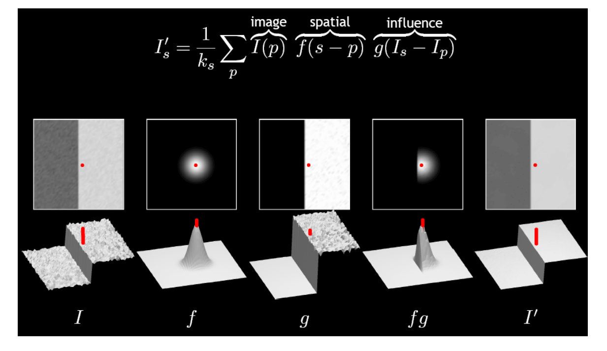
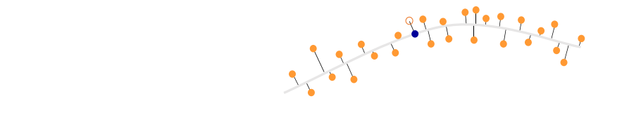
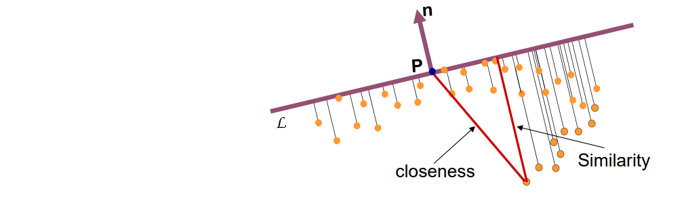
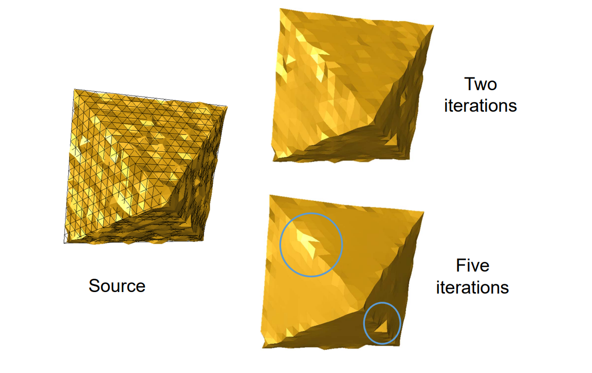

# 1. Vertex Filtering    

## 1.1 Laplacian Smoothing    

### 原理

[link](../LaplacianCoordinates/LocalLaplacianSmoothing.md)

   

### 特点

* Equivalent to box filter in signal processing     
* Apply to all vertices on mesh    
* Typically repeat several times     
* Can describe as energy minimization    
• Energy = sum of squared edge lengths in mesh     
• Parameter\\(\lambda >0\\)controls convergence "speed"     

### 存在的问题

存在Over‐smoothing问题  

   

存在Shrinkage问题     

   

### 改进

* Laplacian   

$$
P^{new} = P^{old}+\lambda L(P^{old})
$$

* Taubin’95：Laplacian + Expansion     

$$
P^{new} = P^{old}-(\mu -\lambda )L(P^{old})-\mu \lambda L^2(P^{old}),\mu >\lambda >0
$$

   

> 图1：原图    
图2：普通 Laplace    
图3：Laplace + 收缩完再扩张回去。去噪同时保留了一些特征。 

* Bilaplacian：Special case of Taubin’s    

$$
P^{new} = P^{old}+\lambda L^2(P^{old})
$$

> 两阶拉普拉斯

## 1.2 Mean Curvature Flow    

[link](../LaplacianCoordinates/LocalLaplacianSmoothing.md)

> 引入平均曲率、考虑了几何特征。    

## 1.3 Bilateral filtering 双边滤波   

此方向借鉴于图像算法

### 图像算法是的双边滤波

   

> Bilateral:双边     
U 和 P 代表U点与P点的位置     
I(U) 和I(P)代表U和P点的值    
分子：U 点对 P 点的影响表现I(P)前面的系数上。     
系数考虑了两方面因素：     
(1) U 与 P 的距离，反映了U 对 P 的影响力。    
(2) I(U) 与I(P)的距离，反映了I(P)的特征性。    
二者都是距离越大权重越小。     
分母，归一化     

例子：  
   
> &#x1F446; f是普通的高斯权重。fg是考虑了点的距离之后的权重。  

> 除了U和I(U)，还可以根据实际情况加入更多的特征考量。    

### 网格中的双边滤波   

   
> 灰线：理想曲面，实际位置未知。    
黄点：曲面上的点，由于带噪声呈上下分布。     
蓝点：黄点中取的任意一点作为例子。

   

> 对蓝点做以下估计：    
取P点邻域内的点，做PCA，最大特征值对应的向量为 P点的法向。    
所有点向切平面上投影，得到距离1。    
所有点向法线上投影，得到距离2。     
由于同时考虑了距离1和距离2，因此称双边。   

> &#x1F4A1; 我的想法：  
> 前面提到的， feature 和 noise 很难区分。     
比如例子中的棱角和噪声一样，具有高频、曲率大的特点。    
但特征有连续性，在大的区间里表现出规律，而噪声不具备这个特点，可以据此区分。     

效果：     
   

## 1.4 Implicit Mesh Evolutions   

explicit scheme：  

$$
M_{n+1}=M_n+\lambda L(M_n)
$$

implicit scheme：  

$$
M_{n+1}=M_n+\lambda L(M_{n+1}) \\\\
\Rightarrow (I-\lambda L)M_{n+1}=M_n
$$

> 隐通过求解线性稀疏方程组得到结果（类似全局法）  
> &#x2753; 认为噪声是沿着法向的偏移，本身就是一种猜测、为什么说用真实曲面的法向会更好呢？[?]     
    

