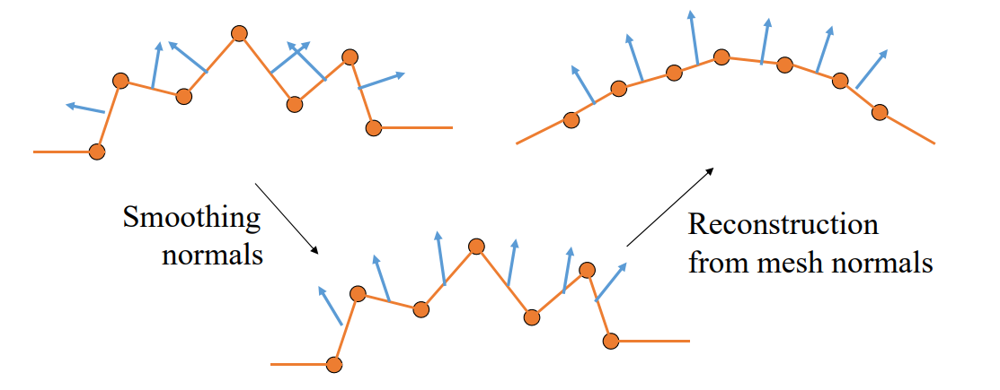

# 2. Normal Filtering    

## 法向滤波的应用场景

先对法向进行滤波（可使用顶点滤波的任何方法），根据滤波后的法向**重建网格顶点**    

   

## 由法向重建顶点   

• 输入：滤波后的法向量场    
• 输出：重建网格顶点，使得其法向量接近输入    

> 法向是一阶微分量，可以通过积分求出顶点。    
离散情况下，积分过程变成了线性方程组，方程依据是法向与边垂直。  

$$
\begin{cases}
 n_f^T\cdot (x_j-x_i)=0\\\\
n_f^T\cdot (x_k-x_j)=0  \\\\
n_f^T\cdot (x_i-x_k)=0
\end{cases}
$$

Energy:   

$$
E=\sum _{fk}\sum _{i,j\in fk}(n^T_k\cdot (x_j-x_i))^2
$$

**求解线性方程组**   

*See more in [Zhang et al. Guided Mesh Normal Filtering. PG 2015.]*

