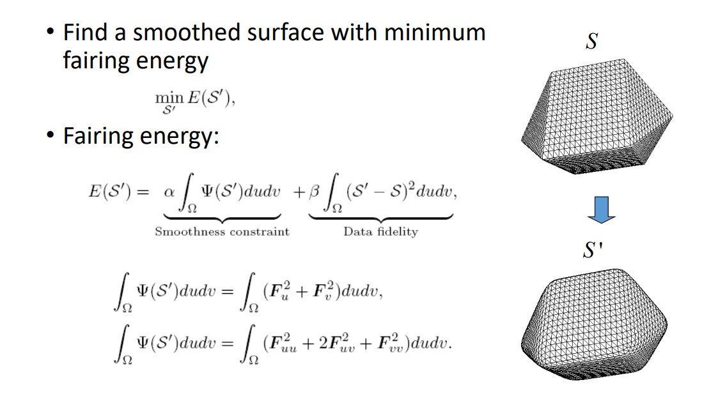

# 3. Global Smoothing   

## 能量优化方法   

*Liu et al. Non‐Iterative Approach for Global Mesh  Optimization. CAD 2007.*    

   

> E(s')，第一项：光滑，第二项：数据保持，关键是如何度量光滑。  

## 增加约束

约束：[link](../LaplacianCoordinates/Constrained.md)

本文出自CaterpillarStudyGroup，转载请注明出处。
https://caterpillarstudygroup.github.io/GAMES102_mdbook/  
