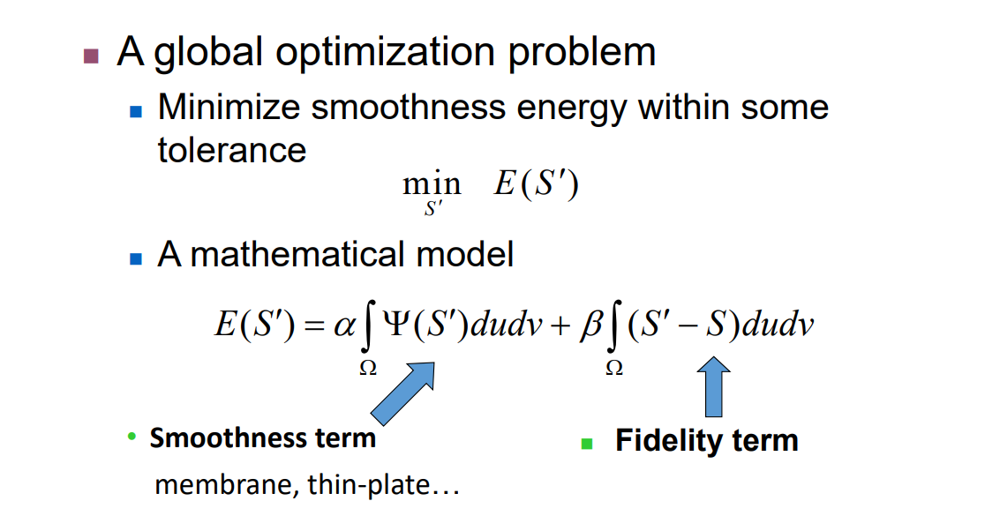
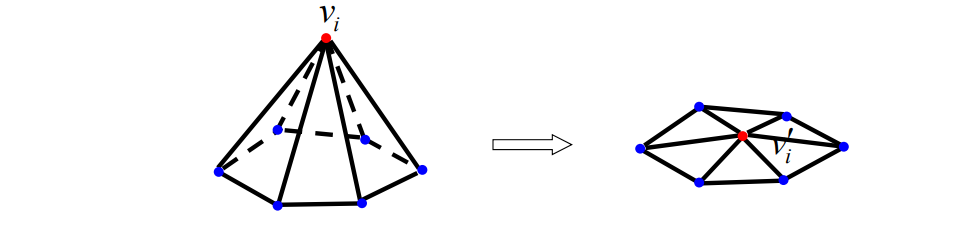
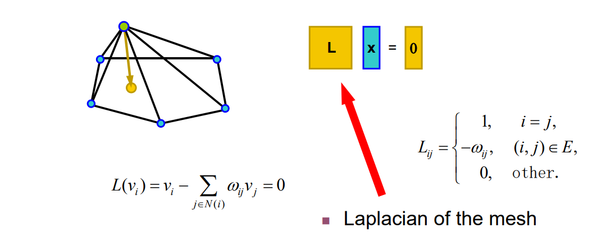
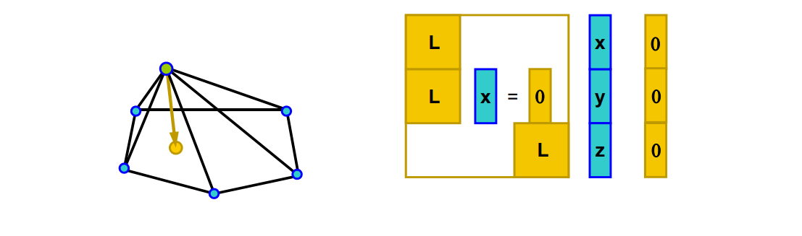
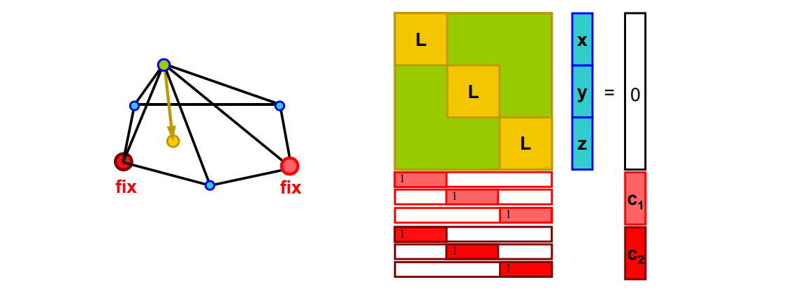
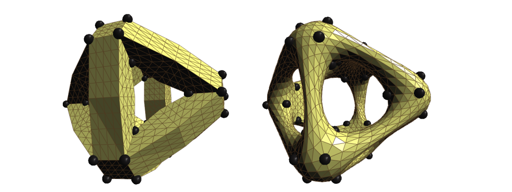
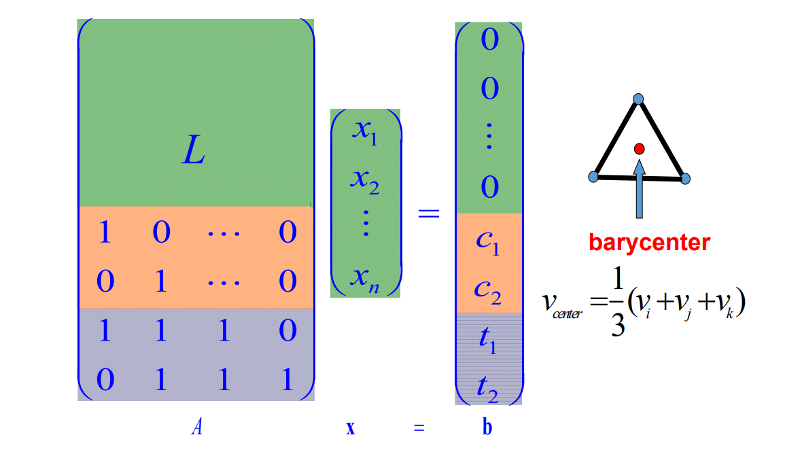
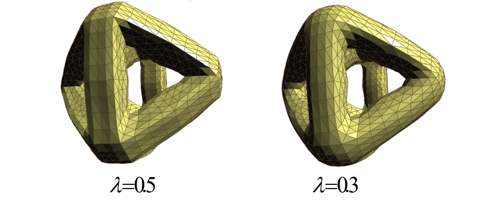
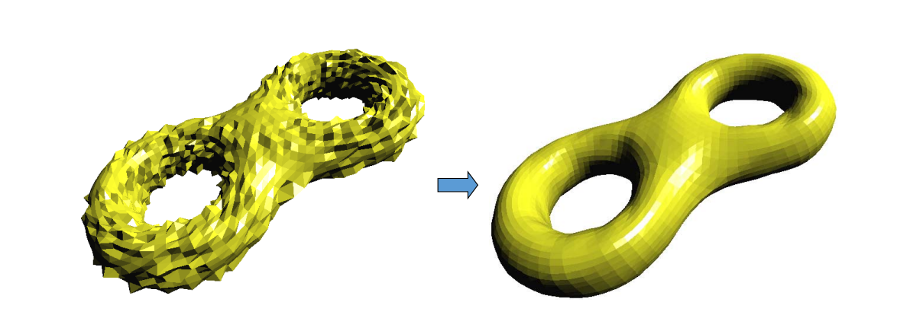

# 3. Global Smoothing   

Liu et al. Non‐Iterative Approach for Global Mesh  Optimization. CAD 2007.    

## Smoothing Formulation   

   

> E(s')，第一项：光滑，第二项：数据保持，关键是如何度量光滑。  

## Smoothing Problem   

   

# Local Lapacian Fairness   

Local discrete Laplacian smoothing operator   

   

$$
L(\nu_i)=\nu_i-\sum_{j\in N(j)}w_{ij}\nu_j=0
$$

$$
\delta_{cotangent}:W_{ij}=cot\alpha_{ij}+cot\beta_{ij}
$$

# Laplacian of Mesh     

   

# Laplacian of Mesh   

• Surface reconstruction    

   

$$
L(\nu_i)=\nu_i-\sum_{j\in N(i)}w_{ij}v_j=0
$$

# Vertex Constraints     

• Add position constraints for more vertices    

   

# Adding Vertex Constraints    

\\(min_{{X}'}\\){\\(||L{X}'||^2+\mu ^2\sum _{i\in C}|{\nu}'_i-\nu_i|^2\\)}     

   

# Face Constraints   

   

# Adding Face Constraints    

\\(min_{{X}'}\\){\\(||L{X}'||^2+\sum _{<i,j,k>\in T}\lambda ^2|({\nu}'_i+{\nu}'_j+{\nu}'_k)-(\nu_i+\nu_j+\nu_k)|^2\\)}     

   

# Other Constraints    

• Edge constraints   

   

• 1‐ring barycenter constraints    

   

• Other linear constraints    

# Minimizing Energy   

\\(min_{{X}'}\\){\\(||L{X}'||^2+\sum _{i\in C }u ^2|{\nu }'_i-\nu _i|^2+\sum _{<i,j,k>\in T}\lambda ^2|({\nu}'_i+{\nu}'_j+{\nu}'_k)-(\nu_i+\nu_j+\nu_k)|^2\\)} 

$$
\Downarrow 
$$

$$
AX=b
$$

# Least Square Solution     

• An over‐determined system:    

$$
AX=b
$$

• Normal equation:    

$$
A^TAX=A^Tb
$$

$$
X=(A^TA)^{-1}A^Tb
$$

# One Channel Solution   

• Very efficient solution by Cholesky factorization of \\(A^TA\\):     

$$
A^TA=R^TR
$$

R is upper‐triangular and sparse Once R is computed, olving for x, y, z by back‐ substitution:    

$$
R^T\xi=A^Tb
$$

$$
RX=\xi
$$

# Results   

   

**‘8’-like mesh model**    
**3070 vertices, 6144 triangles**     

