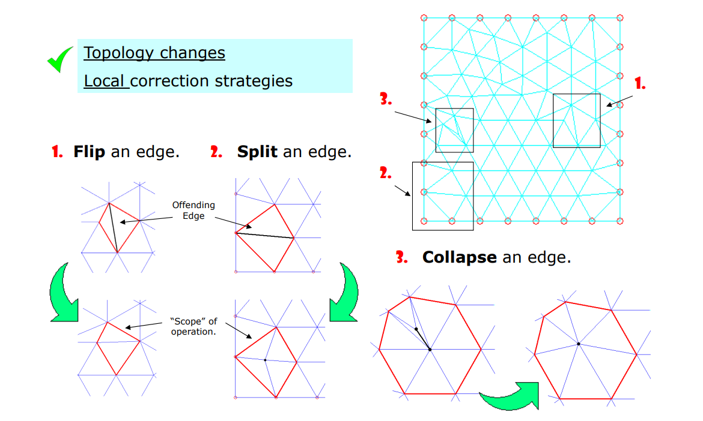
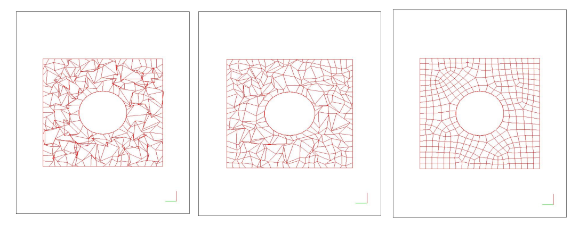

# 4. Mesh Improvement    

什么是质量好？（1）三角形接近正三角形（2）无翻转     

## 方法一：Flip   

   

Example   
   

# 其他去噪方法    

* 基于稀疏优化的方法    
• He and Schaefer. Mesh denoising via L0 minimization. Siggraph 2013.    

* 基于压缩感知的方法    
• Wang et al. Decoupling Noises and Features via Weighted L1‐analysis Compressed Sensing.  ACM TOG, 2014.    
* 基于机器学习的方法    
• Wang et al. Mesh Denoising via Cascaded Normal Regression. Siggraph 2016.    
* 很多很多工作…    

# 其他数据的去噪   

• Point cloud   

> 点云：把点云去噪转化为前面学过的问题。例如取空间上的邻居点作为它的邻域。    

• Volumetric data   

• Depth images    

> 深度相机的数据质量很差，尤其是深度这一维度。    

本文出自CaterpillarStudyGroup，转载请注明出处。
https://caterpillarstudygroup.github.io/GAMES102_mdbook/  
