# 网格曲面上的噪声   

> Meshes obtained from real world objects are often noisy.    

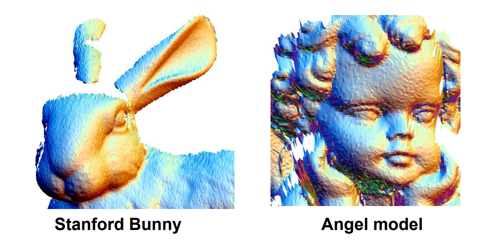    

# Mesh (surface) Denoising    

    

• Mesh denoising    
• Mesh smoothing    
• Mesh filtering     
• Mesh improvement     
• Surface fairing (*)    

# What is noise?   

• High‐frequent tiny parts     
• Small bumps on the surface     
• High curvature parts    
• High fairing energy parts   
• …    

    

> No Precise Mathematical Definition!    

# Denoising / Smoothing [From Wiki]    

 - In statistics and image processing, to smooth a data set is to create **an approximating function** that attempts to capture **important patterns** in the data, while leaving out noise or other fine‐scale structures/rapid phenomena.    
    - Eliminate high frequency    
    - Preserve global features    

    

# Smoothing / Denoising Problem    

 - Input:\\(M\\) （含噪声的网格曲面）     
 - Output:\\(M^0\\) （无噪声的网格曲面）     
 - Denoising model:  \\(M=M^0+\varepsilon \\)      

 - Challenges    
    - Both the ideal mesh \\(M^0\\) and the noise \\(𝜀\\) are unknown    
    - “ill‐posed” problem!    

# Mesh smoothing    

* 假定：网格顶点的数据及连接关系不变    
* 问题转化为：求顶点的新位置，使得“噪声”减少！    
• 顶点进行适当的扰动或偏移    

    

* 问题：顶点偏移的方向？    

# Mesh Smoothing Problem     

* Input: \\(M\\)（含噪声的网格曲面）     
* Output:  \\(M^0\\)（无噪声的网格曲面）    
* Mesh smoothing model:  \\(\nu=\nu^0+\varepsilon n\\) (for all \\(\nu\in M\\))    

* Questions:    
• What is the displacement vector \\(n\\) for vertex \\(𝒗\\) ?   

# Mesh Smoothing Model    

 \\(\nu=\nu^0+\varepsilon n\\) (for all \\(\nu\in M\\))    
     
 - Displacement vector \\(n\\)     
    - The normal of \\(𝒗^0\\)?   ‐‐ unknown! ill‐posed too!    
    - The normal of \\(𝒗\\) : doable     
 - New model: \\(\nu^0=\nu-\varepsilon n\\)    

 - Key: \\(\varepsilon\\) =?   

     

# Filtering   

• Convolution \\((x*h)(t)=\int_{-\infty }^{\infty } x(\tau )h(t-\tau )d\tau\\)     

• Discrete form \\((x*h)(t)= {\textstyle \sum_{𝜏=-\infty }^{\infty }}  x(𝜏 )h(t-𝜏 ) \\)   

    

几何意义：将函数\\(ℎ(𝑡)\\)作为权来对\\(𝑥(𝑡)\\)进行加权平均（滤波）    
• 将\\(𝑥(𝑡)\\)的局部信息进行混合平均    

# Image Filtering   

    

# Gaussian Filtering    

• 使用Gauss函数作为权函数   

$$
{I}' (u)=\sum _{p\in N(u)}e^{\frac{||u-P||^2}{2\sigma ^2} }I(P)
$$

    

# Discrete Filtering (mask)    

    

# Mesh Vertex Filtering: 
# Laplacian operator / Umbrella Operator    

$$
P_{new}\gets P_{old}+\lambda L(P_{old})
$$

    

# 滤波对象    

* Vertex   
* Normal   
* Curvature    
* Color   
* Other physical properties (texture, albedo, … )     

* Challenges:    
• Iteration number   
• Shrinkage      

   

# 1. Vertex Filtering    

# 1.1 Laplacian Smoothing    

$$
P_{new}\gets P_{old}+\lambda L(P_{old})
$$

   

# Laplacian Smoothing    

$$
P^{new} = P^{old}+\lambda L(P^{old})
$$

* Equivalent to box filter in signal processing     
* Apply to all vertices on mesh    
* Typically repeat several times     
* Can describe as energy minimization    
• Energy = sum of squared edge lengths in mesh     
• Parameter\\(\lambda >0\\)controls convergence "speed"     

# Problem of Over‐smoothing   

How to find appropriate and number of iterations?   

   

# Shrinkage Problem     

>&#x2705;Increases mesh regularity    
>&#x2705;Develops unnatural deformations    

   

# Improved Laplacian   

* Laplacian   

$$
P^{new} = P^{old}+\lambda L(P^{old})
$$

* Taubin’95    
• Laplacian + Expansion     

$$
P^{new} = P^{old}-(\mu -\lambda )L(P^{old})-\mu \lambda L^2(P^{old}),\mu >\lambda >0
$$

* Bilaplacian    
• Special case of Taubin’s    

$$
P^{new} = P^{old}+\lambda L^2(P^{old})
$$

# Comparison    

   

 - Drawbacks   
    - Slow    
    - No stoping criteria    

# 1.2 Mean Curvature Flow    

   

# Mean Curvature Filtering   

> &#x2705; Increases mesh irregularity.    
> &#x2705; Doesn’t develop unnatural deformations     

   

# Discrete Mean Curvature    

   

$$
Hn=\frac{\nabla _PA}{2A} 
$$

$$
Hn=\frac{1}{4A} \sum _j(\cot \alpha _j+\cot \beta _j)(P-Q_j)
$$

# Comparisons   

   

# 1.3 Bilateral filtering    

   

# Bilateral filtering    

   

   

# Bilateral filtering of meshes   

 - Height above surface is equivalent to the gray level 
values in images   
 - Apply the bilateral filter to heights     

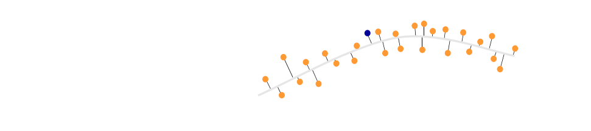   

# Bilateral filtering of meshes   

 - Height above surface is equivalent to the gray level 
values in images   
 - Apply the bilateral filter to heights    
 - Move the vertex to its new height     

   

# Bilateral filtering of meshes   

 - Height above surface is equivalent to the gray level 
values in images    
 - Apply the bilateral filter to heights    
 - Move the vertex to its new height    
 - In practice:   
    - Sharp features    
    - The noise‐free    
      surface is unknown    

   

# Solution    

 - A plane that passes through the point is the 
estimator to the smooth surface      
 - Plane \\(L=(p,n)\\)    

   

# Computing the plane    

* The approximating plane should be:     
• A good approximation to the surface    
• Preserve features   
* Average of the normal to faces in the 1‐ring neighborhood     

   

# Parameters   

* The two parameters to the weight function: \\(σ_c, 
σ_s\\)    
• Interactively select a  point p and the neighborhood radius ρ       
• \\(σ_c\\) = 1/2 ρ     
• \\(σ_s\\) = stdv ( Nbhd (p, ρ))    
* Number of Iterations     

   

# Results   

   

# 1.4 Implicit Mesh Evolutions   

Shape evolution  \\(\frac{\partial P}{\partial t} =F(P)\\)   

\\(M_{n+1}=M_n+\lambda L(M_n)\\) explicit scheme   

\\(M_{n+1}=M_n+\lambda L(M_{n+1})\\) implicit scheme   

$$
\Rightarrow (I-\lambda L)M_{n+1}=M_n
$$

# 2. Normal Filtering    

# Normal Filtering   

• 先对法向进行滤波：可使用顶点滤波的任何方法    
• 根据滤波后的法向重建网格顶点    

   

# 由法向重建顶点   

• 输入：滤波后的法向量场    
• 输出：重建网格顶点，使得其法向量接近输入    
• 优化方法：  
Vertex Updating:   

$$
\begin{cases}
 n_f^T\cdot (x_j-x_i)=0\\\\
n_f^T\cdot (x_k-x_j)=0  \\\\
n_f^T\cdot (x_i-x_k)=0
\end{cases}
$$

Energy:   

$$
E=\sum _{fk}\sum _{i,j\in fk}(n^T_k\cdot (x_j-x_i))^2
$$

**求解线性方程组**   

See more in [Zhang et al. Guided Mesh Normal Filtering. PG 2015.]

# 3. Global Smoothing   

Liu et al. Non‐Iterative Approach for Global Mesh  Optimization. CAD 2007.    

# Smoothing Formulation   

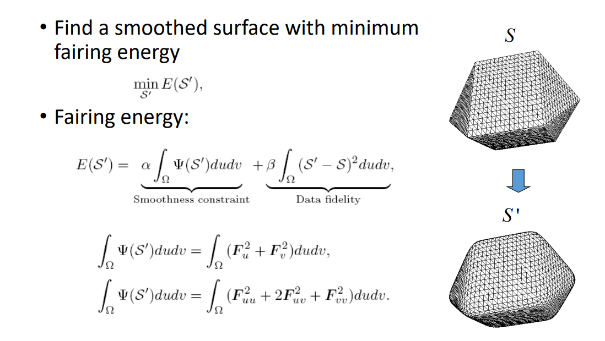   

# Smoothing Problem   

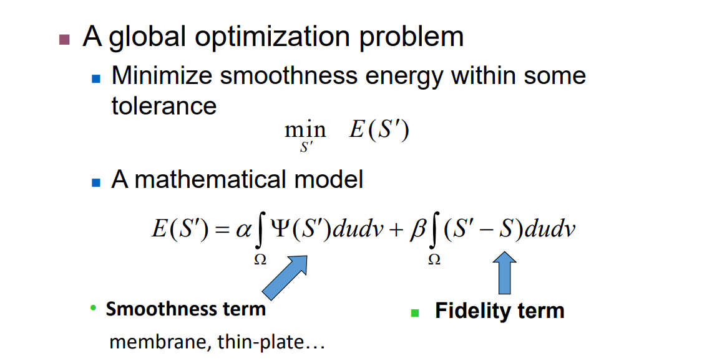   

# Local Lapacian Fairness   

Local discrete Laplacian smoothing operator   

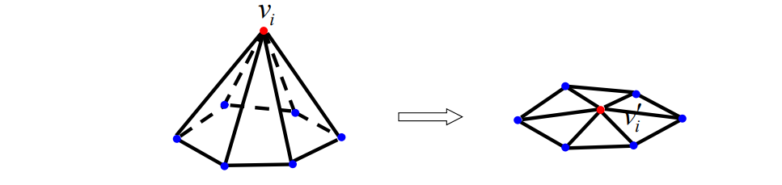   

$$
L(\nu_i)=\nu_i-\sum_{j\in N(j)}w_{ij}\nu_j=0
$$

$$
\delta_{cotangent}:W_{ij}=cot\alpha_{ij}+cot\beta_{ij}
$$

# Laplacian of Mesh     

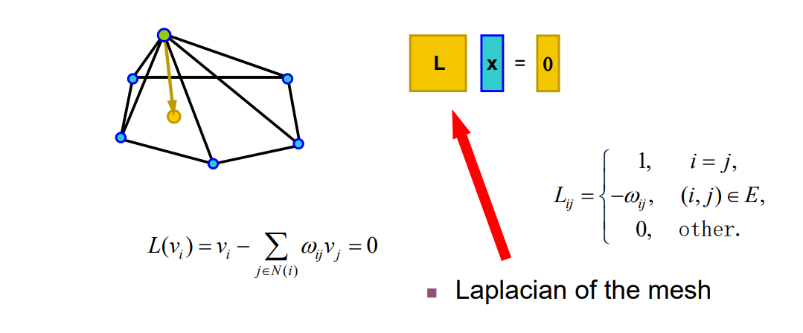   

# Laplacian of Mesh   

• Surface reconstruction    

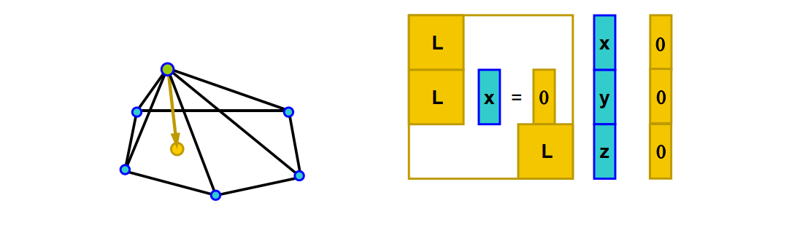   

$$
L(\nu_i)=\nu_i-\sum_{j\in N(i)}w_{ij}v_j=0
$$

# Vertex Constraints     

• Add position constraints for more vertices    

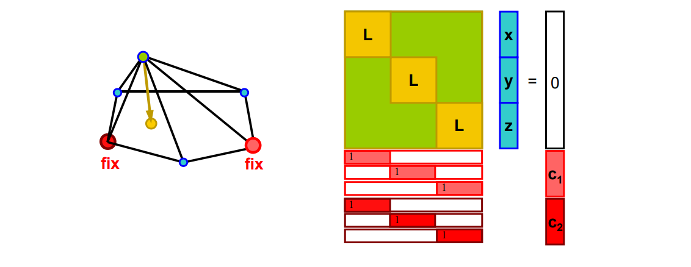   

# Adding Vertex Constraints    

\\(min_{{X}'}\\){\\(||L{X}'||^2+\mu ^2\sum _{i\in C}|{\nu}'_i-\nu_i|^2\\)}     

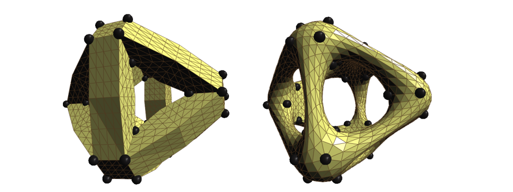   

# Face Constraints   

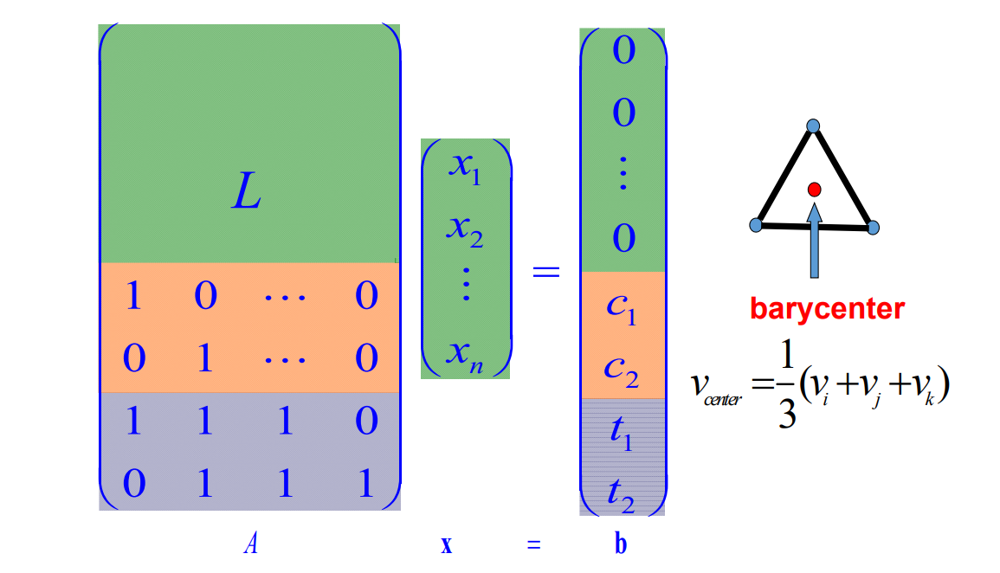   

# Adding Face Constraints    

\\(min_{{X}'}\\){\\(||L{X}'||^2+\sum _{<i,j,k>\in T}\lambda ^2|({\nu}'_i+{\nu}'_j+{\nu}'_k)-(\nu_i+\nu_j+\nu_k)|^2\\)}     

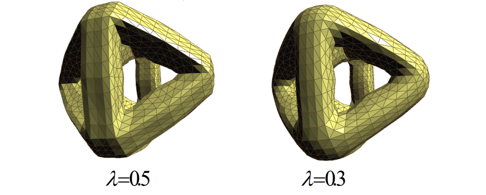   

# Other Constraints    

• Edge constraints   

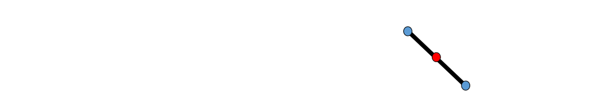   

• 1‐ring barycenter constraints    

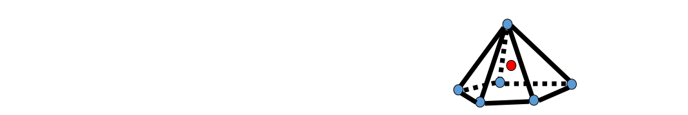   

• Other linear constraints    

# Minimizing Energy   

\\(min_{{X}'}\\){\\(||L{X}'||^2+\sum _{i\in C }u ^2|{\nu }'_i-\nu _i|^2+\sum _{<i,j,k>\in T}\lambda ^2|({\nu}'_i+{\nu}'_j+{\nu}'_k)-(\nu_i+\nu_j+\nu_k)|^2\\)} 

$$
\Downarrow 
$$

$$
AX=b
$$

# Least Square Solution     

• An over‐determined system:    

$$
AX=b
$$

• Normal equation:    

$$
A^TAX=A^Tb
$$

$$
X=(A^TA)^{-1}A^Tb
$$

# One Channel Solution   

• Very efficient solution by Cholesky factorization of \\(A^TA\\):     

$$
A^TA=R^TR
$$

R is upper‐triangular and sparse Once R is computed, olving for x, y, z by back‐ substitution:    

$$
R^T\xi=A^Tb
$$

$$
RX=\xi
$$

# Results   

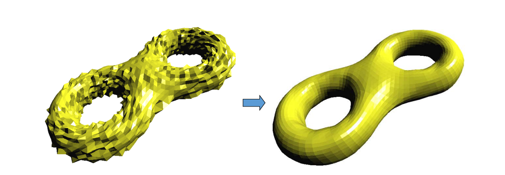   

**‘8’-like mesh model**    
**3070 vertices, 6144 triangles**     

# 4. Mesh Improvement    

# Smoothing Everywhere    

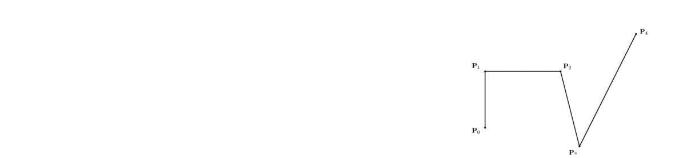   

* Real life applications    
• Sculpture    
• Decoration    

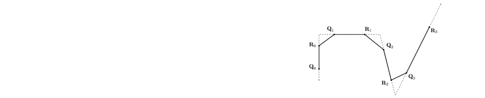   

* Methods    
• Corner cutting    

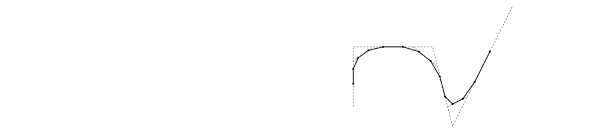   

* Geometric modeling    
• Chaikin's scheme     
• Bézier: de Castljau algorithm   
• B‐spline: knot insertion   
• Subdivision surface    

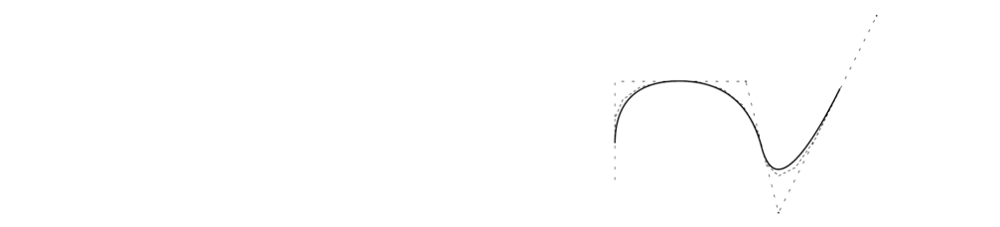   

# Mesh Improvement   

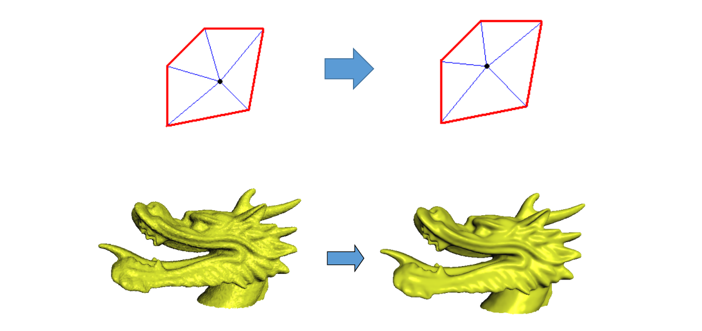   

# Mesh Improvement   

   

# Mesh Improvement 

• Example   

   

# 其他去噪方法    

* 基于稀疏优化的方法    
• He and Schaefer. Mesh denoising via L0 minimization. Siggraph 2013.    

* 基于压缩感知的方法    
• Wang et al. Decoupling Noises and Features via Weighted L1‐analysis Compressed Sensing.  ACM TOG, 2014.    
* 基于机器学习的方法    
• Wang et al. Mesh Denoising via Cascaded Normal Regression. Siggraph 2016.    
* 很多很多工作…    

# 其他数据的去噪   

• Point cloud   

• Volumetric data   

• Depth images    

# Many Problems Remain    

> Mesh smoothing remains to be an active research area   

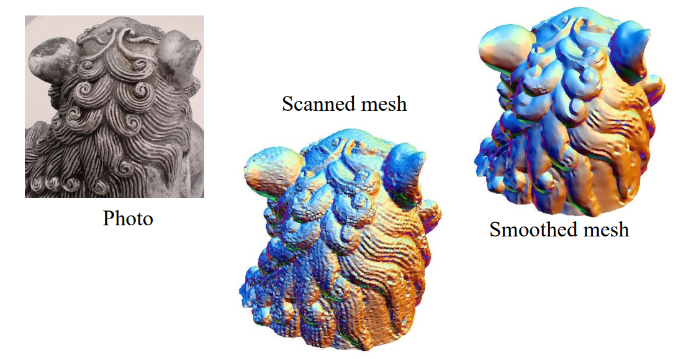   
