# Mesh (surface) Denoising    

Meshes obtained from real world objects are often noisy.    

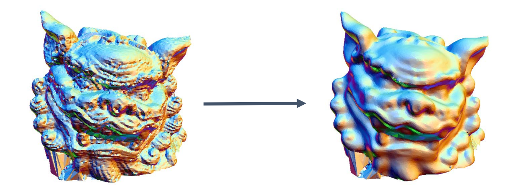    

• Mesh denoising    
• Mesh smoothing    
• Mesh filtering     
• Mesh improvement     
• Surface fairing (*)    

> 这几个词都是去噪的不同表达。    
在连续几何中， fairing 代表光顺，与 smoothing 不同。   
在离散几何中， fairing 与 smoothing 通用。     

## What is noise?   

• High‐frequent tiny parts     
• Small bumps on the surface     
• High curvature parts    
• High fairing energy parts   
• …    

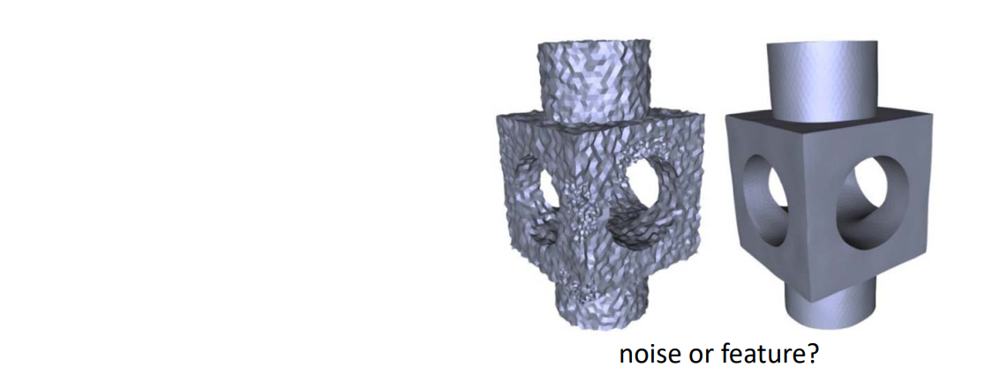    

> No Precise Mathematical Definition!    

## Denoising / Smoothing [From Wiki]    

 - In statistics and image processing, to smooth a data set is to create **an approximating function** that attempts to capture **important patterns** in the data, while leaving out noise or other fine‐scale structures/rapid phenomena.    
    - Eliminate high frequency    
    - Preserve global features    

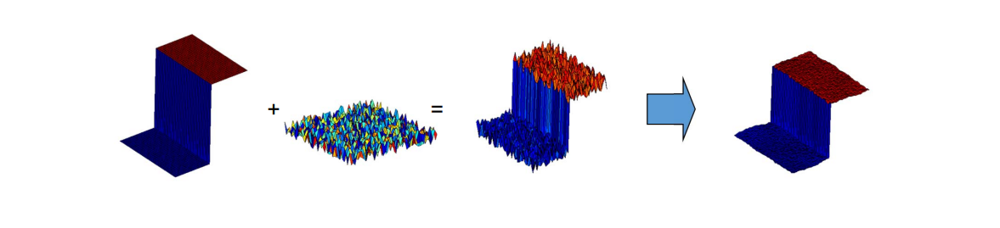    

# Smoothing / Denoising Problem    

## 问题定义

 - Input:\\(M\\) （含噪声的网格曲面）     
 - Output:\\(M^0\\) （无噪声的网格曲面）     
 - Denoising model:  \\(M=M^0+\varepsilon \\)      

## Challenges    
    - Both the ideal mesh \\(M^0\\) and the noise \\(𝜀\\) are unknown    
    - “ill‐posed” problem!    

## 原理    

* 假定：网格顶点的数据及连接关系不变    
* 问题转化为：求顶点的新位置，使得“噪声”减少！    
• 顶点进行适当的扰动或偏移    

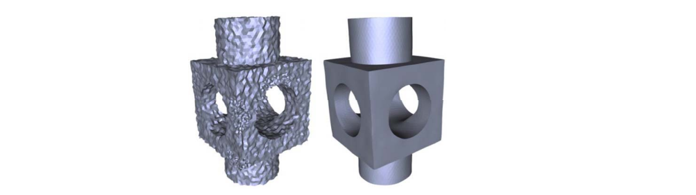    

* 问题：顶点偏移的方向？    

# Mesh Smoothing Problem     

## 定义

* Input: \\(M\\)（含噪声的网格曲面）     
* Output:  \\(M^0\\)（无噪声的网格曲面）    
* Mesh smoothing model:  \\(\nu=\nu^0+\varepsilon n\\) (for all \\(\nu\in M\\))    

* Questions:    
• What is the displacement vector \\(n\\) for vertex \\(𝒗\\) ?   

## Mesh Smoothing Model    

 \\(\nu=\nu^0+\varepsilon n\\) (for all \\(\nu\in M\\))    
     
 - Displacement vector \\(n\\)     
    - The normal of \\(𝒗^0\\)?   ‐‐ unknown! ill‐posed too!    
    - The normal of \\(𝒗\\) : doable     
 - New model: \\(\nu^0=\nu-\varepsilon n\\)    

 - Key: \\(\varepsilon\\) =?   

 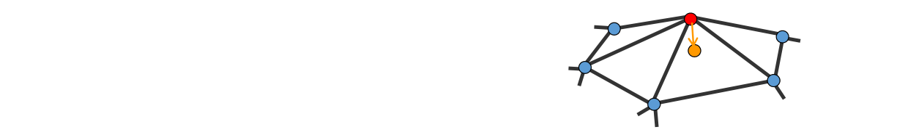    

> \\(V是带噪声曲面上的点，V_0\\)是无噪声曲面上的点。    
假设：   
① \\(V是V_0\\)沿几方向上做了一点偏移。    
② \\(n是V_0\\)的法方向。   
③ 当\\(V接近V_0\\)时， \\(V 的法国方向接近 n\\)    

# Filtering   

• Convolution \\((x*h)(t)=\int_{-\infty }^{\infty } x(\tau )h(t-\tau )d\tau\\)     

• Discrete form \\((x*h)(t)= {\textstyle \sum_{𝜏=-\infty }^{\infty }}  x(𝜏 )h(t-𝜏 ) \\)   

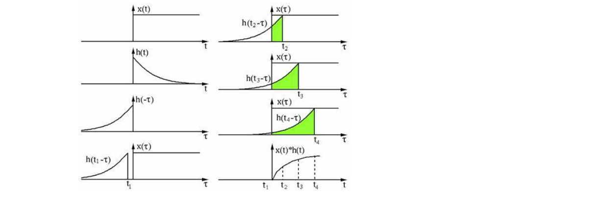    

几何意义：将函数\\(ℎ(𝑡)\\)作为权来对\\(𝑥(𝑡)\\)进行加权平均（滤波）    
• 将\\(𝑥(𝑡)\\)的局部信息进行混合平均    

## Image Filtering   

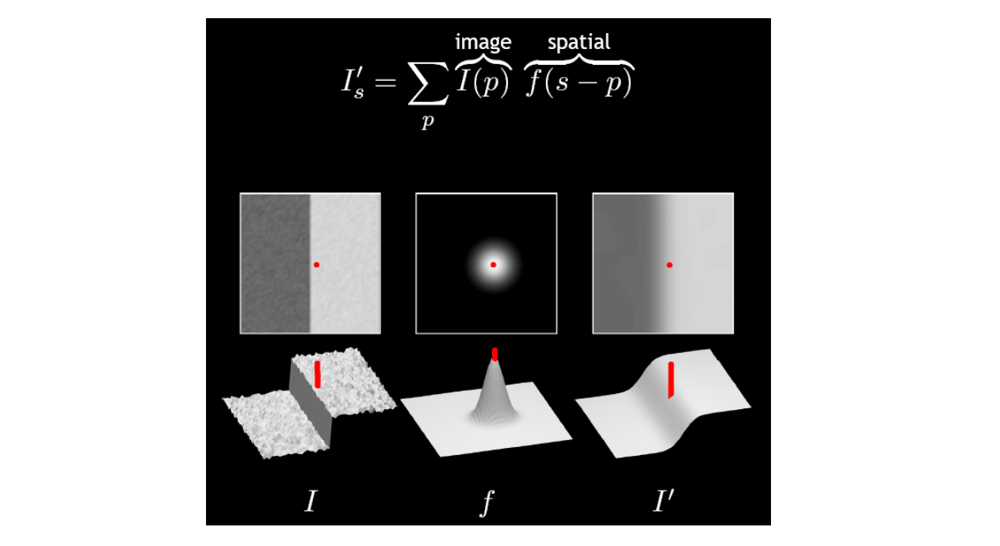    

## Gaussian Filtering    

• 使用Gauss函数作为权函数   

$$
{I}' (u)=\sum _{p\in N(u)}e^{\frac{||u-P||^2}{2\sigma ^2} }I(P)
$$

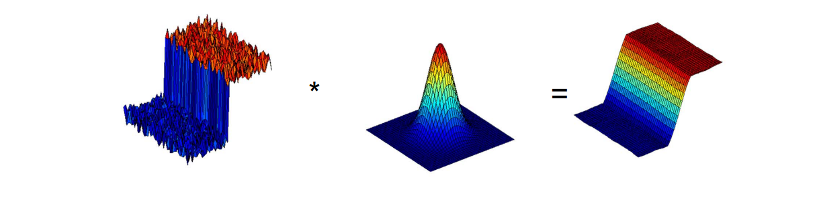    

> Gauss 函数的好处：   
① 概率密度函数，积分和为1.     
② 具有对称性    
③ 与距离相关    

## Discrete Filtering (mask)    

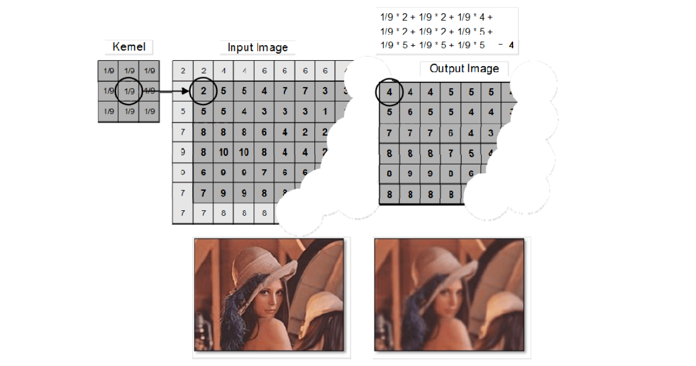    

## Mesh Vertex Filtering: Laplacian operator / Umbrella Operator    

$$
P_{new}\gets P_{old}+\lambda L(P_{old})
$$

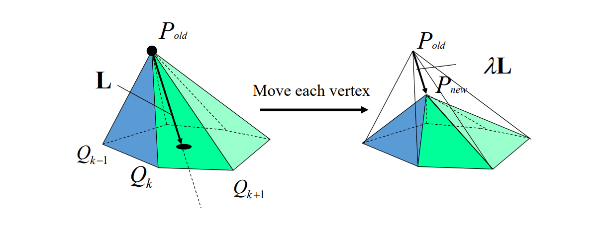    

> [26:48] Laplace 光顺===极小化所有边长平方和     

## 滤波对象    

* Vertex   
* Normal   
* Curvature    
* Color   
* Other physical properties (texture, albedo, … )     

* Challenges:    
• Iteration number   
• Shrinkage      

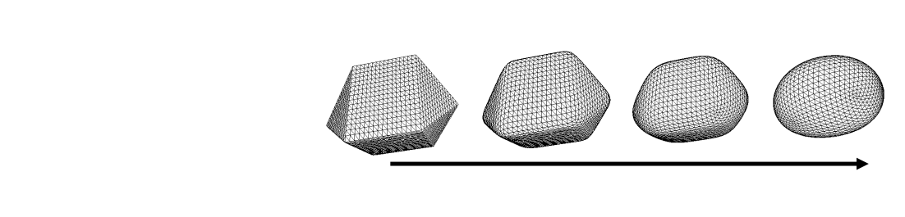   

