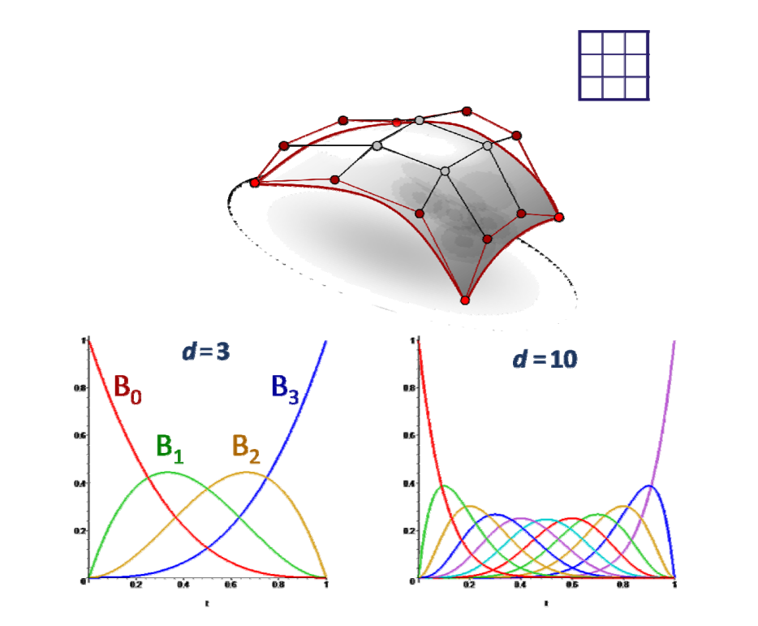
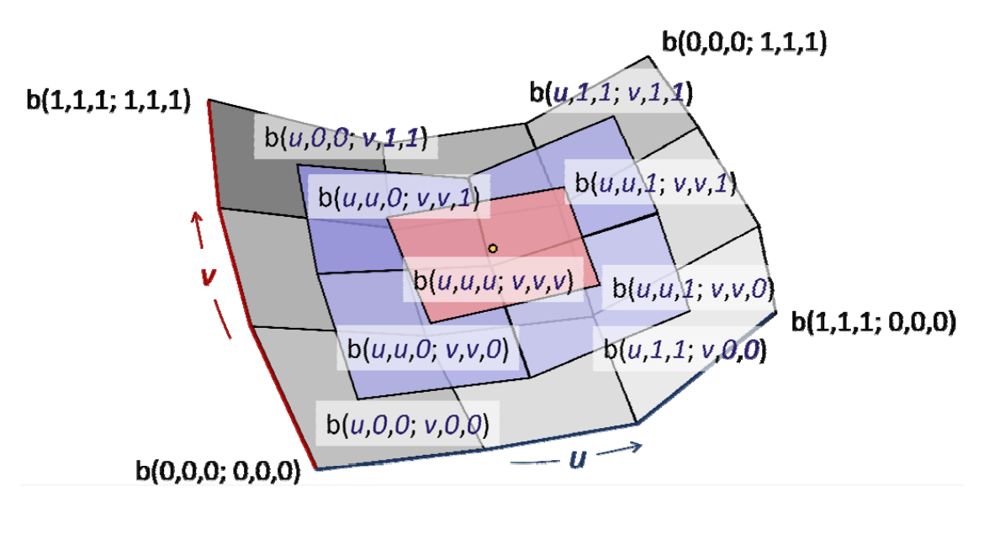
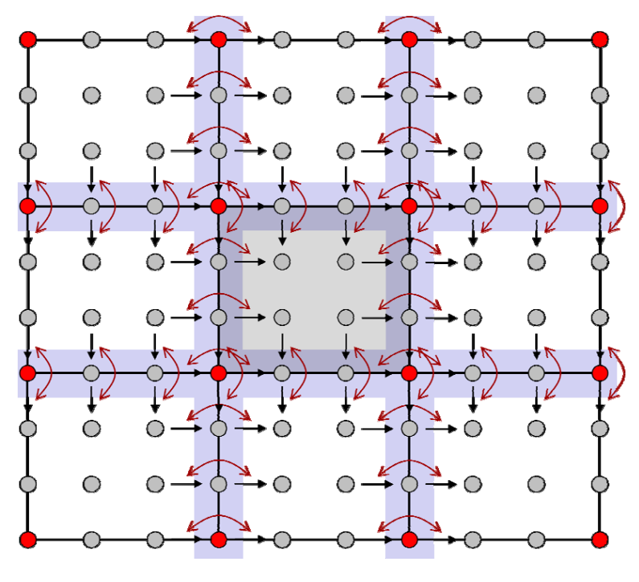

# 参数曲面

[link](https://caterpillarstudygroup.github.io/GAMES102_mdbook/ParametricFitting/VectorValue.html)   

# 张量积曲面  

## 定义

张量积：[link](https://caterpillarstudygroup.github.io/GAMES102_mdbook/ParametricFitting/Multi.html)  

$$
f(u,v)=\sum_{i=1}^{n} \sum_{j=1}^{n}b_i(u)b_j(v)p_{i,j}
$$

$$
=\sum_{i=1}^{n} b_i(u)\sum_{j=1}^{n}b_j(v)p_{i,j}
$$

$$
=\sum_{j=1}^{n} b_j(v)\sum_{i=1}^{n}b_{i}(u)p_{i,j}
$$

曲面是曲线的曲线      
先沿一个方向做，然后再沿另一个方向做（方向顺序无关）     

## 张量积曲面的性质    

类似于曲线情形，性质取决于基函数的性质      

# Bezier曲面   

## 定义

基于张量基定义的形式，以Bizier基定义的曲面

$$
f(u,v)=\sum_{i=1}^{d} \sum_{j=0}^{d}B_i^{(d)}(u)B_j^{(d)}(v)p_{i,j}
$$

   

## Bezier曲面的性质    
 
- 边界插值     
- 凸包    
- 变差缩减    
- 几何作图法     
   

- 曲面片之间的拼接连续性    

   

# 其他曲面    

• B样条曲面    

• 有理曲面    

• NURBS曲面    

本文出自CaterpillarStudyGroup，转载请注明出处。
<https://caterpillarstudygroup.github.io/GAMES102_mdbook/>

