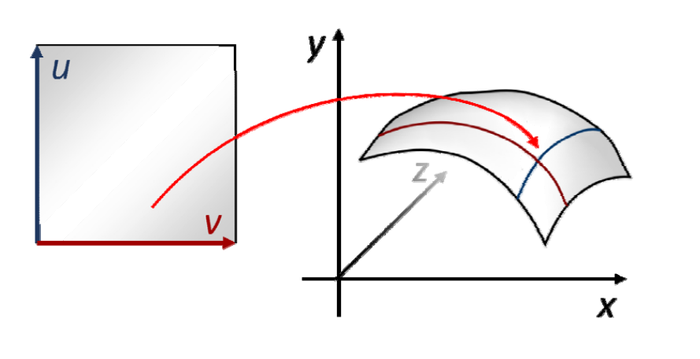
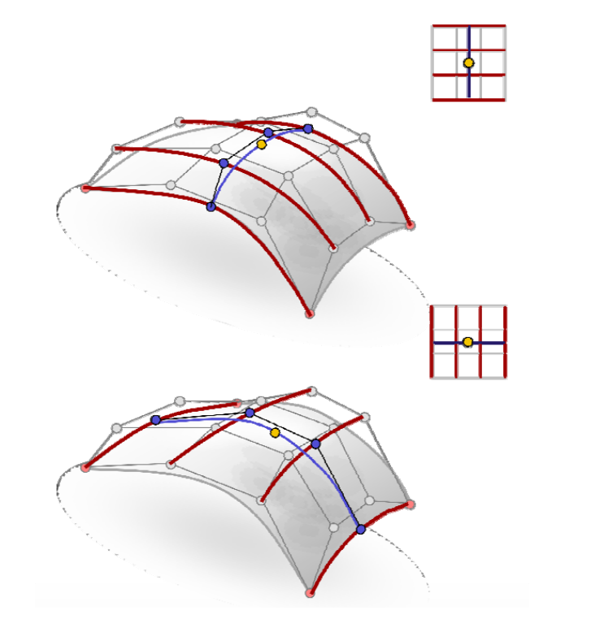

# 回顾：  

## 参数曲面
[参数曲面](https://caterpillarstudygroup.github.io/GAMES102_mdbook/ParametricFitting/VectorValue.html)   

• 双参数\\((u,v)\\)     
• 参数曲面  
$$
\begin{pmatrix}x
 \\\\y 
 \\\\z
\end{pmatrix}=\begin{pmatrix}x(u,v)
 \\\\y (u,v)
 \\\\z(u,v)
\end{pmatrix}
$$

## 张量积曲面  

[张量积](https://caterpillarstudygroup.github.io/GAMES102_mdbook/ParametricFitting/Multi.html)  

$$
f(u,v)=\sum_{i=1}^{n} \sum_{j=1}^{n}b_i(u)b_j(v)p_{i,j}
$$

$$
=\sum_{i=1}^{n} b_i(u)\sum_{j=1}^{n}b_j(v)p_{i,j}
$$

$$
=\sum_{j=1}^{n} b_j(v)\sum_{i=1}^{n}b_{i}(u)p_{i,j}
$$

   

• “曲线的曲线”      
• 两个参数的顺序无关    

## Bezier曲面   

$$
f(u,v)=\sum_{i=1}^{d} \sum_{j=0}^{d}B_i^{(d)}(u)B_j^{(d)}(v)p_{i,j}
$$

   

 
## 张量积曲面的性质    

 - 类似于曲线情形，性质取决于基函数的性质      
    - 先沿一个方向做，然后再沿另一个方向做（方向顺序无关）     
 - Bezier曲面片具有类似的良好性质    
    - 边界插值     
    - 凸包    
    - 变差缩减    
    - 几何作图法     
    - …     

## de Casteljau作图法    

   

# 曲面片之间的拼接连续性    

   

# 其他曲面的定义完全同    

• B样条曲面    

• 有理曲面    

• NURBS曲面    

   