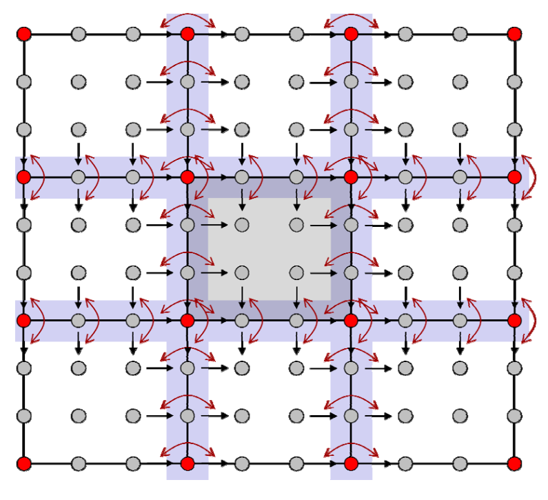

# NURBS曲面   

# 回顾：曲线曲面的不同形式   

    

# 参数曲面   

• 双参数\\((u,v)\\)     
• 参数曲面  
$$
\begin{pmatrix}x
 \\\\y 
 \\\\z
\end{pmatrix}=\begin{pmatrix}x(u,v)
 \\\\y (u,v)
 \\\\z(u,v)
\end{pmatrix}
$$

# 基本方法：张量积  

每个参数的基函数两两相乘得到二元函数的基函数

    

# 张量积函数   

    

# 张量积曲面  

$$
f(u,v)=\sum_{i=1}^{n} \sum_{j=1}^{n}b_i(u)b_j(v)p_{i,j}
$$

$$
=\sum_{i=1}^{n} b_i(u)\sum_{j=1}^{n}b_j(v)p_{i,j}
$$

$$
=\sum_{j=1}^{n} b_j(v)\sum_{i=1}^{n}b_{i}(u)p_{i,j}
$$

   

• “曲线的曲线”      
• 两个参数的顺序无关    

# Bezier曲面   

$$
f(u,v)=\sum_{i=1}^{d} \sum_{j=0}^{d}B_i^{(d)}(u)B_j^{(d)}(v)p_{i,j}
$$

   

 
# 张量积曲面的性质    

 - 类似于曲线情形，性质取决于基函数的性质      
    - 先沿一个方向做，然后再沿另一个方向做（方向顺序无关）     
 - Bezier曲面片具有类似的良好性质    
    - 边界插值     
    - 凸包    
    - 变差缩减    
    - 几何作图法     
    - …     

# de Casteljau作图法    

   

# 曲面片之间的拼接连续性    

   

# \\(C^1\\) Continuity    

   

# \\(C^1\\) Continuity   

   

# 其他曲面的定义完全同    

• B样条曲面    

• 有理曲面    

• NURBS曲面    

   

# Trimmed NURBS曲面   

> Trimmed:裁剪   

# 表达带“洞”或非矩形边界的曲面   

• 曲面上的曲线：使用参数域上的NURBS曲线来定义，然后复合得到曲面上的曲线      

   

> 由于 NURBS 曲面由张量积形式定义，因此只能定义在矩形域上。    
表达方法，在定义域用曲线表达同，再应用到 Bezier 曲面上。    

# Curves‐on‐Surfaces (CONS)    

   

# Curves‐on‐Surfaces (CONS)   

   

# Curves‐on‐Surfaces (CONS)    
   

# 三角域上的Bezier曲面片    

# 三角域的Bernstein‐Bezier曲面片    

• 矩形域有时不方便     
• 使用三角域来定义曲面片    

   

> 背景：张量积形式的 Bezier 曲面定义在矩形曲域，表达很不灵活，难以应用于非规整曲面。    
定义在三角面片上的类似于 Bezier 的曲面。      

# 三角Bezier曲面片    

$$
F(x)=\sum_{i+j+k=n;i,j,k\ge0}^{} \frac{n!}{i!j!k!} \alpha  ^i\beta ^j\gamma ^kp_{i,j,k}
$$

$$
x=\alpha a+\beta b+\gamma c,\alpha +\beta +\gamma =1
$$

   

> \\(\alpha ,\beta ,\gamma \\) 为三角形上某个点的重心坐标。 

# 连续性   

   

# 总结  

* 张量积曲面   
• 两个独立方向的“曲线的曲线”    
• 性质大都类同于曲线的性质   
• 表达、公式形式比曲线情形复杂    
• 特殊问题：角点的光滑性    

* 张量积体（三参数）    
• Bezier体    

    
