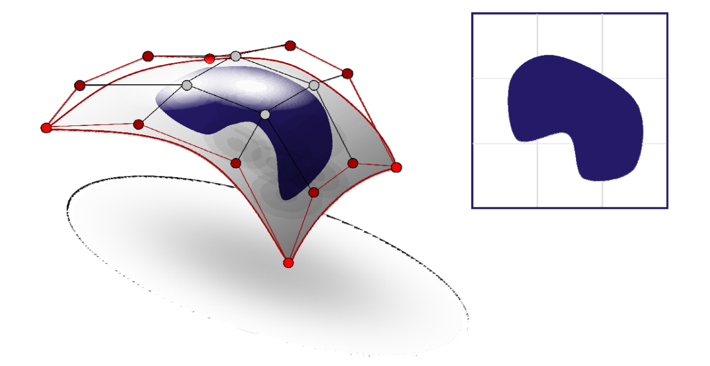
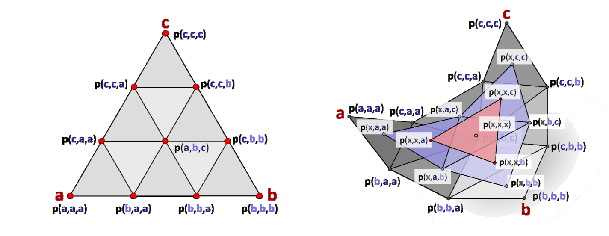
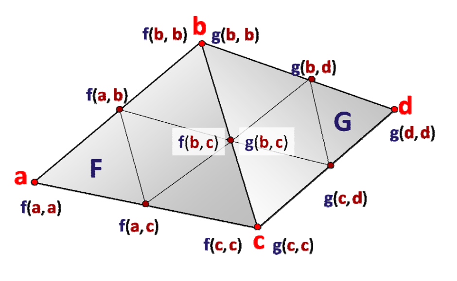
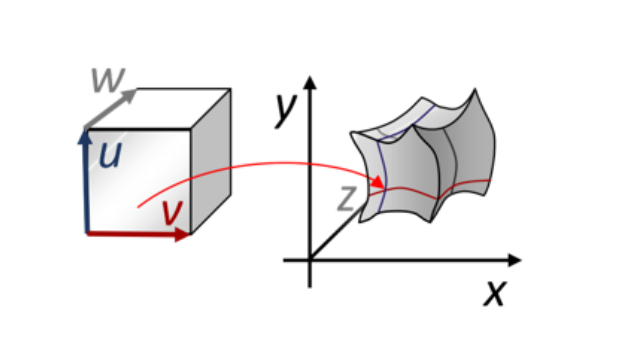

# Trimmed NURBS曲面

Trimmed：裁剪   
Trimmed NURBS曲面：表达带“洞”的曲面

（1）在曲面上定义曲线：使用参数域上的NURBS曲线来定义，然后复合得到曲面上的曲线   
（2）用曲线来表达曲面上的洞   

   

# 三角域上的Bezier曲面片    

> 背景：张量积形式的 Bezier 曲面定义在矩形曲域，表达很不灵活，难以应用于非规整曲面。    
定义在三角面片上的类似于 Bezier 的曲面。      

三角域的Bernstein‐Bezier曲面片：表达非矩形边界的曲面    

• 矩形域有时不方便     
• 使用三角域来定义曲面片    

## 三角Bezier曲面片    

$$
F(x)=\sum_{i+j+k=n;i,j,k\ge0}^{} \frac{n!}{i!j!k!} \alpha  ^i\beta ^j\gamma ^kp_{i,j,k}
$$

$$
x=\alpha a+\beta b+\gamma c,\alpha +\beta +\gamma =1
$$

   

> \\(\alpha ,\beta ,\gamma \\) 为三角形上某个点的重心坐标。 

## 连续性   

   

# 张量积体（三参数）    

## Bezier体    

    

# 张量积曲面总结  

• 两个独立方向的“曲线的曲线”    
• 性质大都类同于曲线的性质   
• 表达、公式形式比曲线情形复杂    
• 特殊问题：角点的光滑性    

---  

> 本文出自CaterpillarStudyGroup，转载请注明出处。
https://caterpillarstudygroup.github.io/GAMES102_mdbook/

