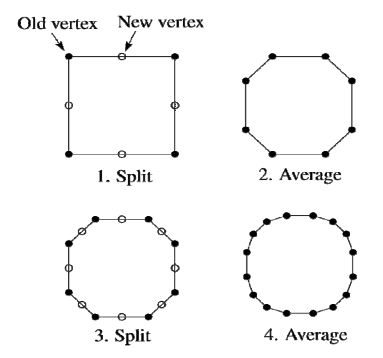
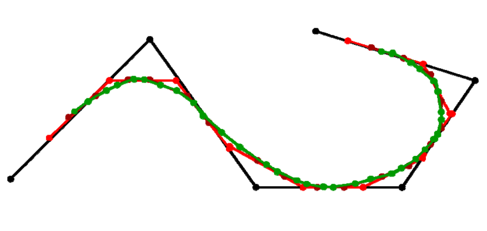
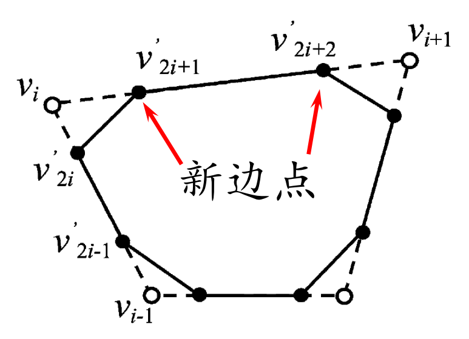
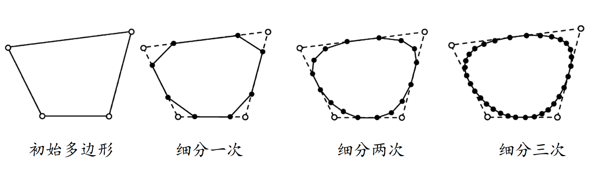
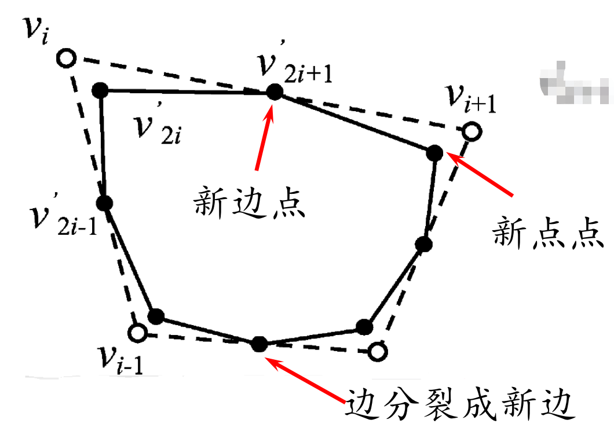

# Chaikin细分方法   

# Chaikin割角法[1974]   

• 每条边取中点，生成新点       
• 每个点与其相邻点平均（顺时针）    
• 迭代生成曲线     

    

    

# Chaikin割角法[1974]   

* 拓扑规则：   
• 点分裂成边（割角），老点被抛弃（逼近型）    
• 新点老点重新编号   
* 几何规则：新顶点是老顶点的线性组合     

    

$$
{\nu }' _{2i}=\frac{1}{4} \nu _{i-1}+\frac{3}{4} \nu _i
$$

$$
{\nu }' _{2i+1}=\frac{3}{4} \nu _{i}+\frac{1}{4} \nu _{i+1}
$$

# Chaikin细分曲线     

    

* 可以证明：    
• 极限曲线为二次均匀B样条曲线     
• 节点处\\(𝐶^1\\)，其余点处\\(𝐶^\infty \\)          

# 均匀三次B样条曲线细分方法     

• 拓扑规则：边分裂成两条新边     
• 几何规则：     

    

$$
{\nu }' _{2i}=\frac{1}{8} \nu _{i-1}+\frac{3}{4} \nu _i+\frac{1}{8} \nu _{i+1}
$$

$$
{\nu }' _{2i+1}=\frac{1}{2} \nu _{i}+\frac{1}{2} \nu _{i+1}
$$
