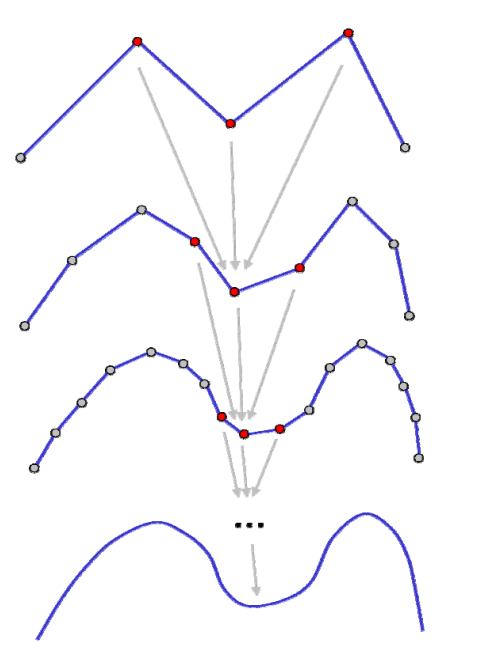
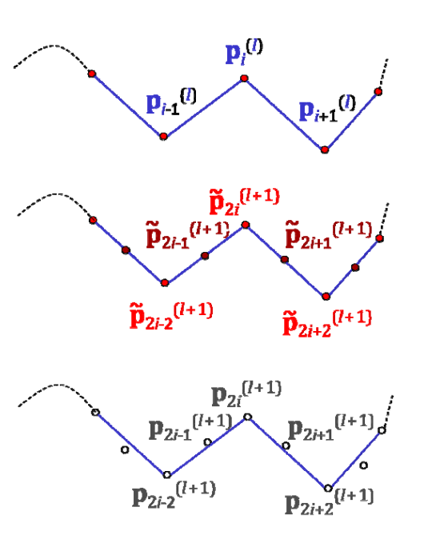
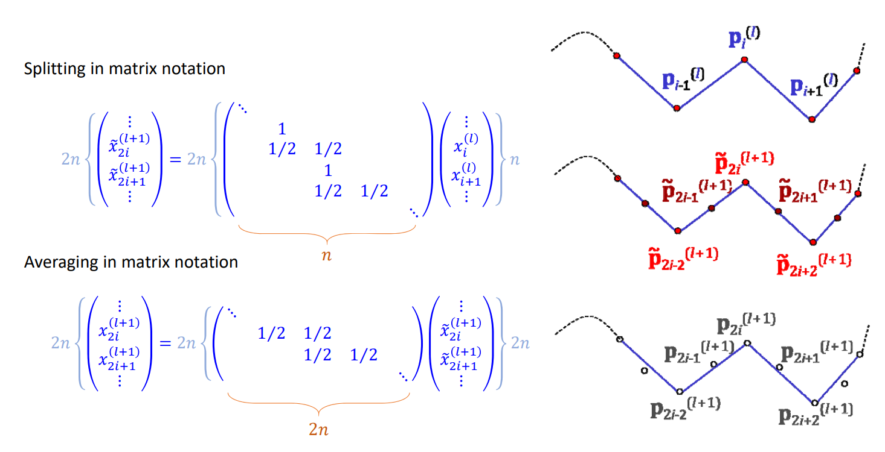
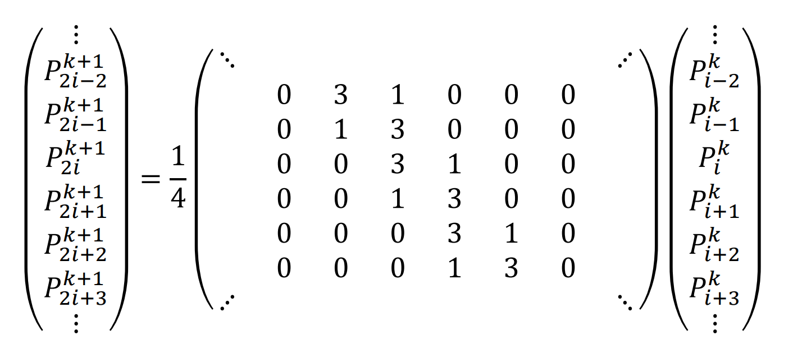

# 细分曲线的性质证明      

# 证明的思路    

* 将细分过程表达成矩阵形式        
• 新顶点是老顶点的线性组合    
* 讨论细分矩阵的谱性质（特征根）           

  

# 举例：Chaikin细分    

矩阵形式: 

•Control points at level   \\(𝑙: 𝒑^{(l)}_i\\)    

• “Splitted” points at level \\(𝑙+1: \tilde{p} ^{(l+1)}_i\\)      

• “Averaged” control points at level \\( 𝑙+1:𝒑^{(l+1)}_i\\)    

  

# Chaikin细分的矩阵形式      

  

# Chaikin细分的矩阵形式   

  

# 极限情况    

极限曲线上的点可由**细分矩阵**的幂次的极限求得:    

$$
\begin{pmatrix}x_-^{[\infty ]}
 \\\\x^{[\infty ]} 
 \\\\x_+^{[\infty ]}
\end{pmatrix}=\lim_{k \to \infty} M^k_{srbdiv}\begin{pmatrix}x_-^{[l]}
 \\\\x^{[l]} 
 \\\\x_+^{[l ]}
\end{pmatrix}
$$

# 极限情况    

 - 收敛的必要条件:
• 细分矩阵的最大特征根为1
• 否则会爆炸 (>1) 或收缩 (<1)

$$
\begin{Bmatrix}x_{-n}^{[l+k]} 
\\\\\vdots
  \\\\x_{0}^{[l+k]}
 \\\\\vdots
  \\\\x_{+n}^{[l+k]}
\end{Bmatrix}=M^k_{subdiv}\begin{Bmatrix}x_{-n}^{[l]}
 \\\\\vdots 
 \\\\x_{0}^{[l]}
 \\\\\vdots 
 \\\\x_{+n}^{[l]}
\end{Bmatrix}=UD^kU^{-1}\begin{Bmatrix}x_{-n}^{[l]}
 \\\\\vdots 
 \\\\x_{0}^{[l]}
 \\\\\vdots
  \\\\x_{+n}^{[l]}
\end{Bmatrix}
$$