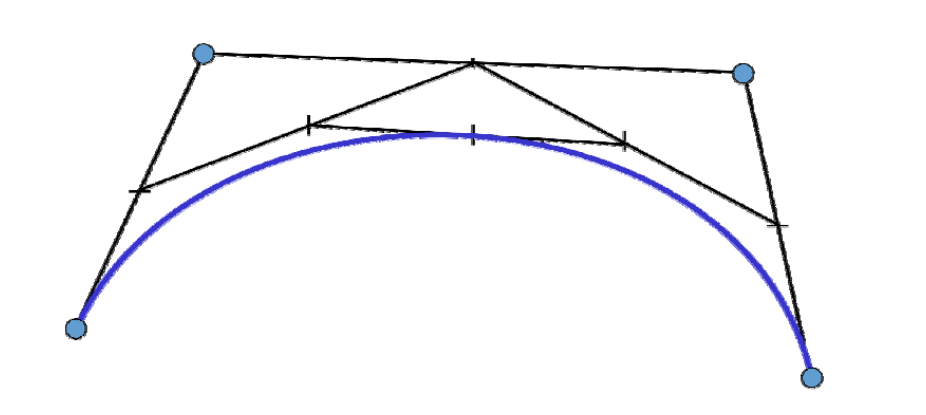
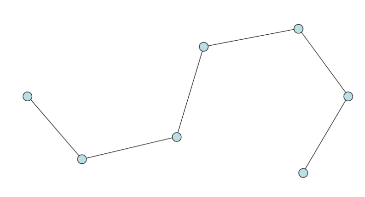
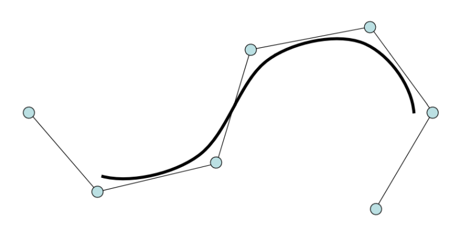
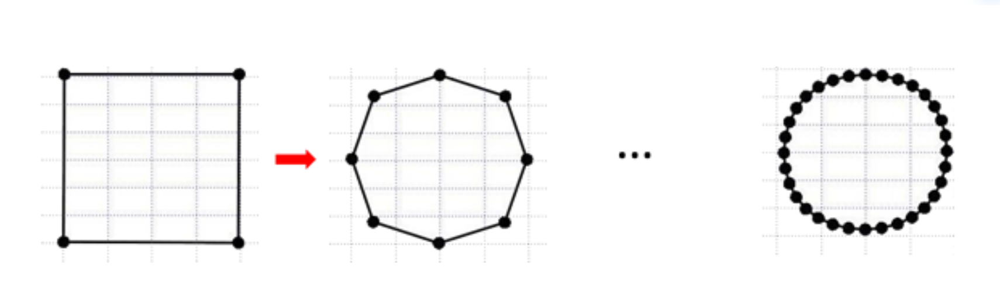
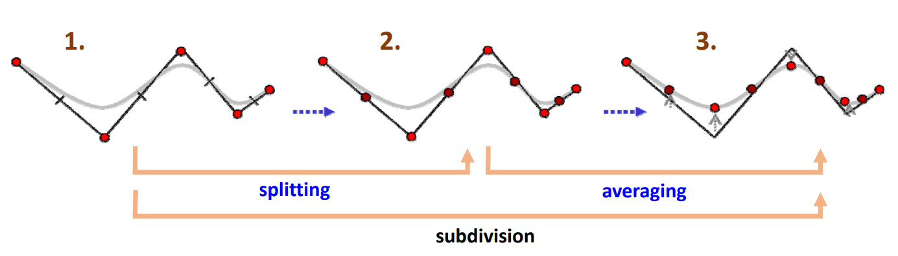

# 回顾：Bezier曲线的作图法    
* de Casteljau作图算法    

  

* 几何直观性：逐步割角、磨光    
• 类似于雕塑雕刻过程   

    

> “其实，这座雕塑本来就在那里，我只是将它多余的边边角角去掉而已。”    

> 作图法中每画一条线段，可以看作是对凸包多边形的割角。     
对多边形不断地割角可以得到一条光滑细线。 

# 问题   

• 输入：一个简单多边形（控制多边形）     

     

• 输出：一条与之关联的光滑曲线     

    

# 启发：通过不断“割角”构造曲线？   

• 给定一个简单多边形    
• 通过一定规则，割角磨光，产生更多边的多边形     
• 不断迭代操作割角磨光，产生（极限）光滑曲线     

    

# 细分方法的思想   

两个步骤：    
* 拓扑规则：加入新点，组成新多边形 (\\(splitting\\))    
* 几何规则：移动顶点，局部加权平均 (\\(averaging\\))    
• 对所有顶点都移动：逼近型    
• 只对新顶点移动：插值型        

    

> 在哪加:在哪两个点之间加新点。     
加在哪：新点的坐标是多少。通常是旧点的线性组合，因这样算得快。     