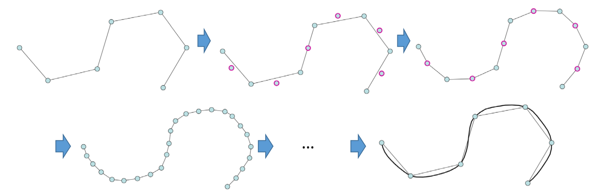
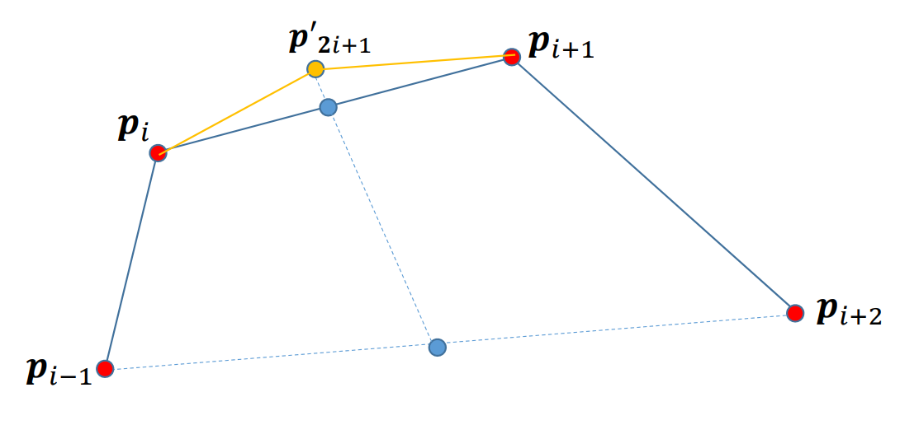
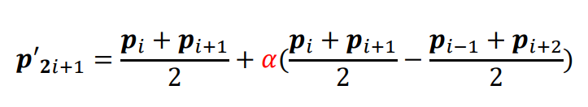
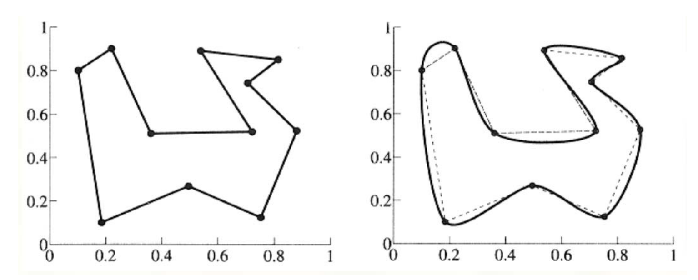
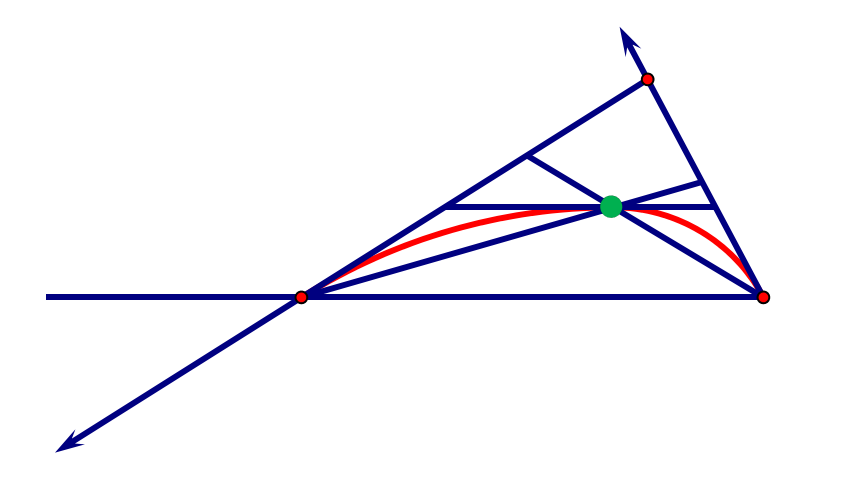
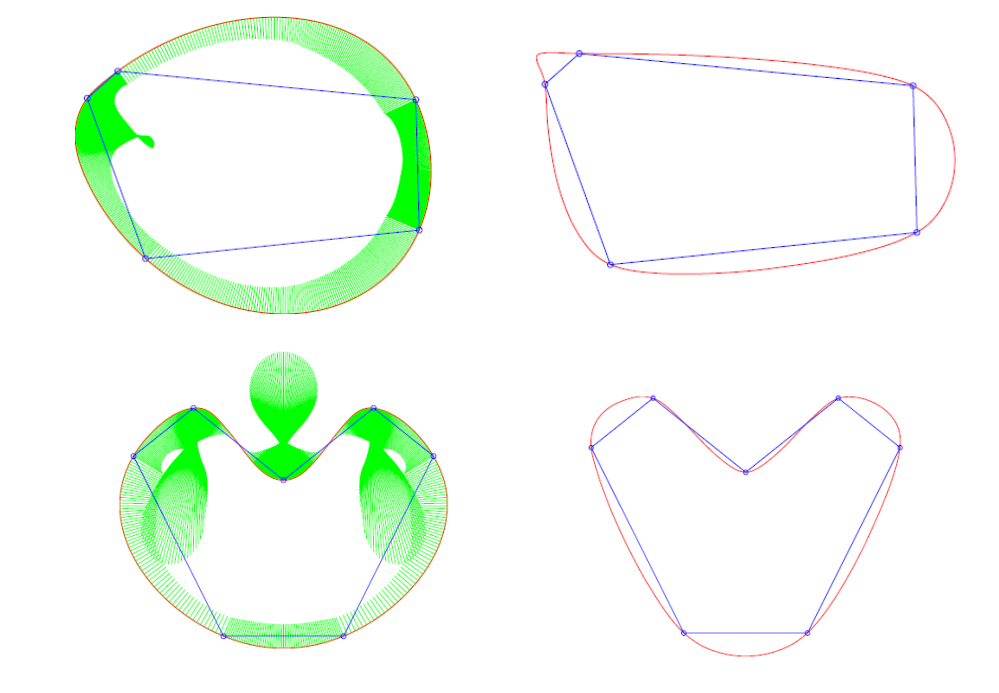

# 插值型细分方法     

细分方法：   
• 保留原有顶点   
• 对每条边，增加一个新顶点     
• 不断迭代，生成一条曲线     

* 可以看成是“**补角法**”        

  

> 保证原顶点不动。    
又称为补角法。   

## 4点插值型细分

### 细分规则     

     

> 蓝点分别是两条线的中点、新增点在中点连线的延长线上。     

> 可以证明：当\\(𝛼∈(0,\frac{1}{8})\\) 时，生成的细分曲线是光滑的；否则，细分曲线非光滑，生成了分形曲线。    

Nira Dyn, David Levin, John A. Gregory A 4‐point interpolatory subdivision     
scheme for curve design. Computer Aided Geometric Design, 4(4): 257‐268, 1987.   

### 4点插值型细分曲线的例子

     

## 一般：2n点插值细分方法    

• 连续阶随着\\(n\\)增大而增加     
2点插值细分方法    

$$
P_{2i+1}^{k+1}=\frac{1}{2} (P^k_i+P^k_{i+1})
$$

4点插值细分方法    

$$
P_{2i+1}^{k+1}=-\frac{1}{16} P^k_{i-1}+\frac{9}{16}P^k_{i}+\frac{9}{16}P^k_{i+1}-\frac{1}{16}P^k_{i+2}
$$

6点插值细分方法    

$$
P_{2i+1}^{k+1}=\frac{3}{256} P^k_{i-2}-\frac{25}{256}P^k_{i-1}+\frac{150}{256}P^k_{i}+\frac{150}{256}P^k_{i+1}-\frac{25}{256}P^k_{i+2}+\frac{3}{256}P^k_{i+3}
$$

# 非线性细分方法    

* 基于双圆弧插值的曲线细分方法     
• 给定一条边,新点为插值其两端点及两端切向的双圆弧的一个连接点,也是其两端点两端切向的所确定三角形的内心.     
• 每个细分步骤后调整切向.     

     

> 要通过解方程或优化来解

## 基于双圆弧插值的曲线细分方法    

性质（证明稍难）：极限曲线\\(𝐺^2\\)，光顺，保形      

     

## 参考文献    

• Denis Zorin et al.Subdivision for Modeling and Animation. SIGGRAPH 2000 Course Notes    
• Warren and Weimer. Subdivision Methods for Geometric Design: A Constructive Approach. Morgan-Kaufmann Publishers, 2002     
• M.S. Sabin. Recent Progress in Subdivision: a Survey. Advances in Multiresolution for Geometric Modelling Mathematics and Visualization 2005, 203‐230      
• Cashman. Beyond Catmull–Clark? A survey of advances in subdivision surface methods. Compute Graphics Forum,  31(1), 2012, 42–61     
 

 