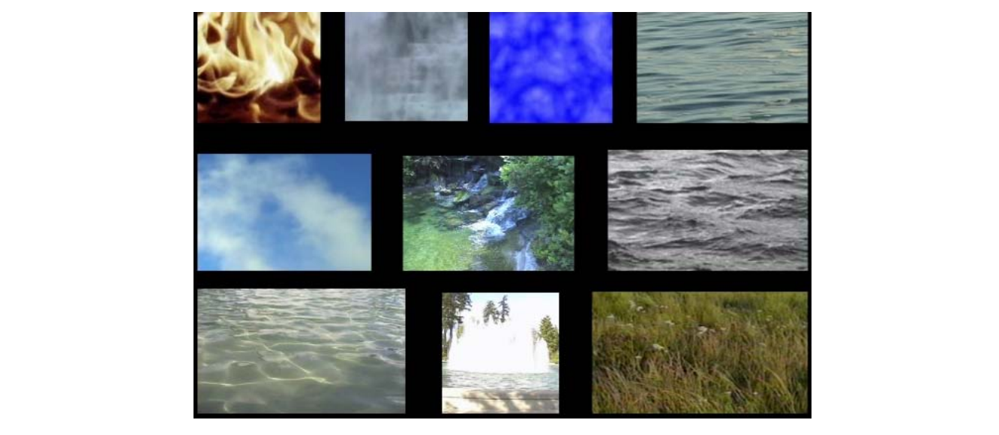

# 1. Textures    

## What is texture?    

### 静态纹理

• **Characterized** by appearance：small parts look alike   
• Elements arranged quasi‐**randomly**: they never look exactly the same         

 

### Dynamic Textures    

Appearance similar even as texture evolves    

 

## Classification (Attribution)   

 

