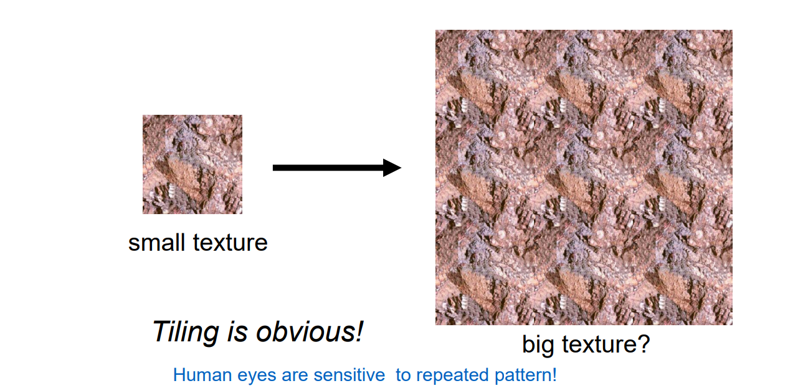
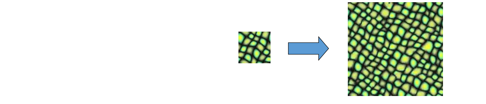
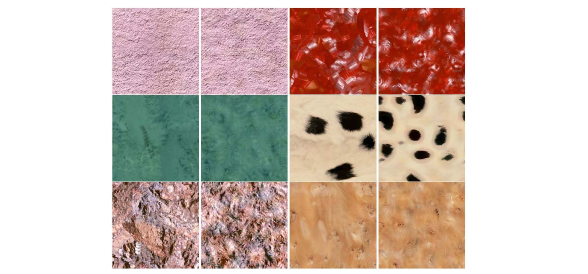
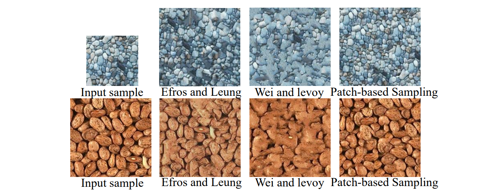
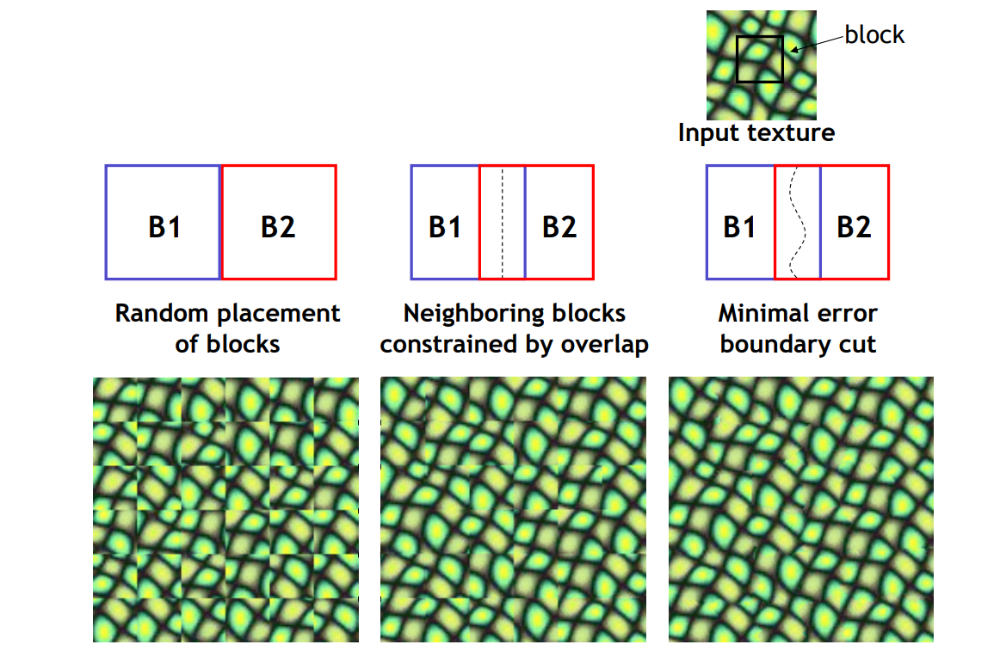
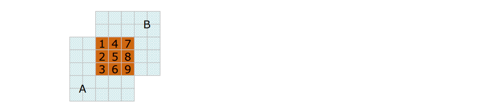
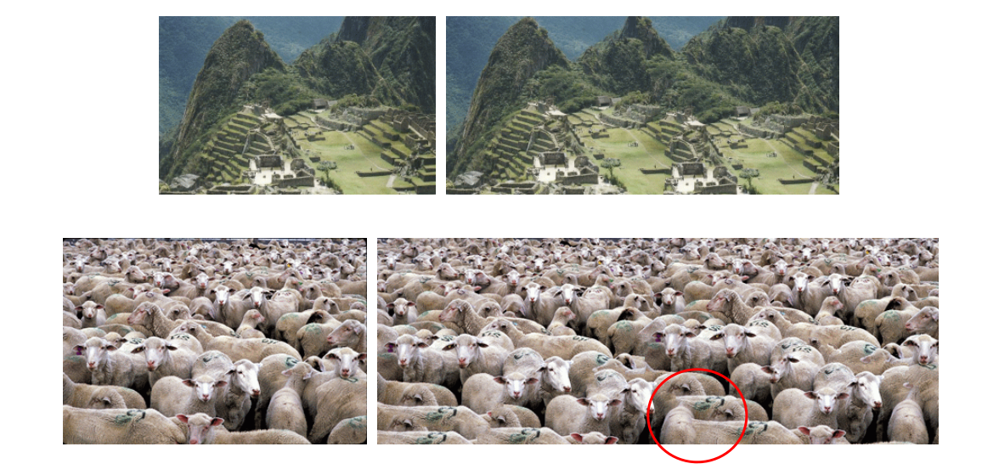
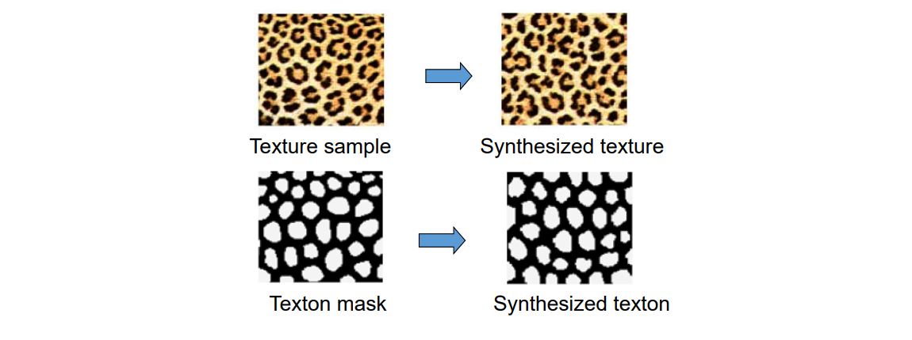

# 2. 2D Texture Synthesis   

## 挑战

简单重复的效果不好：  
 

### Desirable Properties 

• Result looks like the input    
• Efficient    
• General   
• Easy to use    
• Extensible     

 

### Challenges   

• how to capture the essence of texture?    
• from repeated to stochastic texture   

## 方法论

* Parametric Techniques    
• Compute global statistics in feature space and sample images from texture ensemble directly     
* Non‐parametric Techniques    
• Estimate local conditional probability density function and synthesize pixels incrementally    

## Parametric Techniques   

• Hypothesize a **mathematical model** for texture representation     
• **Match** model parameters of input and output texture    

 

> 对每个分辨率，用一个函数提取它的feature，再还原出原始纹理   
> 有点像VAE 

### Pyramid‐Based Texture Analysis/Synthesis    
[Heeger & Bergen, Siggraph 1995]

• Initialize J to noise    
• Create multiresolution pyramids for I and J    
• Match the histograms of J’s pyramid levels with I’s pyramid levels    
• Loop until convergence    
• Can be generalized to 3D    

|Good Case|Bad Case|
|---|---|
|| |

> 只体现了分布，没有体现特征  

## Non‐Parametric Techniques   

* Synthesis by **copying** from the input    
* **Markov‐Random** Field Model     
• Pixel appearance depends only on neighborhood    

 

> &#x1F50E; Markov Random Field     

### Synthesizing One Pixel   

   

• Assuming Markov property, what is conditional probability distribution of p, given the neighbourhood window?    
• Instead of constructing a model, let’s directly search the input image for all such neighbourhoods to produce a histogram for p     
• To synthesize p,  just pick one match at random    

例子：  
    
> &#x1F446; Select Best Neighborhood from all Candidates   

### Randomness Parameter   

 

    

> 选择不同大小的框，会得到不同的效果  

### Patch‐based Synthesis     
[Liang et al. TOG 2002]   

Copy patches instead of single pixels       

 

**Select** ***Best*** **Neighborhood from all Candidates**   

#### Synthesis Result     

    

• Efros’ algorithm has a tendency to grow garbage and Wei’s TSVQ acceleration further aggravates this problem. In Contrast, patch‐based sampling avoids growing garbage      

#### 优点：  
* Speed    
• Orders of magnitude faster than existing texture synthesis algorithm    
• Real‐time synthesis    
* Quality    
• Synthesize high‐quality textures ranging from regular to stochastic     
• Avoid growing garbage     
• Synthesize subjectively better natural textures     

#### Mincut: Graph-cut based     

[Efros&Freeman, Siggraph 2002]     

    

> 用动态规划减少割缝处的突变

**Minimal error boundary**    

    

**Seam Optimization**   

> 最大流最小割问题  

    

Construct graph such that:    
Graph Mincut \\(\Leftrightarrow\\) Best Seam     

    

    

#### Results: Natural Images    

    

### Texton‐based Synthesis    

[Zhang et al., Siggraph 2003]    

• Texton: texture element / texture pattern   
• Texture elements don’t break apart using texton synthesis     

     

### Feature Map + Texture Map   
   

     

> 寻求保持纹理的特征  

### Synthesis with Local Size Control    

     

### Synthesis with Vector Field Control    

     
