# 3D Texture Synthesis算法

## Procedural texture synthesis    

Procedual：过程式，用函数表达纹理

### 方法论

Use 3D functions to define texture properties of objects    
• Non‐trivial programming    
• Flexibility    
• Parametric control    
• Unlimited resolution, antialiasing possible     
• Low memory requirements    
• Low‐cost visual complexity    
• Adapts to arbitrary geometry   

     

### 第一步：构造纹理特征   

 - **Analytic scalar function of world coordinates**  (**x, y, z**)    
 - **Texturing: evaluation of function on object surface**    
    - Ray tracing: 3D intersection point with surface    
 - **Textures of natural objects**    
    - Similarity between different patches    
      - Repetitiveness, coherence    
    - Similarity on different resolution scales    
      - Self-similarity    
    - But never completely identical    
      - Additional disturbances, turbulence, noise    
 - **Procedural texture function**    
    - Mimics statistical properties of natural textures    
    - Purely empirical approach    
      - Looks convincing, but has nothing to do with material's physics    

### 第二步：Perlin’s Noise生成随机纹理   
[Perlin, Siggraph 1985]    

 - **Noise**  (**x,y,z**)    
    - Statistical invariance under rotation    
    - Statistical invariance under translation    
    - Narrow bandpass limit in frequency    
 - **Integer lattice**  (**i, j,k**)    
    - Random number at each lattice point  (i, j,k)     
      - Look-up table or hashing function    
    - Gradient lattice noise    
      - Random gradient vectors    
 - **Evaluation at** (**x,y,z**)    
    - Tri-linear interpolation    
    - Cubic interpolation (Hermite spline \\(\to\\) later)    
 - **Unlimited domain**    
    - Lattice replicated to fill entire space    
 - **Fixed fundamental frequency of \\(\sim\\) 1 Hz over lattice**    
 - **Smooth interpolation of interim values**   

      

### 噪声转化为纹理    

 - **Noise function**    
    - “White” frequency spectrum    
 - **Natural textures**    
    - Decreasing power spectrum towards high frequencies    
 - **Turbulence from noise**    
    - Turbulence \\((x)=\sum_{i=0}^{k}\\) abs ( noise \\((2^i x ) / 2^{i}\\))      
    - Summation truncation    
       -  \\(1 / 2^{k+1}\\) <  size of one pixel (band limit)    
    - 1. Term: noise  (x)     
    - 2. Term: noise  (2 x) / 2    
    - \\(\dots\\)     
    - Power spectrum:  1 / f    
    - (Brownian motion: \\(1/f^2\\))    

    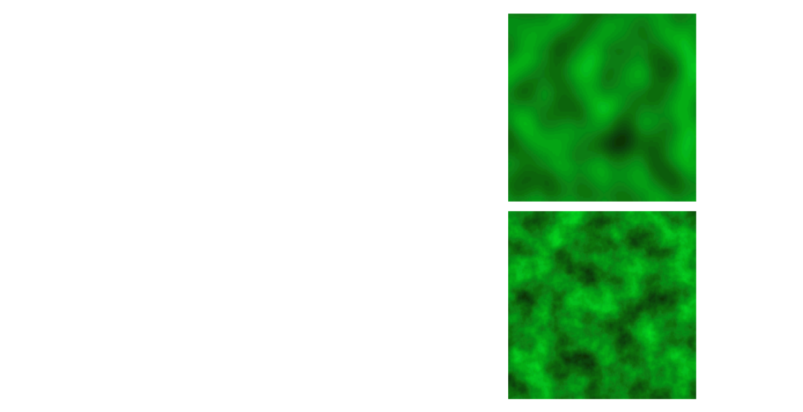     

### 应用

Reaction Diffusion Based Method    
[Turk, Siggraph 1991]   

### Solid Textures    
[Peachey, Siggraph 1985]    

* Solid texture functions in 3D space    
* Nonhomogeneous materials    
• wood and stone    

     

> 切开之后里面的体素也有纹理

## Sample‐based texture synthesis   

### Methodology    

 - Synthesize a surface texture by **coloring mesh vertices**    
 - Extensions from 2D texture synthesis    
 - Key issues   
    - Resampling    
    - 邻域信息：Size、Orientation    

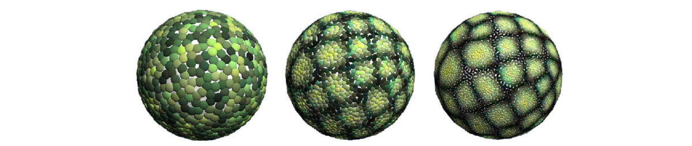     

> 纹理只定义在mesh顶点上，这种算法常于mesh加密的情况

Vertex colors on three levels in the mesh hierarchy    

### 例子

以下是mesh上某个点的邻域信息

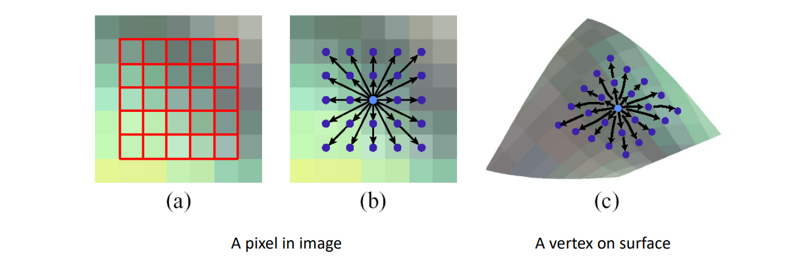     

第一步：把点的邻域参数化 

     

第二步：采样

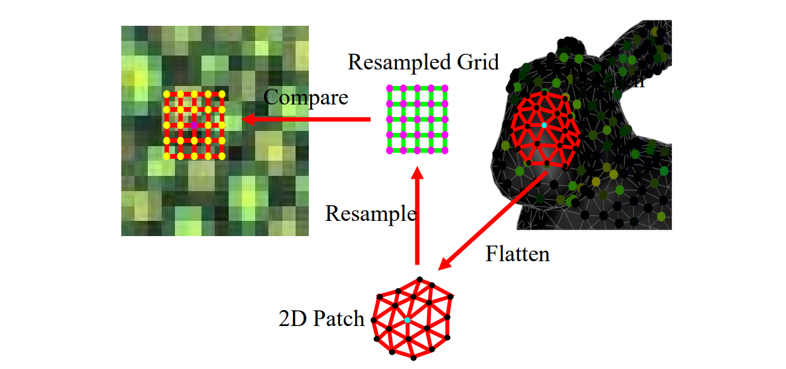     

### Recap: Texture Synthesis by Neighborhood Search     

     

> 用多分辨率的方法实现上面过程，可以同时捕捉不同大小的特征

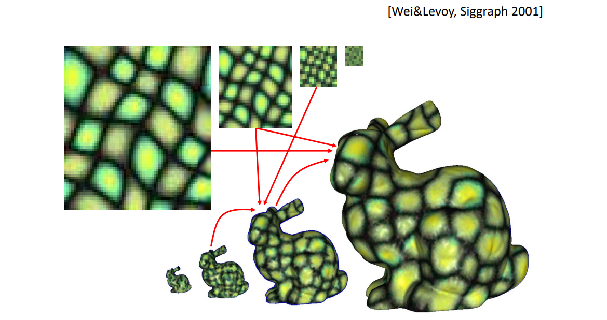     

### Differences between 2D and 3D    

     

### Texture Orientation    

Methodology中提到这类算法需要使用某点邻域的方向，获取方向的方法有：

- user‐specified    
  
- random (for isotropic textures)    
- smooth or symmetric (for anisotropic textures)    
  - by relaxation     

不同orientation对纹理结果的影响：  
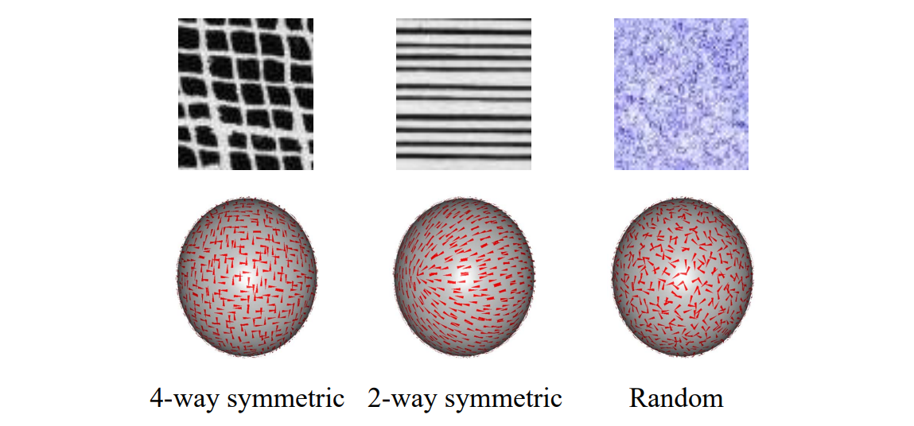  

## Patch‐based Synthesis     

[Praun et al., Siggraph 2001]  

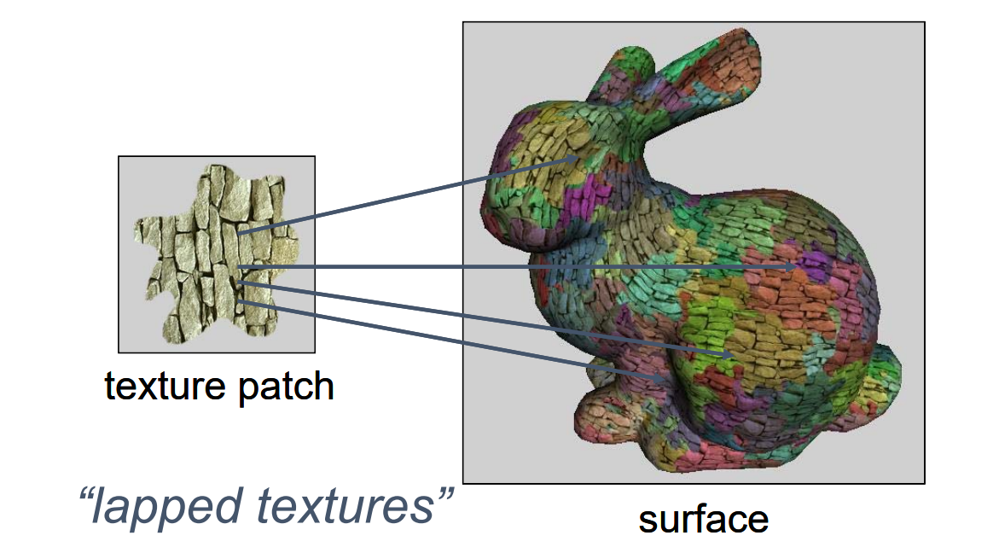     

每贴一块就是这一块的参数化  

大块贴完没贴满的部分，用周边的颜色产生一个patch

     
> 一个patch一般不是整块，而是基于基本元素的边界，这样是为了保证纹理特征的完整性  

     
> 如果没有结构，可以随机设置边界

### Patch Growth     

||||
|---|---|---|
|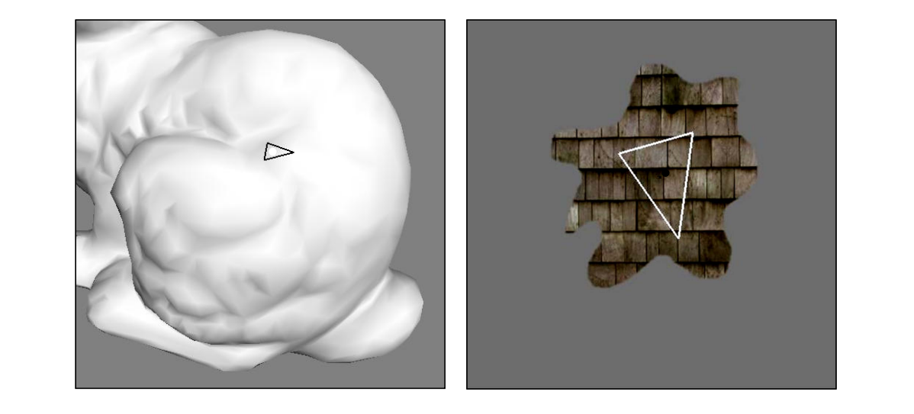|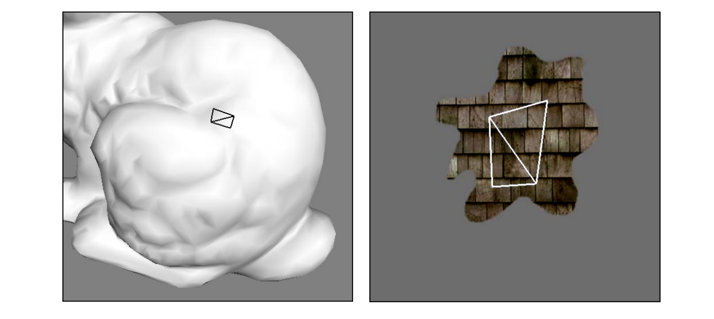||

### Results: Splotches     

     

(***completely automatic: no direction field***)    

### Controlling Direction and Scale     

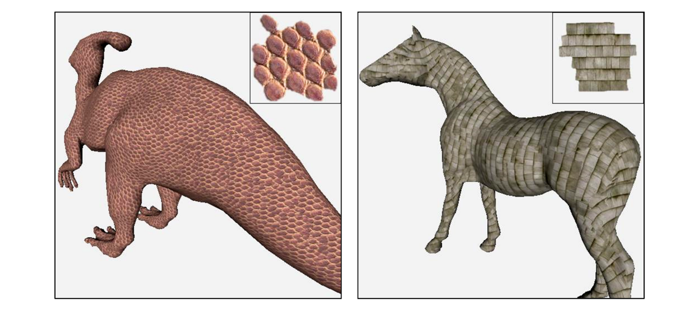     

> 各向同性可以随机nomral，各向异性必须定义normal  
### Controlling Direction and Scale     

|各向同性|各向异性|
|---|---|
||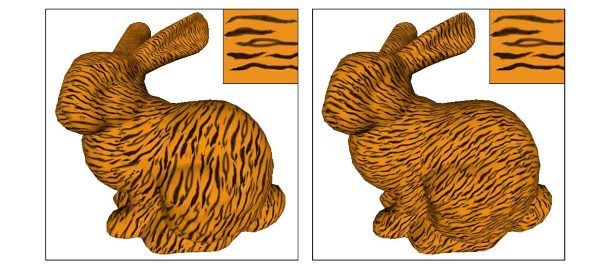|

### Limitations    

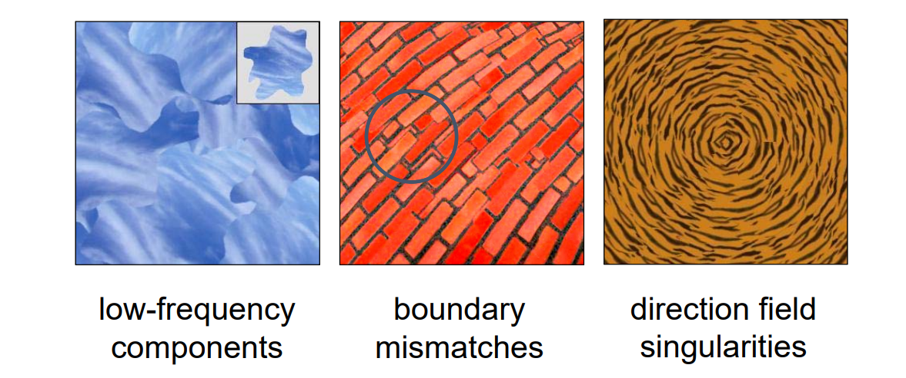     

## Feature‐aligned Texture Synthesis    
[Xu et al., Siggraph Asia 2009]    

     

第一步：提取边界特性和方向，把起点集中到一个不显眼的地方  
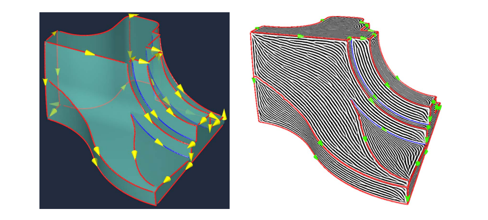     

结果对比：  

|不基于特征|基于特征|
|---|---|
|||

### Progressively‐Variant Texture Synthesis     
[Zhang et al., Siggraph 2003]     

     

## BTF Synthesis     
[Tong et al., Siggraph 2002]     

> 纹理效果与光照方向有关，这样合成效果更有立体感  

Bidirectional Texture Functions (**BTF**): A collection of images of the same surface under different lighting and viewing directions.     
&#x2705; 6D Function ( \\(x, y, l_θ, l_φ, v_θ, v_φ\\) )    
&#x2705; Dense Sampling in Viewing/Lighting Directions    
&#x2705; Capturing Appearance of Real World Surface    

     

### *Real World Texture from CuRet*      

     

•Geometry Details (Mesostructure) on Surface    
•Self-Occlusion, Self-Shadow, and Specularity     

### 学习

*Treating BTF as a 2D Texture Map*    

     

> 一个像素有多个对应点，每个对应点是这个像素在不同光线下的特征。  
> 把左图特征转化为右图特征，用右图特征来做匹配。  
> 特征转化的过程可以用网络或传统方法，本文用的是滤波。  
> 左右维数越高，能抓到的信息的越多。&#x2753; 上限不就是3600吗？为什么需要10800？

**Surface Texton**    

### 使用

Surface Texton Map & Rendering    

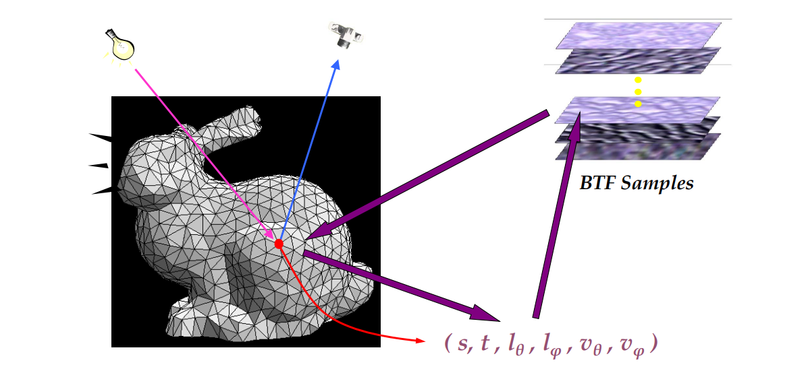     

每个点根据它的实际情况，从源里面匹配出合适的纹理效果。  
> &#x1F4A1; 需要提前采好这个兔子的各个角度的数据？

K‐Coherent Search：通过匹配找到最好的K个，从里面随机选择一个    

     

### Comparison    

     

  
## Geometry synthesis   

要解决的问题：Generating geometry over surfaces by texture (geometry) samples，例如：  

||体素合成|风格合成|基于几何匹配的拼接|
|---|---|---|---|
|效果|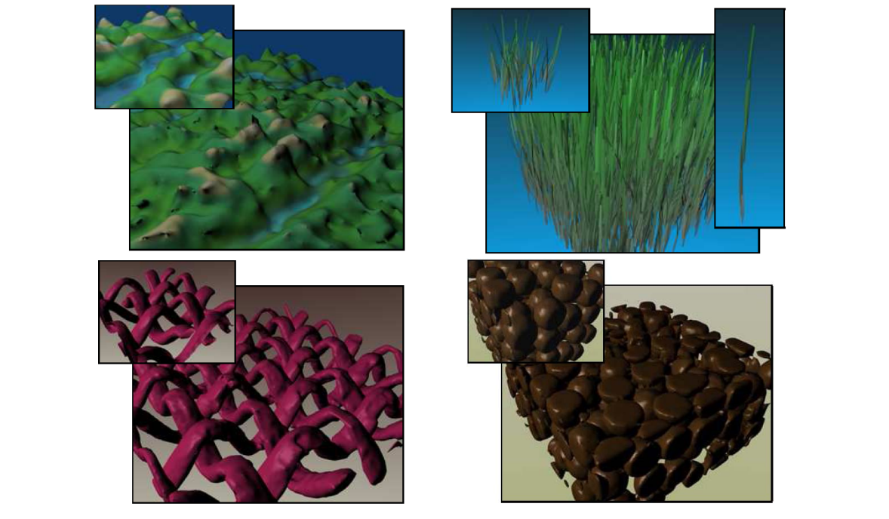| 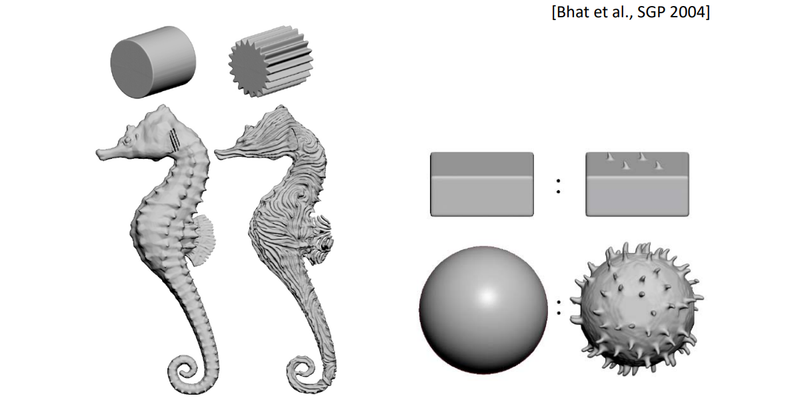|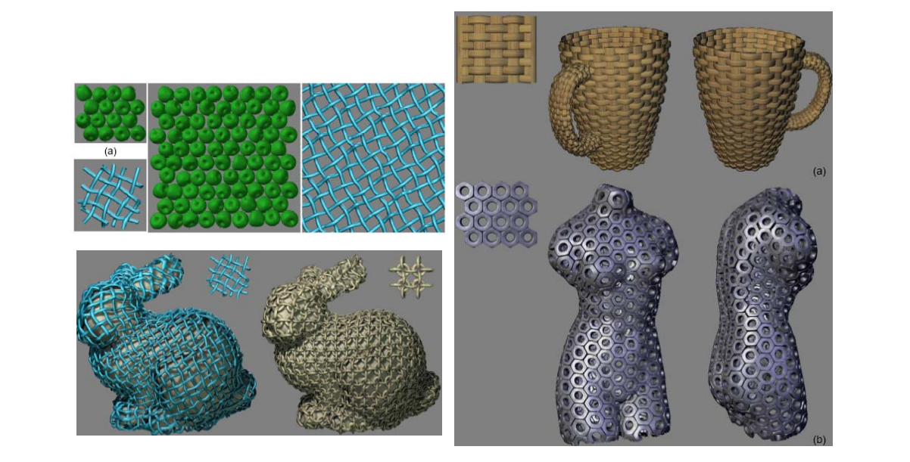|
|方法|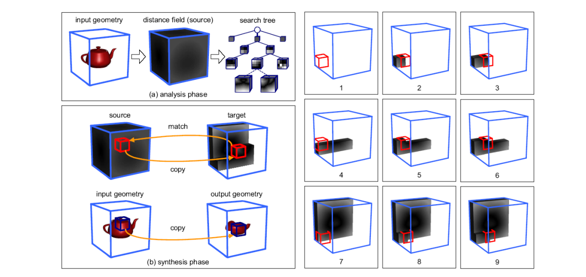  [Lagae et al., TR 2004] |Laplace|  [Zhou et al., Siggraph 2006] |

方法：   
• 3D distance field based method     
• Image analogies extended to volumes    
• Mesh‐based geometric texture synthesis technique    

# Summary: Texture Synthesis    

• An important topic on content generation (2D/3D) textures or repeated geometries    
• A well‐studied topic    
• Many applications     

本文出自CaterpillarStudyGroup，转载请注明出处。
https://caterpillarstudygroup.github.io/GAMES102_mdbook/  
