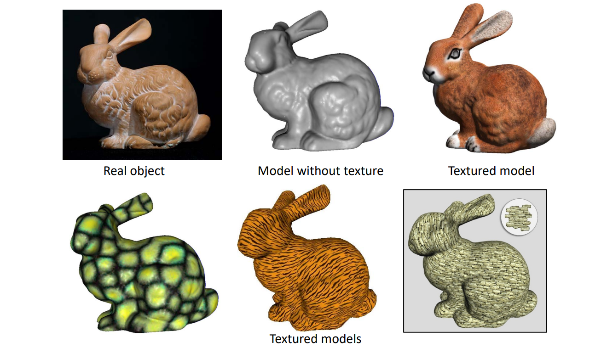
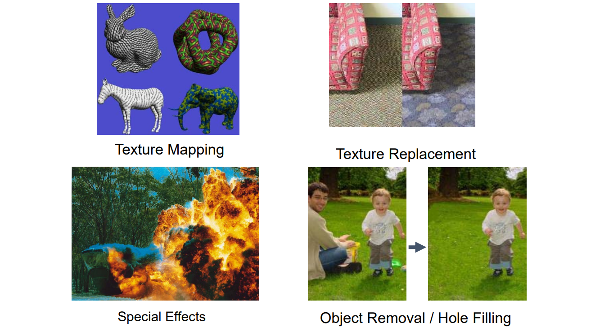
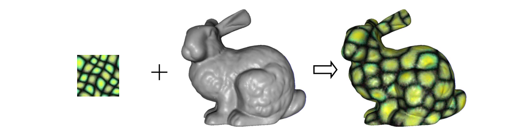

# 回顾

曲面重建或建模    

Textured Surfaces    

 

# Texture Synthesis   

## 3D纹理合成

目标：把一小片纹理铺满整个模型，但要注意接缝入不连续的现象

 

## 2D Texture Synthesis    

 

> Result像（**度量有多像**）input，但又不是简单的重复（**具有随机性**）

Given a sample texture *I*, the goal is to synthesize a new texture *J* that     
• looks like the input sample   
• no part of result is the duplicate of the sampl   

## Applications   

 

# 3. 3D Texture Synthesis: Texture Synthesis on Surfaces   

## 目标

     

     

与2D纹理合成类似

## Desired Properties    

* Share advantages of 2D algorithm    
• Quality    
• Efficient    
• General    
• Easy to use    
* Minimum distortion    
* Minimum discontinuity    

     

---  

> 本文出自CaterpillarStudyGroup，转载请注明出处。
https://caterpillarstudygroup.github.io/GAMES102_mdbook/

