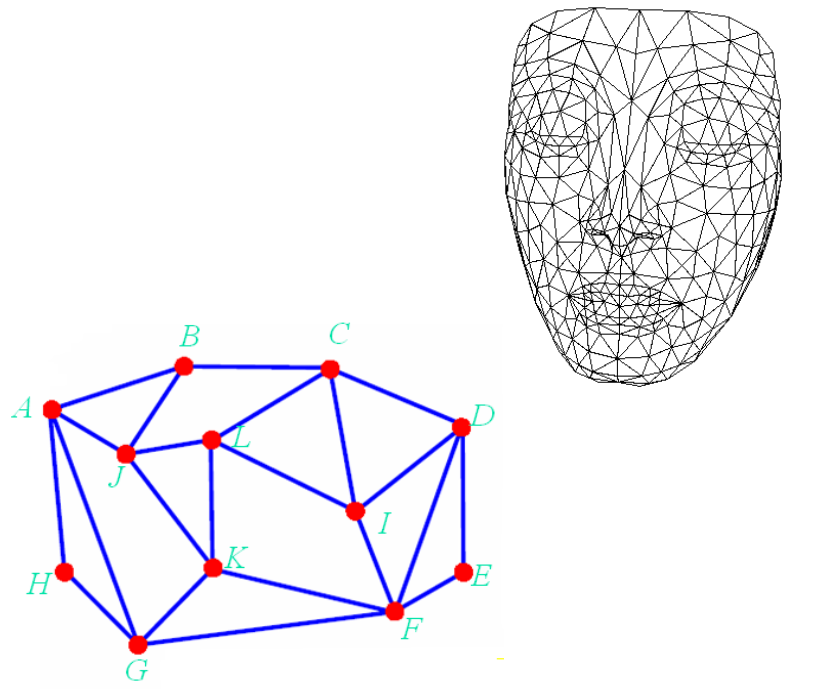
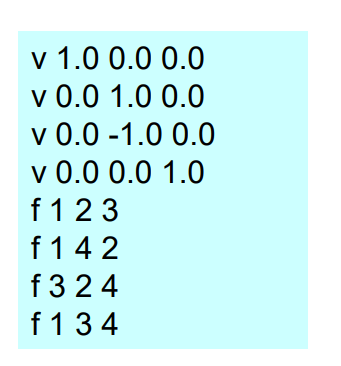
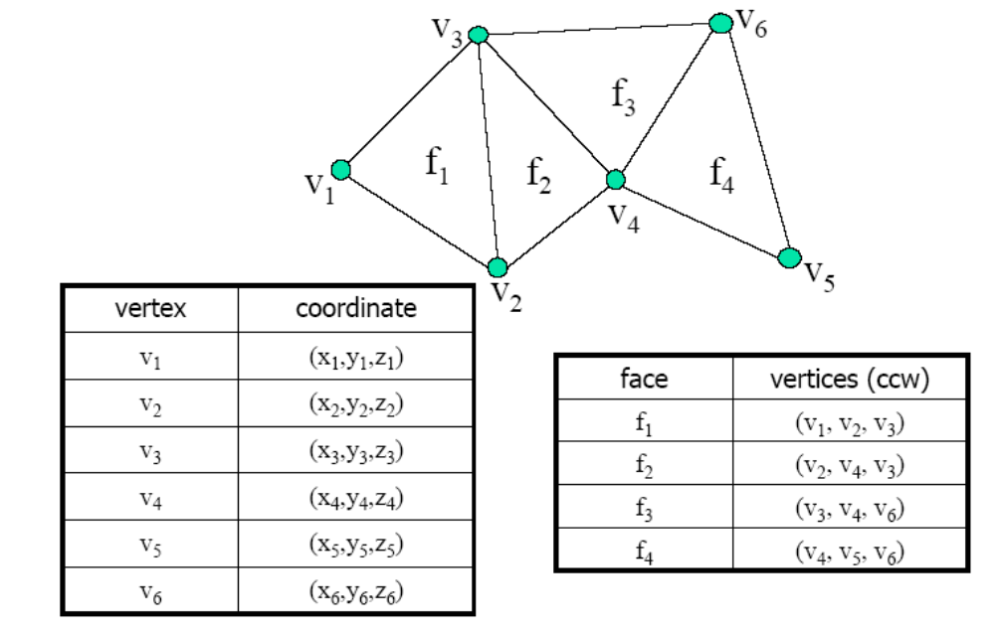
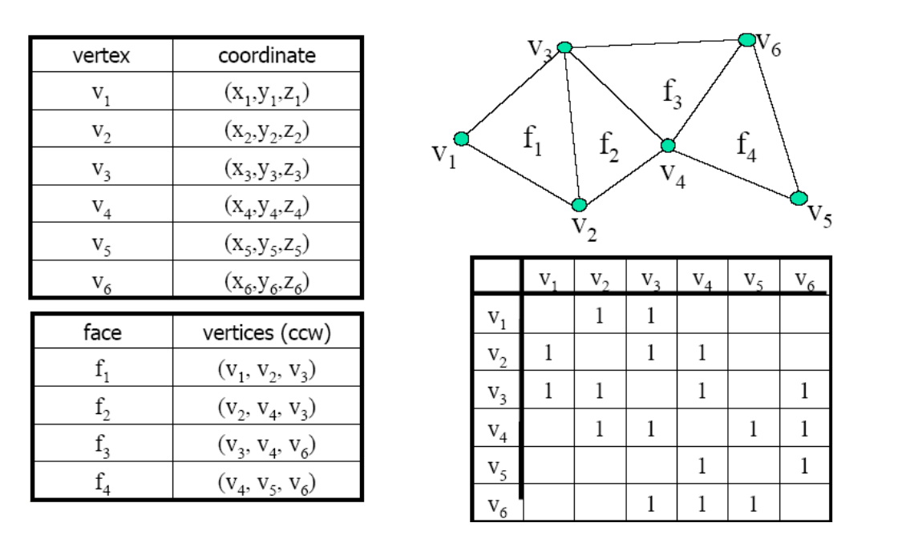
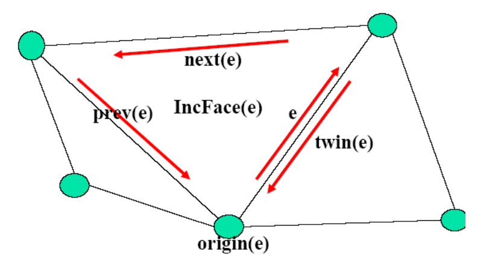
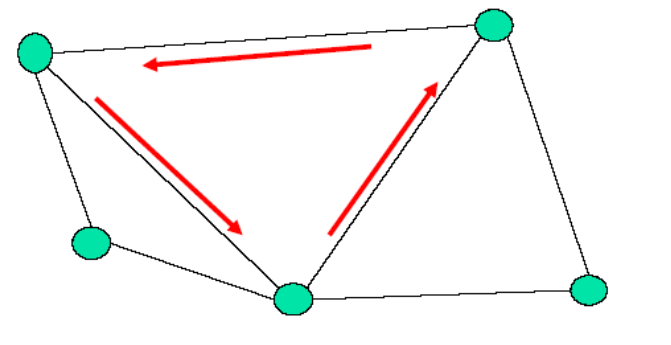
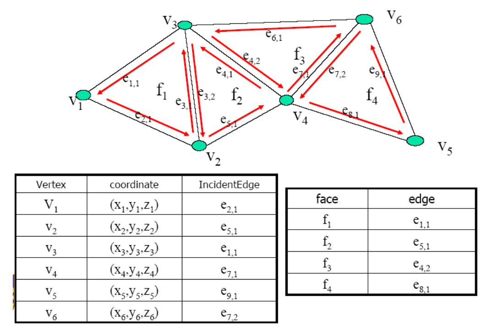
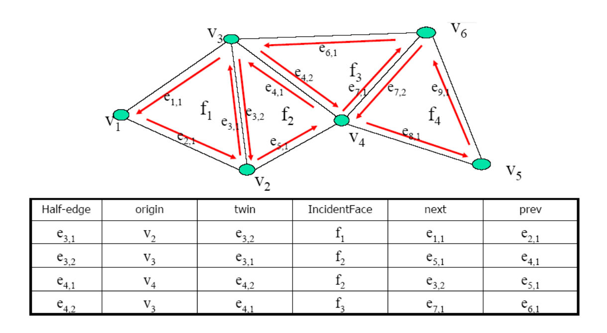
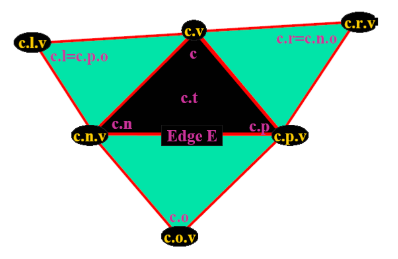
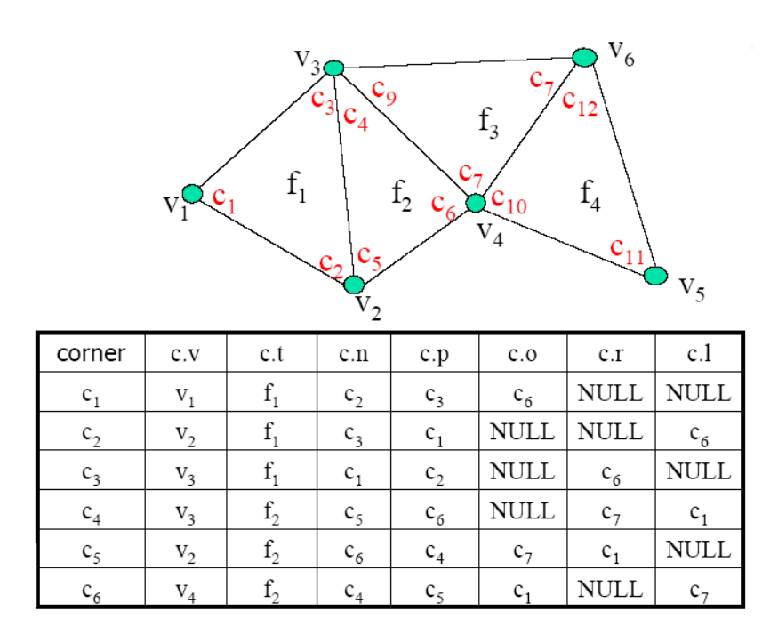

# 网格曲面的数据结构    

# Uses of Mesh Data     

* Rendering     
• Triangle trip     
* Geometry queries     
• What are the vertices of face #k ?      
• Are vertices #i and #j adjacent?     
• Which faces are adjacent face #k ?    
* Geometry operations    
• Remove/add a vertex/face    
• Mesh simplification     
• Vertex split, edge collapse     

# Storing Mesh Data     

* Storage of generic meshes     
• Hard to implement efficiently     
* Assume     
• Triangular     
• Orientable     
• Manifold        

## How “good” is a data structure?     
    - Space complexity      
    - Time      
      - Time to construct ‐ preprocessing       
      - Time to answer a query       
      - Time to perform an operation (update the data structure)     
    - Trade‐off between time and space      
    - Redundancy     

## Define a Mesh

* Geometry     
• Vertex coordinates     
* Connectivity     
• How do vertices connected?     

   

• List of Edge      
• Vertex‐Edge     
• Vertex‐Face      
• Combined      

# 3D Mesh Surface     

* Surface & material properties       
• Material color      
• Ambient, hightlight coefficients      
• Texture coordinates     
• BRDF, BTF    
* Rendering properties      
• Lighting      
• Normals       
• Rendering modes     

# General Used Mesh Files    

* General used mesh files     
• Wavefront OBJ ( *. obj)     
• 3D Max ( *. max, *. 3ds)     
• VRML ( *. vrl)     
• Inventor (  *.  iv)      
• PLY ( *. ply, *. ply2)     
• User‐defined ( *. m, *. liu)     
* Storage     
• Text – (Recommended)     
• Binary     

## Wavefront OBJ File Format    

* Vertices     
• Start with char ‘v’    
• (x,y,z) coordinates     
* Faces     
• Start with char ‘f’     
• Indices of its vertices in the file     
* Other properties     
• Normal, texture coordinates, material, etc.     

   

# List of Faces    

 - List of vertices      
    - Position coordinates      
 - List of faces     
    - Triplets of pointers to face vertices (c1,c2,c3)     
 - Queries:    
    - What are the vertices of face #3?    
      - Answered in O(1) ‐ checking third triplet     
    - Are vertices i and j adjacent?     
      - A pass over all faces is necessary – NOT GOOD    

## List of Faces – Example    

   

## List of Faces – Analysis    

* Pros:      
• Convenient and efficient (memory wise)     
• Can represent non‐manifold meshes     
* Cons:       
• Too simple ‐ not enough information on relations between vertices & faces      

# Adjacency Matrix     

## Adjacency Matrix – Definition      

* View mesh as connected graph    
* Given n vertices build n*n matrix of adjacency information     
• Entry (i,j) is TRUE value if vertices i and j are adjacent    
* Geometric info     
• list of vertex coordinates      
* Add faces     
• list of triplets of vertex indices (v1,v2,v3)     

## Adjacency Matrix – Example      

   

## Adjacency Matrix – Queries    

* What are the vertices of face #3?     
• O(1) – checking third triplet of faces      
* Are vertices i and j adjacent?      
• O(1) ‐ checking adjacency matrix at location (i,j).      
* Which faces are adjacent to vertex j?      
• Full pass on all faces is necessary      

## Adjacency Matrix – Analysis     

* Pros:     
• Information on vertices adjacency      
• Stores non‐manifold meshes    
* Cons:    
• Connects faces to their vertices, BUT NO connection between vertex and its face     

# Doubly‐Connected Edge List (DCEL)    

## DCEL的特点     

* Record for each face, edge and vertex:     
• Geometric information       
• Topological information     
• Attribute information     
* Half‐Edge Structure   

## DCEL的数据结构

 - Vertex record:    
    - Coordinates    
    - Pointer to one half-edge that has v as its origin     
 - Face record:      
    - Pointer to one half-edge on its boundary     
 - Half-edge record:     
    - Pointer to its origin, origin(e)    
    - Pointer to its twin half-edge, twin(e)     
    - Pointer to the face it bounds, IncidentFace(e) (face lies to left of e when traversed from origin to destination)     
    - Next and previous edge on boundary of IncidentFace(e)     

   

## Operations supported:     
• Walk around boundary of given face      
• Visit all edges incident to vertex v      
* Queries:      
• Most queries are  O(1) 

   

## DCEL – Example     

   
   

## DCEL – Analysis     

* Pros    
• All queries in O(1) time    
• All operations are O(1) (usually)    
* Cons    
• Represents only manifold meshes    

# Corner Table

> Corner: Coupling of vertex with one of its incident triangles    

Corner c contains:     
 - Triangle - **c.t**     
 - Vertex - **c.v**    
 - Next corner in **c.t** (ccw) - **c.n**     
 - Previous corner - **c.p** (== c.n.n)    
 - Corner opposite c - **c.o**
    - E edge opposite c - not incident on c.v    
    - **c.o** couples triangle T adjacent to c.t across E with vertex of T not incident on E       
      - Right corner - **c.r** - corner opposite c.n (== c.n.o).     
      - Left corner - **c.l** (== c.p.o == c.n.n.o )      

   

## Corner Table – Example    

   

## Example Queries    

* What are the vertices of face #3?      
• Check **c.v** of corners 9,10, 11      
* Are vertices i and j adjacent?       
• Scan all corners of vertex i, check if **c.p.v** or **c.n.v** are j    
* Which faces are adjacent to vertex j?    
• Check **c.t** of all corners of vertex j      

## Corner Table – Analysis    

* Pros     
• All queries in O(1) time     
• All operations are O(1) (usually)     
* Cons    
• Represents only manifold meshes    
• High redundancy (but not too high …)     
