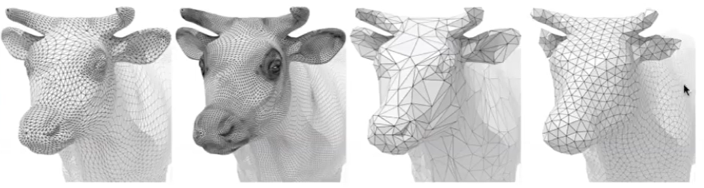

# 三角网格：曲面的离散表达   

三角形网格是曲面的分片线性逼近。通过定义点的位置和点之间的连续关系，来描述一个曲面。      

## 流形Meshes     

流形：任意一个点的无穷小领域同胚于一个二维圆盘      

### 非流形边

   

> &#x1F446; 图1中一条边有三个相邻的面，因此是非流型边  

### 非流形顶点
   

> &#x2757; 本课程假设都是流型曲面。如果遇到非流型就直接去掉或变成流形。 

## Mesh上的操作

在mesh上的操作有：  
- 网速细分：引入更多三角形，并调整顶点坐标。使表面更光滑
- 网格简化：在保持基本形状的情况下，用更少的三角形  
- 网格 Regularization：使网格更接近正三角形，这样对渲染更友好

---  

> 本文出自CaterpillarStudyGroup，转载请注明出处。
https://caterpillarstudygroup.github.io/GAMES102_mdbook/

