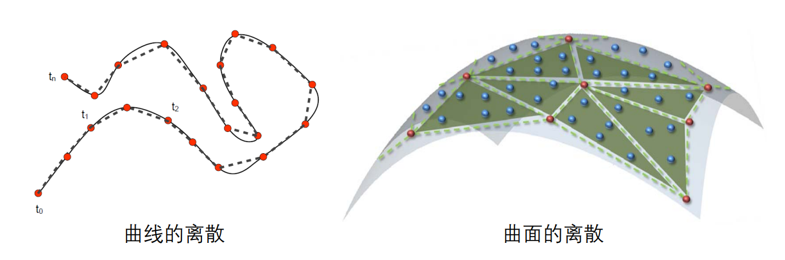

# 三角网格：曲面的离散表达   

# 绘制：离散表达     

* 曲线的绘制：    
• GDI/OpenGL 绘制基本单元：点、线段      
• 曲线须离散成多边形      
* 曲面的绘制：     
• OpenGL 绘制基本单元：点、线、三角形      
• 曲面须离散成**三角形网格**       

   

> 三角形网格是曲面的分片线性逼近  

# Standard Graph Definition    

   

# Connectivity    

   

# Graph Embedding    

   

# Planar Graphs     

   

# Triangulation    

   

# Meshes     

   

> 边非流型：图1. 点非流型      
 
本课程假设都是流型曲面。如果遇到非流型就直接去掉或变成流形。 

# Planar Graphs and Meshes     

   

# Topology     

   

# Orientability     

   

# Duality      

   

• Delaunay Triangulation vs. Voronoi Graph    

